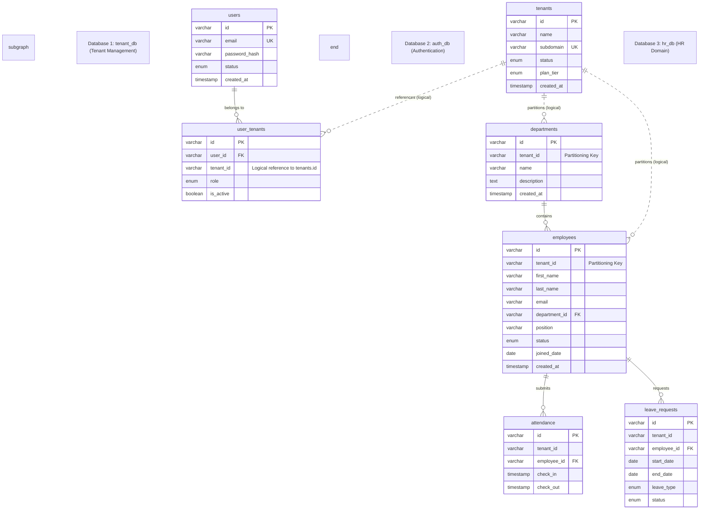
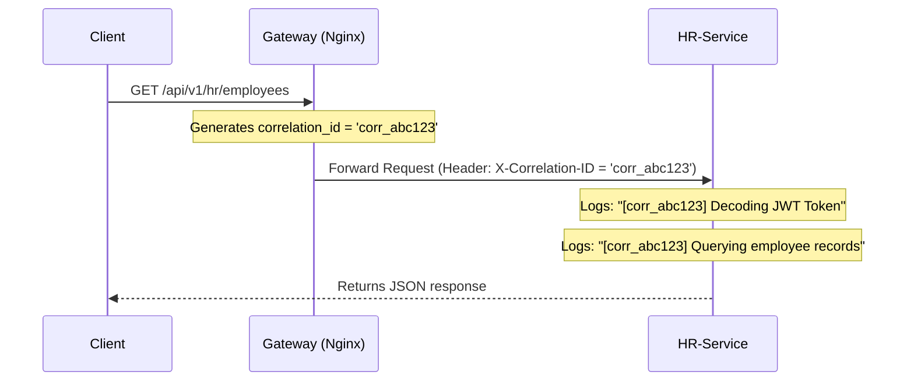
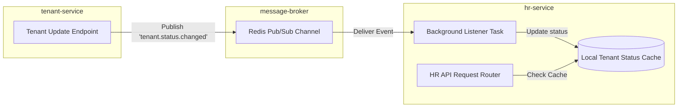

# SaaS HR Multi-Tenant: Directory Blueprint, Database Diagram & API Spec

This document details the recommended directory structure, the Logical Database Entity Relationship (ER) diagrams across the three microservices databases, and the complete API endpoint specification.

---

## 1. Proposed Detailed Directory Structure

Below is the production-ready directory structure designed to scale. It implements a **Layered Architecture** (Router -> Service -> Repository/CRUD -> Model/Schema) for each FastAPI microservice, incorporates Dockerfiles, setup files for migrations (Alembic), and configures Nginx and Docker Compose at the root.

```text
SaaS-HR-Multi-tenant/
├── .env                          # Global environment variables
├── PLAN.md                       # High-level implementation plan
├── ARCH_DETAIL.md                # This document (Architecture & Specs)
├── docker-compose.yml            # Orchestrates Nginx, Services, and DBs
│
├── api-gateway/
│   ├── nginx.conf                # Nginx proxy routing configurations
│   └── Dockerfile                # Nginx custom container packaging
│
├── database/
│   ├── init.sql                  # Initial script to provision auth_db, tenant_db, hr_db
│   └── migrations/               # Shared migration tools (if any)
│
├── frontend/                     # React Vite app
│   ├── src/
│   │   ├── assets/               # Images, custom global CSS styles
│   │   ├── components/           # Reusable UI elements (Buttons, Tables, Modals)
│   │   ├── contexts/             # AuthContext (JWT management, tenant state)
│   │   ├── layouts/              # MainLayout, AuthLayout
│   │   ├── pages/                # Login, Dashboard, Employees, Departments
│   │   ├── services/             # API clients (Axios instance with JWT interceptors)
│   │   ├── App.jsx
│   │   └── main.jsx
│   ├── package.json
│   ├── vite.config.js
│   └── Dockerfile                # Multi-stage production Dockerfile
│
└── microservices/
    ├── auth-service/
    │   ├── app/
    │   │   ├── core/             # Security (bcrypt, RS256 signing), config, logging
    │   │   │   ├── config.py
    │   │   │   ├── security.py
    │   │   │   └── logging.py    # Correlation ID logging setup
    │   │   ├── database.py       # SQLAlchemy engine & session maker
    │   │   ├── models.py         # SQLAlchemy ORM Models (users, user_tenants)
    │   │   ├── schemas.py        # Pydantic schemas (LoginRequest, UserOut)
    │   │   ├── crud.py           # DB operations
    │   │   └── routers/          # API routers
    │   │       ├── auth.py
    │   │       └── health.py     # /health endpoint router
    │   ├── main.py               # FastAPI application entrypoint (Correlation middleware registered)
    │   ├── requirements.txt      # python-jose, passlib, sqlalchemy, etc.
    │   └── Dockerfile            # Multi-stage python runner
    │
    ├── tenant-service/
    │   ├── app/
    │   │   ├── core/             # Config, logging, Redis publisher client
    │   │   │   ├── config.py
    │   │   │   ├── logging.py
    │   │   │   └── redis.py      # Redis connection & publisher logic
    │   │   ├── database.py       # Session configs for tenant_db
    │   │   ├── models.py         # ORM Models (tenants)
    │   │   ├── schemas.py        # Pydantic validation (TenantCreate, TenantOut)
    │   │   ├── crud.py           # DB interactions
    │   │   └── routers/          # API route handlers
    │   │       ├── tenants.py
    │   │       └── health.py     # /health endpoint router
    │   ├── main.py
    │   ├── requirements.txt
    │   └── Dockerfile
    │
    └── hr-service/
        ├── app/
        │   ├── core/             # RS256 token verification, logging, event workers
        │   │   ├── security.py   # JWT decoding & public key evaluation
        │   │   ├── config.py
        │   │   ├── logging.py
        │   │   ├── middleware.py # Intercepts headers to capture & log Correlation IDs
        │   │   └── worker.py     # Subscribes to Redis channels (tenant.status.changed events)
        │   ├── database.py       # Session configs for hr_db
        │   ├── models.py         # ORM Models (departments, employees, attendance, leaves)
        │   ├── schemas.py        # Pydantic schemas (EmployeeCreate, DepartmentOut)
        │   ├── crud.py           # Repository logic (enforces tenant_id filters)
        │   └── routers/          # API route handlers
        │       ├── hr.py
        │       └── health.py     # /health endpoint router
        ├── main.py
        ├── requirements.txt
        └── Dockerfile
```
```

---

## 2. Multi-Tenant Database Diagram (Entity Relationships)

Although the MySQL databases are physically/logically separated into three distinct schemas (`tenant_db`, `auth_db`, `hr_db`), they are logically linked through ID references. 

- **Pool Model**: In the `hr_db` schema, all tables contain `tenant_id` as a partitioning discriminator key.



---

## 3. Microservices API Endpoint Specification

Here is the complete API specifications for the initial releases of all 3 microservices.

### 3.1. Auth Service (`auth-service`)
Responsible for credential validation, token issuance, and user-to-tenant routing.

| HTTP Method | Path | Auth Req. | Payload / Params | Response Codes | Description |
| :--- | :--- | :--- | :--- | :--- | :--- |
| **POST** | `/api/v1/auth/login` | No | `{email, password, subdomain}` | `200 OK`, `401 Unauthorized` | Authenticate user credentials and return an RS256-signed JWT. |
| **POST** | `/api/v1/auth/register` | No | `{email, password, fullname}` | `201 Created`, `400 Bad Req` | Register a new user account globally. |
| **GET** | `/api/v1/auth/me` | **Yes** | *None* | `200 OK`, `401 Unauthorized` | Retrieve current authenticated user profile context. |

---

### 3.2. Tenant Service (`tenant-service`)
Manages registration of corporate entities, plan upgrades, and tenant lifecycle statuses.

| HTTP Method | Path | Auth Req. | Payload / Params | Response Codes | Description |
| :--- | :--- | :--- | :--- | :--- | :--- |
| **POST** | `/api/v1/tenants` | **Yes (SysAdmin)**| `{name, subdomain, plan_tier}` | `201 Created`, `409 Conflict` | Create a new business tenant and database context. |
| **GET** | `/api/v1/tenants/{id}`| **Yes** | *None* | `200 OK`, `404 Not Found` | Fetch core details for a tenant. |
| **PUT** | `/api/v1/tenants/{id}`| **Yes (Owner)** | `{status, plan_tier}` | `200 OK`, `403 Forbidden` | Update subscription status or plan. |

---

### 3.3. HR Service (`hr-service`)
Executes business logic for employees and departments. **Enforces tenant isolation by validating claims embedded within the bearer token.**

| HTTP Method | Path | Auth Req. | Payload / Params | Response Codes | Description |
| :--- | :--- | :--- | :--- | :--- | :--- |
| **GET** | `/api/v1/hr/departments`| **Yes** | Query: `page`, `size` | `200 OK` | Fetch all departments associated with the user's `tenant_id`. |
| **POST** | `/api/v1/hr/departments`| **Yes (Admin)**| `{name, description}` | `201 Created`, `400 Bad Req` | Add a new department within the tenant. |
| **GET** | `/api/v1/hr/employees` | **Yes** | Query: `page`, `size`, `department_id` | `200 OK` | Fetch paginated employees belonging exclusively to the caller's `tenant_id`. |
| **POST** | `/api/v1/hr/employees` | **Yes (Admin)**| `{first_name, last_name, email, position, joined_date, department_id}` | `201 Created`, `409 Conflict` | Insert a new employee under the caller's tenant context. |
| **GET** | `/api/v1/hr/employees/{id}`| **Yes** | *None* | `200 OK`, `404 Not Found` | Get detailed employee dossier. |
| **PUT** | `/api/v1/hr/employees/{id}`| **Yes (Admin)**| `{first_name, last_name, position, status, department_id}` | `200 OK`, `404 Not Found` | Update worker records. |
| **DELETE**| `/api/v1/hr/employees/{id}`| **Yes (Admin)**| *None* | `204 No Content` | Remove employee record. |

---

### 3.4. Leave & Attendance Services (in `hr-service`)
Enables employees to submit timekeeping events (Clock In/Out) and request paid time off.

| HTTP Method | Path | Auth Req. | Payload / Params | Response Codes | Description |
| :--- | :--- | :--- | :--- | :--- | :--- |
| **POST** | `/api/v1/hr/attendance/check-in` | **Yes** | *None* | `201 Created` | Log standard clock-in timestamp (tenant isolation enforced). |
| **POST** | `/api/v1/hr/attendance/check-out`| **Yes** | *None* | `200 OK` | Log clock-out timestamp. |
| **GET** | `/api/v1/hr/attendance/my-logs` | **Yes** | Query: `start_date`, `end_date` | `200 OK` | Fetch attendance calendar history of the requesting employee. |
| **POST** | `/api/v1/hr/leaves` | **Yes** | `{start_date, end_date, type, reason}` | `201 Created` | Request leave (sick leave, vacation, unpaid). |
| **GET** | `/api/v1/hr/leaves/pending` | **Yes (Admin)**| Query: `page`, `size` | `200 OK` | Audit all pending leave requests requiring admin approval. |
| **PUT** | `/api/v1/hr/leaves/{id}` | **Yes (Admin)**| `{status: 'approved'\|'rejected'}` | `200 OK`, `404 Not Found` | Resolve a leave request. |

---

### 3.5. Tenant Administration & User Roles (in `auth-service` / `tenant-service`)
Allows business owners to configure company metadata and control internal user access roles.

| HTTP Method | Path | Service | Auth Req. | Payload / Params | Response Codes | Description |
| :--- | :--- | :--- | :--- | :--- | :--- | :--- |
| **GET** | `/api/v1/tenants/my-tenant` | `tenant-service` | **Yes** | *None* | `200 OK` | Retrieve profile configs for the user's active tenant. |
| **PUT** | `/api/v1/tenants/my-tenant` | `tenant-service` | **Yes (Owner)** | `{name, logo_url}` | `200 OK` | Modify company profile details. |
| **GET** | `/api/v1/auth/tenants/users` | `auth-service` | **Yes (Admin)** | Query: `page`, `size` | `200 OK` | List users invited/belonging to the tenant. |
| **PUT** | `/api/v1/auth/tenants/users/{id}/role`| `auth-service` | **Yes (Owner)** | `{role}` | `200 OK`, `403 Forbidden` | Update role permissions of a tenant user. |
| **DELETE**| `/api/v1/auth/tenants/users/{id}` | `auth-service` | **Yes (Admin)** | *None* | `204 No Content` | Revoke a user's access rights to the tenant workspace. |

---

### 3.6. Global Diagnostics & Health Checks (All Services)
Each microservice exposes an unauthenticated health endpoint used by Docker/Kubernetes readiness probes to verify database connection and Redis status. All services expect an optional transaction ID header to support tracing.

| HTTP Method | Path | Auth Req. | Expected Headers | Response Codes | Description |
| :--- | :--- | :--- | :--- | :--- | :--- |
| **GET** | `/api/v1/auth/health` | No | `X-Correlation-ID` (Optional) | `200 OK`, `503 Service Unavail` | Verifies auth_db MySQL pool connection health. |
| **GET** | `/api/v1/tenants/health` | No | `X-Correlation-ID` (Optional) | `200 OK`, `503 Service Unavail` | Verifies tenant_db MySQL and Redis connection health. |
| **GET** | `/api/v1/hr/health` | No | `X-Correlation-ID` (Optional) | `200 OK`, `503 Service Unavail` | Verifies hr_db MySQL and Redis connection health. |

---

### 3.7. Offline Database Diagnostics Tool
For local host environment configurations (e.g., when setting up the codebase on new developers' machines before launching Docker or running microservices natively), a standalone test connection script is provided:
- **Location**: `test_db_connection.py` in the root folder.
- **Features**: 
  - Manually parses `.env` configuration file without requiring any third-party dependencies (like `python-dotenv`).
  - Verifies basic TCP socket connectivity to the database port (host port `3307`).
  - Conducts authentication and database existence checks for all three schemas (`tenant_db`, `auth_db`, and `hr_db`) using the PyMySQL connector if installed locally on the host.

---


## 4. Advanced Enterprise Microservices Patterns & Proposals

To elevate this project into an enterprise-grade distributed system, the following core microservice design patterns have been implemented across the stack:

### 4.1. Distributed Request Tracing (Correlation IDs)
- **Concept**: A unique transaction UUID (`X-Correlation-ID`) tracks the lifecycle of every client request as it traverses from the Nginx API gateway into the downstream microservices.
- **Nginx Generation**: Nginx intercepts requests, generates a `$request_id` if the header is absent, and forwards it to downstream containers.
- **FastAPI Logging Integration**: A custom FastAPI logging middleware reads the header, stores it in a thread-safe ContextVar (`correlation_id_ctx`), and a logging filter appends it to all stdout log messages:
  `[%(asctime)s] [%(levelname)s] [TraceID: %(correlation_id)s] [%(name)s]: %(message)s`



### 4.2. Asynchronous Event-Driven Pub/Sub via Redis
- **Concept**: Promotes eventual consistency and loose service coupling.
- **Implementation**:
  - When a tenant subscription is updated/suspended in the `tenant-service`, it publishes a JSON payload event to the `tenant.status.changed` channel in Redis.
  - The `hr-service` runs a background subscriber thread (`worker.py`) that listens to this channel and processes the status changes asynchronously.



### 4.3. Health Checks & Resiliency Probes
- **Concept**: Each microservice exposes a `/health` endpoint to verify internal connectivity (MySQL connection test via `SELECT 1` and Redis ping test).
- **Docker Compose Integration**: The `docker-compose.yml` file uses these routes in container healthchecks to monitor readiness and ensure services start in the correct dependency sequence.


