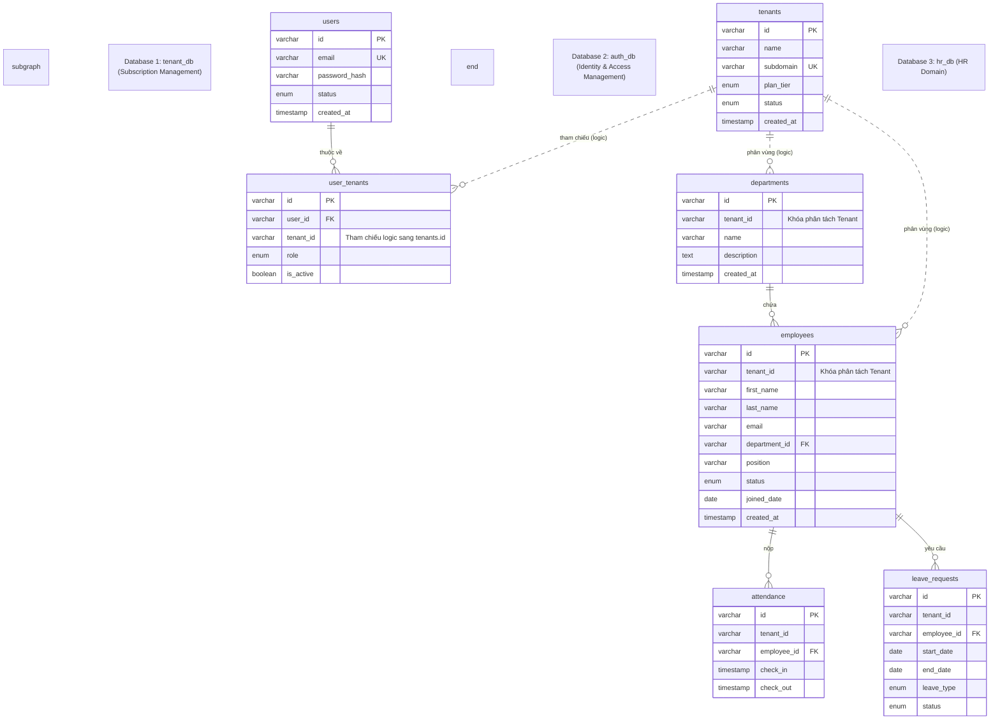
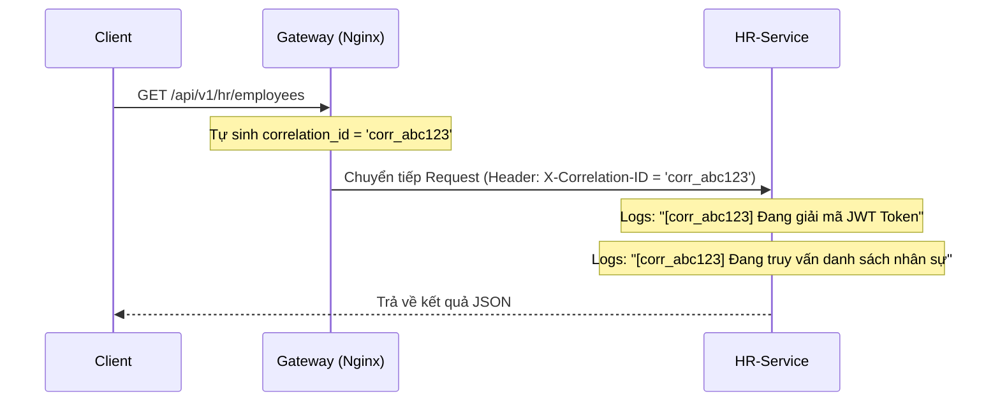
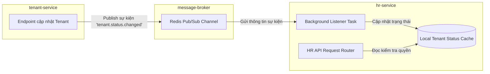

# SaaS HR Multi-Tenant: Đặc Tả Thư Mục, Sơ Đồ Cơ Sở Dữ Liệu & Danh Sách API

Tài liệu này trình bày cấu trúc thư mục chi tiết, sơ đồ quan hệ thực thể (ER) logic giữa 3 database của các microservices, và tài liệu đặc tả đầy đủ các API Endpoints.

---

## 1. Đề Xuất Cấu Trúc Thư Mục Chi Tiết

Dưới đây là cấu trúc thư mục tiêu chuẩn cho môi trường production. Từng microservice FastAPI được thiết kế theo **Kiến trúc phân tầng** (Router -> Service -> Repository/CRUD -> Model/Schema) để dễ dàng mở rộng và bảo trì độc lập.

```text
SaaS-HR-Multi-tenant/
├── .env                          # Biến môi trường toàn cục
├── PLAN.md                       # Kế hoạch phát triển dự án
├── ARCH_DETAIL.md                # Tài liệu đặc tả kiến trúc (Tiếng Anh)
├── ARCH_DETAIL_VI.md             # Tài liệu đặc tả này (Tiếng Việt)
├── docker-compose.yml            # Điều phối các container Nginx, Services và DBs
│
├── api-gateway/
│   ├── nginx.conf                # Cấu hình định tuyến proxy của Nginx Gateway
│   └── Dockerfile                # File đóng gói container Nginx
│
├── database/
│   ├── init.sql                  # Script SQL tạo các database tenant_db, auth_db, hr_db
│   └── migrations/               # Công cụ quản lý migration (nếu có)
│
├── frontend/                     # Ứng dụng React Vite
│   ├── src/
│   │   ├── assets/               # Ảnh, tệp tin CSS toàn cục
│   │   ├── components/           # UI components tái sử dụng (Buttons, Tables, Modals)
│   │   ├── contexts/             # Quản lý trạng thái đăng nhập, JWT, tenant hiện tại
│   │   ├── layouts/              # Giao diện khung: MainLayout, AuthLayout
│   │   ├── pages/                # Các trang: Login, Dashboard, Employees, Departments
│   │   ├── services/             # Khởi tạo Axios client có gắn Interceptor tự đính JWT
│   │   ├── App.jsx
│   │   └── main.jsx
│   ├── package.json
│   ├── vite.config.js
│   └── Dockerfile                # File đóng gói multi-stage production cho React
│
└── microservices/
    ├── auth-service/
    │   ├── app/
    │   │   ├── core/             # Bảo mật (bcrypt, ký RS256), cấu hình, log tracing
    │   │   │   ├── config.py
    │   │   │   ├── security.py
    │   │   │   └── logging.py    # Cấu hình Correlation ID cho nhật ký log
    │   │   ├── database.py       # Cấu hình engine & session maker của SQLAlchemy
    │   │   ├── models.py         # Thực thể DB ORM (users, user_tenants)
    │   │   ├── schemas.py        # Định nghĩa Pydantic (LoginRequest, UserOut)
    │   │   ├── crud.py           # Thao tác truy vấn DB
    │   │   └── routers/          # Định tuyến các API
    │   │       ├── auth.py
    │   │       └── health.py     # API kiểm tra sức khỏe
    │   ├── main.py               # Entrypoint ứng dụng FastAPI (đăng ký Middleware tracing)
    │   ├── requirements.txt      # python-jose, passlib, sqlalchemy, cryptography, v.v.
    │   └── Dockerfile            # File đóng gói python container cho auth-service
    │
    ├── tenant-service/
    │   ├── app/
    │   │   ├── core/             # Biến cấu hình, log, Redis publisher client
    │   │   │   ├── config.py
    │   │   │   ├── redis.py
    │   │   │   └── logging.py
    │   │   ├── database.py
    │   │   ├── models.py         # Thực thể DB (tenants)
    │   │   ├── schemas.py        # Định nghĩa Pydantic (TenantCreate, TenantOut)
    │   │   ├── crud.py
    │   │   └── routers/
    │   │       ├── tenants.py
    │   │       └── health.py     # Định tuyến health check
    │   ├── main.py               # Entrypoint chính (Cần đăng ký health router trước)
    │   ├── requirements.txt      # fastapi, uvicorn, sqlalchemy, redis, httpx
    │   └── Dockerfile
    │
    └── hr-service/
        ├── app/
        │   ├── core/             # Cấu hình, log, Redis subscriber worker
        │   │   ├── config.py
        │   │   ├── worker.py     # Lắng nghe thay đổi trạng thái tenant từ Redis
        │   │   └── logging.py
        │   ├── database.py
        │   ├── models.py         # Thực thể DB (departments, employees, attendance, leaves)
        │   ├── schemas.py
        │   ├── crud.py           # Thực thi ràng buộc tenant_id cho tất cả truy vấn
        │   └── routers/
        │       ├── hr.py         # Nghiệp vụ nhân sự
        │       └── health.py     # API healthcheck
        ├── main.py               # Entrypoint chính
        ├── requirements.txt
        └── Dockerfile
```

---

## 2. Sơ Đồ Cơ Sở Dữ Liệu Logic (ER Diagram)

Dự án áp dụng mô hình dữ liệu **Pool Model (Dùng chung database & bảng, phân tách dữ liệu bằng khóa `tenant_id`)**. 
Để đảm bảo tính tự trị cao nhất giữa các microservices, hệ thống chia làm 3 database logic riêng biệt chạy trên cùng một cụm MySQL instance.



---

## 3. Danh Sách Đặc Tả API Endpoints

Bảng tổng hợp tất cả API của 3 microservices để hỗ trợ việc giao tiếp của Gateway và Frontend:

### 3.1. Dịch Vụ Xác Thực (`auth-service`)
Đảm nhận xác thực tài khoản, kiểm tra thông tin đăng nhập và cấp phát token JWT ký bằng thuật toán RS256.

| HTTP Method | Đường dẫn API | Cần Login? | Body / Params | Mã Phản Hồi | Mô tả |
| :--- | :--- | :--- | :--- | :--- | :--- |
| **POST** | `/api/v1/auth/login` | Không | `{email, password, subdomain}` | `200 OK`, `401 Unauthorized` | Xác thực đăng nhập và trả về mã JWT (ký mã RS256). |
| **POST** | `/api/v1/auth/register` | Không | `{email, password, fullname}` | `201 Created`, `400 Bad Req` | Đăng ký tài khoản người dùng hệ thống toàn cục. |
| **GET** | `/api/v1/auth/me` | **Có** | *Không* | `200 OK`, `401 Unauthorized` | Lấy thông tin tài khoản người dùng đang đăng nhập. |

---

### 3.2. Dịch Vụ Quản Lý Doanh Nghiệp (`tenant-service`)
Quản lý vòng đời hoạt động, subdomain và nâng cấp gói cước cho doanh nghiệp.

| HTTP Method | Đường dẫn API | Cần Login? | Body / Params | Mã Phản Hồi | Mô tả |
| :--- | :--- | :--- | :--- | :--- | :--- |
| **POST** | `/api/v1/tenants` | **Có (SysAdmin)**| `{name, subdomain, plan_tier}` | `201 Created`, `409 Conflict` | Đăng ký một doanh nghiệp (tenant) mới và tạo vùng dữ liệu. |
| **GET** | `/api/v1/tenants/{id}`| **Có** | *Không* | `200 OK`, `404 Not Found` | Lấy thông tin cấu hình chi tiết của một tenant. |
| **PUT** | `/api/v1/tenants/{id}`| **Có (Owner)** | `{status, plan_tier}` | `200 OK`, `403 Forbidden` | Cập nhật gói dịch vụ hoặc trạng thái hoạt động của tenant. |

---

### 3.3. Dịch Vụ Nhân Sự (`hr-service`)
Nghiệp vụ cốt lõi quản lý nhân viên và phòng ban. **Bắt buộc kiểm tra token và áp đặt khóa `tenant_id` từ token để cô lập dữ liệu giữa các doanh nghiệp.**

| HTTP Method | Đường dẫn API | Cần Login? | Body / Params | Mã Phản Hồi | Mô tả |
| :--- | :--- | :--- | :--- | :--- | :--- |
| **GET** | `/api/v1/hr/departments`| **Có** | Query: `page`, `size` | `200 OK` | Lấy danh sách phòng ban thuộc tenant hiện hành của user. |
| **POST** | `/api/v1/hr/departments`| **Có (Admin)**| `{name, description}` | `201 Created`, `400 Bad Req` | Tạo một phòng ban mới trực thuộc tenant. |
| **GET** | `/api/v1/hr/employees` | **Có** | Query: `page`, `size`, `department_id` | `200 OK` | Lấy danh sách nhân viên phân trang (chỉ hiển thị nhân viên thuộc tenant đó). |
| **POST** | `/api/v1/hr/employees` | **Có (Admin)**| `{first_name, last_name, email, position, joined_date, department_id}` | `201 Created`, `409 Conflict` | Thêm nhân viên mới trực thuộc tenant hiện tại. |
| **GET** | `/api/v1/hr/employees/{id}`| **Có** | *Không* | `200 OK`, `404 Not Found` | Lấy hồ sơ thông tin chi tiết của một nhân viên. |
| **PUT** | `/api/v1/hr/employees/{id}`| **Có (Admin)**| `{first_name, last_name, position, status, department_id}` | `200 OK`, `404 Not Found` | Cập nhật thông tin chi tiết nhân viên. |
| **DELETE**| `/api/v1/hr/employees/{id}`| **Có (Admin)**| *Không* | `204 No Content` | Xóa (hoặc vô hiệu hóa) hồ sơ nhân viên. |

---

### 3.4. Dịch Vụ Chấm Công & Nghỉ Phép (nằm trong `hr-service`)
Hỗ trợ nhân viên điểm danh (Clock In/Out) và tạo các đề xuất xin nghỉ phép.

| HTTP Method | Đường dẫn API | Cần Login? | Body / Params | Mã Phản Hồi | Mô tả |
| :--- | :--- | :--- | :--- | :--- | :--- |
| **POST** | `/api/v1/hr/attendance/check-in` | **Có** | *Không* | `201 Created` | Lưu lịch sử vào ca làm việc (tự động đính tenant_id bảo mật). |
| **POST** | `/api/v1/hr/attendance/check-out`| **Có** | *Không* | `200 OK` | Lưu lịch sử tan ca làm việc. |
| **GET** | `/api/v1/hr/attendance/my-logs` | **Có** | Query: `start_date`, `end_date` | `200 OK` | Lấy lịch sử điểm danh của bản thân nhân viên đang đăng nhập. |
| **POST** | `/api/v1/hr/leaves` | **Có** | `{start_date, end_date, type, reason}` | `201 Created` | Gửi đơn xin nghỉ phép (ốm, nghỉ phép năm, nghỉ không lương). |
| **GET** | `/api/v1/hr/leaves/pending` | **Có (Admin)**| Query: `page`, `size` | `200 OK` | Lấy danh sách các đơn xin nghỉ đang chờ duyệt. |
| **PUT** | `/api/v1/hr/leaves/{id}` | **Có (Admin)**| `{status: 'approved'\|'rejected'}` | `200 OK`, `404 Not Found` | Duyệt hoặc từ chối đơn xin nghỉ phép. |

---

### 3.5. Cấu Hình Doanh Nghiệp & Thành Viên (nằm trong `auth-service` / `tenant-service`)
Cho phép chủ doanh nghiệp cập nhật cấu hình công ty và phân quyền thành viên nội bộ.

| HTTP Method | Đường dẫn API | Dịch vụ | Cần Login? | Body / Params | Mã Phản Hồi | Mô tả |
| :--- | :--- | :--- | :--- | :--- | :--- | :--- |
| **GET** | `/api/v1/tenants/my-tenant` | `tenant-service` | **Có** | *Không* | `200 OK` | Lấy cấu hình và thông tin của doanh nghiệp hiện tại. |
| **PUT** | `/api/v1/tenants/my-tenant` | `tenant-service` | **Có (Owner)** | `{name, logo_url}` | `200 OK` | Cập nhật cấu hình hồ sơ của doanh nghiệp. |
| **GET** | `/api/v1/auth/tenants/users` | `auth-service` | **Có (Admin)** | Query: `page`, `size` | `200 OK` | Liệt kê các thành viên thuộc workspace doanh nghiệp đó. |
| **PUT** | `/api/v1/auth/tenants/users/{id}/role`| `auth-service` | **Có (Owner)** | `{role}` | `200 OK`, `403 Forbidden` | Thay đổi vai trò (Owner, Admin, Member) của thành viên. |
| **DELETE**| `/api/v1/auth/tenants/users/{id}` | `auth-service` | **Có (Admin)** | *Không* | `204 No Content` | Thu hồi quyền truy cập của một thành viên ra khỏi doanh nghiệp. |

---

### 3.6. Giám Sát Sức Khỏe Toàn Cục (Tất cả dịch vụ)
Mỗi microservice cung cấp một endpoint kiểm tra trạng thái hoạt động không yêu cầu token, phục vụ việc giám sát chất lượng hệ thống của Docker/Kubernetes.

| HTTP Method | Đường dẫn API | Cần Login? | Mã Phản Hồi | Mô tả |
| :--- | :--- | :--- | :--- | :--- |
| **GET** | `/api/v1/auth/health` | Không | `200 OK`, `503 Service Unavail` | Kiểm tra kết nối tới cơ sở dữ liệu `auth_db`. |
| **GET** | `/api/v1/tenants/health` | Không | `200 OK`, `503 Service Unavail` | Kiểm tra kết nối tới cơ sở dữ liệu `tenant_db` và Redis Broker. |
| **GET** | `/api/v1/hr/health` | Không | `200 OK`, `503 Service Unavail` | Kiểm tra kết nối tới cơ sở dữ liệu `hr_db` và Redis Subscriber. |

---

### 3.7. Công Cụ Kiểm Tra Kết Nối Cơ Sở Dữ Liệu Ngoại Tuyến
Để tối ưu hóa trải nghiệm nhà phát triển khi cài đặt codebase cục bộ (local) trên máy cá nhân trước khi bật Docker hoặc chạy trực tiếp code:
- **Vị trí**: `test_db_connection.py` tại thư mục gốc.
- **Tính năng**: 
  - Đọc trực tiếp tệp `.env` mà không cần thư viện bên thứ ba (như `python-dotenv`).
  - Kiểm tra xem cổng MySQL của máy ảo Docker (mặc định là cổng `3307`) có đang hoạt động tốt hay không.
  - Kiểm tra cấu trúc phân quyền tài khoản của cả 3 database (`tenant_db`, `auth_db`, và `hr_db`) bằng thư viện `pymysql` nếu có sẵn trên máy thật.

---

## 4. Các Mẫu Thiết Kế Hệ Thống Nâng Cao Đã Áp Dụng

Để nâng tầm dự án thành một hệ thống phân tán chuẩn doanh nghiệp, các mô hình thiết kế dưới đây đã được tích hợp trực tiếp:

### 4.1. Mã Theo Vết Request Toàn Cục (Correlation ID)
- **Khái niệm**: Một mã định danh duy nhất (`X-Correlation-ID`) được đính kèm vào luồng hoạt động của request từ lúc người dùng gửi tới Gateway cho đến khi chạy xuyên suốt qua các microservices backend.
- **Tạo mã tại Gateway**: Nginx kiểm tra request gửi đến. Nếu chưa có mã tracing, Nginx tự sinh ra một chuỗi UUID bằng `$request_id` và đính kèm vào header chuyển tiếp tới các microservice.
- **Nhật ký Log phân tán**: Từng microservice FastAPI có Middleware trích xuất header này, lưu vào biến luồng an toàn (`ContextVar`) và tự động chèn vào trước tất cả dòng log in ra màn hình:
  `[%(asctime)s] [%(levelname)s] [TraceID: %(correlation_id)s] [%(name)s]: %(message)s`



### 4.2. Giao Tiếp Bất Đồng Bộ Hướng Sự Kiện Qua Redis (Pub/Sub)
- **Khái niệm**: Đảm bảo tính nhất quán cuối cùng (eventual consistency) và giúp giảm mức độ liên kết cứng giữa các service.
- **Thực thi luồng**:
  - Khi một doanh nghiệp thay đổi gói cước hoặc bị khóa tài khoản ở `tenant-service`, hệ thống lập tức bắn một gói tin sự kiện JSON lên kênh `tenant.status.changed` trên Redis.
  - Dịch vụ `hr-service` chạy một luồng chạy ngầm lắng nghe (`worker.py`) liên tục subscribe kênh này để đồng bộ và cập nhật quyền truy cập dữ liệu của doanh nghiệp tương ứng ngay lập tức.



### 4.3. Giám Sát Sức Khỏe & Tự Phục Hồi (Resiliency Probes)
- **Khái niệm**: Mỗi dịch vụ bắt buộc phải khai báo API `/health` để tự kiểm tra các kết nối bên trong (chạy thử `SELECT 1` đến DB của mình và ping thử tới Redis).
- **Ứng dụng trên Docker**: Cấu hình `docker-compose.yml` tích hợp các đầu dẫn này làm cờ kiểm duyệt sức khỏe (`healthcheck`). Các container backend sẽ được khởi động theo tuần tự chính xác (chỉ khởi chạy khi database và broker đã ở trạng thái Healthy hoàn toàn).
