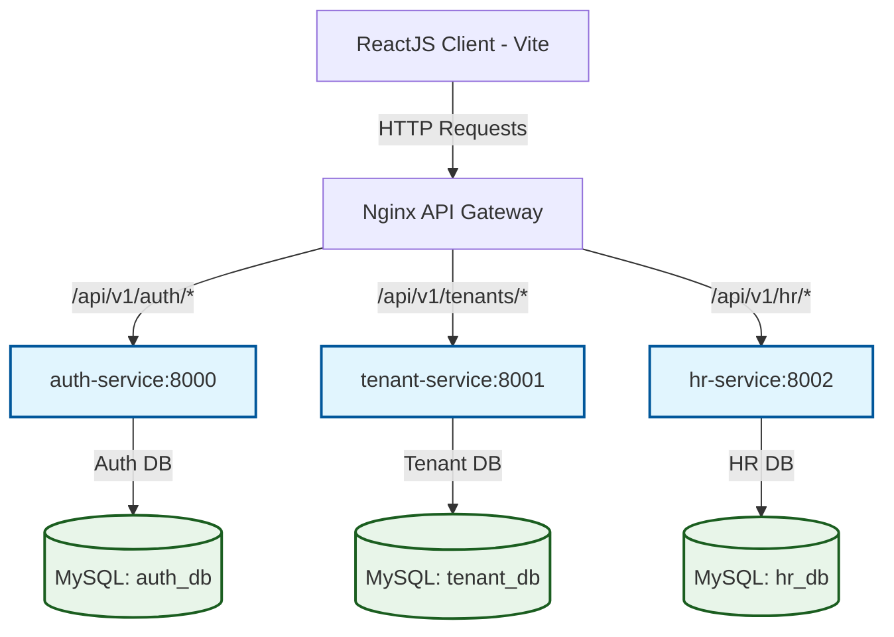
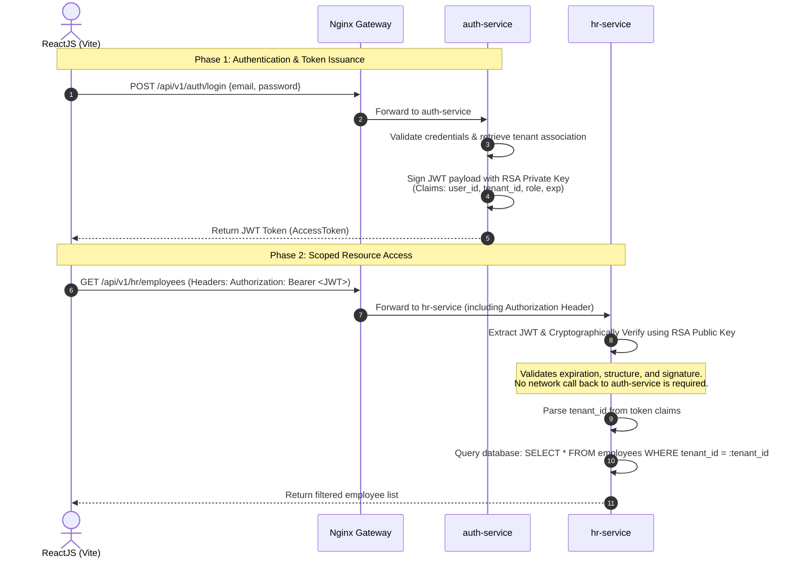
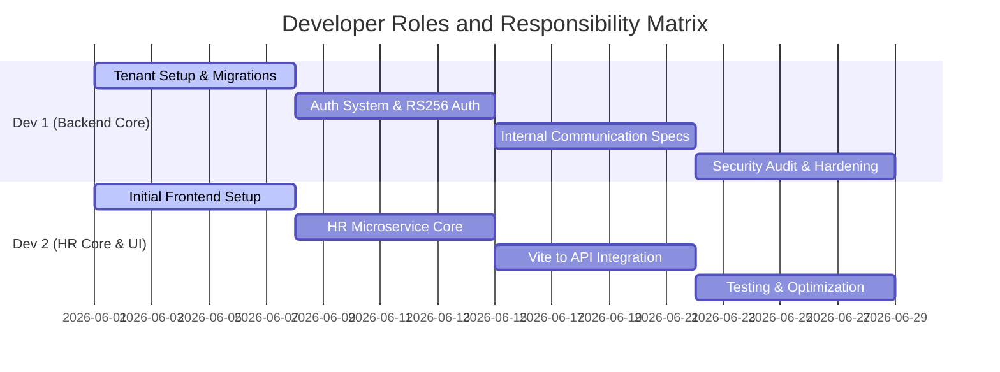

# SaaS-HR-Multi-tenant
Dự án SaaS HR Multi-tenant (Đa khách hàng). Hệ thống sử dụng kiến trúc Microservices.

# SaaS Multi-Tenant HR System: Architectural Blueprint & 4-Sprint Coding Plan

This document details the architecture, data models, integration contracts, deployment configurations, and a structured 4-week development roadmap for building a SaaS Multi-Tenant HR system.

---

## 1. System Architecture & Request Routing

The system employs a decentralized, microservices-based multi-tenant architecture. Client requests flow from the frontend through Nginx (which serves as an API Gateway), routing traffic to individual microservices backed by separate MySQL instances.



---

## 2. Stateless JWT Authentication Flow (Asymmetric Verification)

To avoid network bottlenecking and database latency, the microservices validate user tokens statelessly using **RS256 asymmetric signatures**. 

- **Private Key**: Kept exclusively by the `auth-service` to sign tokens.
- **Public Key**: Shared with `hr-service` and `tenant-service` (statically injected or fetched dynamically via a JWKS endpoint) to verify authenticity.



### JWT Claims Payload Example
```json
{
  "iss": "auth.saashr.internal",
  "sub": "usr_90a781b2-2e55-46cb-8d19-4824e8a1d744",
  "tenant_id": "tenant_44f12d8a-9a2c-47ea-bd3e-90ee9c5123d4",
  "role": "admin",
  "exp": 1782298800,
  "iat": 1782262800
}
```

---

## 3. Database Schema Design (Pool Model)

In a **Pool Model**, resources are shared, meaning multiple tenants share database tables. To ensure strict isolation, every table in `hr_db` is logically partitioned using a `tenant_id` column.

### Database 1: `tenant_db` (Tenant Management)
Manages subscription states, subdomains, and tenants.
```sql
CREATE TABLE tenants (
    id VARCHAR(36) PRIMARY KEY,
    name VARCHAR(100) NOT NULL,
    subdomain VARCHAR(50) UNIQUE NOT NULL,
    status ENUM('active', 'suspended', 'trial_expired') DEFAULT 'active',
    plan_tier ENUM('basic', 'pro', 'enterprise') DEFAULT 'basic',
    created_at TIMESTAMP DEFAULT CURRENT_TIMESTAMP,
    updated_at TIMESTAMP DEFAULT CURRENT_TIMESTAMP ON UPDATE CURRENT_TIMESTAMP
);
```

### Database 2: `auth_db` (Authentication & Mapping)
Manages credentials and mappings connecting users to specific tenants.
```sql
CREATE TABLE users (
    id VARCHAR(36) PRIMARY KEY,
    email VARCHAR(255) UNIQUE NOT NULL,
    password_hash VARCHAR(255) NOT NULL,
    status ENUM('active', 'inactive') DEFAULT 'active',
    created_at TIMESTAMP DEFAULT CURRENT_TIMESTAMP
);

CREATE TABLE user_tenants (
    id VARCHAR(36) PRIMARY KEY,
    user_id VARCHAR(36) NOT NULL,
    tenant_id VARCHAR(36) NOT NULL, -- Logical reference to tenant_db.tenants.id
    role ENUM('owner', 'admin', 'employee') DEFAULT 'employee',
    is_active BOOLEAN DEFAULT TRUE,
    FOREIGN KEY (user_id) REFERENCES users(id),
    UNIQUE KEY uq_user_tenant (user_id, tenant_id)
);
```

### Database 3: `hr_db` (HR Domain - Pool Model)
Stores employee records, structured to prevent cross-tenant queries.
```sql
CREATE TABLE departments (
    id VARCHAR(36) PRIMARY KEY,
    tenant_id VARCHAR(36) NOT NULL, -- Crucial discriminator for multi-tenancy
    name VARCHAR(100) NOT NULL,
    description TEXT,
    created_at TIMESTAMP DEFAULT CURRENT_TIMESTAMP,
    UNIQUE KEY uq_tenant_dept (tenant_id, name) -- Restricts uniqueness per tenant
);

CREATE TABLE employees (
    id VARCHAR(36) PRIMARY KEY,
    tenant_id VARCHAR(36) NOT NULL, -- Crucial discriminator for multi-tenancy
    first_name VARCHAR(100) NOT NULL,
    last_name VARCHAR(100) NOT NULL,
    email VARCHAR(255) NOT NULL,
    department_id VARCHAR(36),
    position VARCHAR(100) NOT NULL,
    status ENUM('active', 'on_leave', 'terminated') DEFAULT 'active',
    joined_date DATE NOT NULL,
    created_at TIMESTAMP DEFAULT CURRENT_TIMESTAMP,
    FOREIGN KEY (department_id) REFERENCES departments(id),
    UNIQUE KEY uq_tenant_email (tenant_id, email), -- Unique within tenant workspace
    INDEX idx_tenant_lookup (tenant_id) -- Heavy indexing on tenant_id for rapid retrieval filtering
);
```

---

## 4. API Contracts (JSON Interface Specs)

### 4.1. Login Authentication
- **Endpoint**: `POST /api/v1/auth/login`
- **Headers**:
  - `Content-Type: application/json`

#### Request Payload
```json
{
  "email": "admin@acme-corp.saashr.com",
  "password": "securepassword123",
  "subdomain": "acme-corp"
}
```

#### Response Payload (HTTP 200 OK)
```json
{
  "access_token": "eyJhbGciOiJSUzI1NiIsInR5cCI6IkpXVCJ9...",
  "token_type": "Bearer",
  "expires_in": 3600,
  "user": {
    "id": "usr_90a781b2-2e55-46cb-8d19-4824e8a1d744",
    "email": "admin@acme-corp.saashr.com",
    "name": "Jane Doe"
  },
  "tenant": {
    "id": "tenant_44f12d8a-9a2c-47ea-bd3e-90ee9c5123d4",
    "name": "Acme Corporation",
    "role": "admin"
  }
}
```

---

### 4.2. Fetch HR Employees
- **Endpoint**: `GET /api/v1/hr/employees`
- **Headers**:
  - `Authorization: Bearer <access_token>`
  - `Accept: application/json`
- **Query Parameters**:
  - `page` (optional, default: 1)
  - `size` (optional, default: 20)
  - `department_id` (optional)

#### Response Payload (HTTP 200 OK)
```json
{
  "items": [
    {
      "id": "emp_1a2b3c4d-5e6f-7g8h-9i0j-1k2l3m4n5o6p",
      "tenant_id": "tenant_44f12d8a-9a2c-47ea-bd3e-90ee9c5123d4",
      "first_name": "John",
      "last_name": "Smith",
      "email": "john.smith@acme-corp.com",
      "position": "Software Engineer",
      "department": {
        "id": "dept_3b4c5d6e-7f8a-9b0c-1d2e3f4a5b6c",
        "name": "Engineering"
      },
      "status": "active",
      "joined_date": "2024-03-15"
    }
  ],
  "total": 128,
  "page": 1,
  "size": 20,
  "pages": 7
}
```

---

## 5. Optimized Docker Configurations

### 5.1. FastAPI Production Dockerfile (Multistage Slim Build)
This Dockerfile uses a multistage build to compile dependencies (e.g., wheels requiring C extensions) in a build stage and copies them to a minimal final image, avoiding compiler tools in the production container.

```dockerfile
# Stage 1: Build dependencies
FROM python:3.11-slim AS builder

WORKDIR /app

ENV PYTHONDONTWRITEBYTECODE=1 \
    PYTHONUNBUFFERED=1

RUN apt-get update && apt-get install -y --no-install-recommends \
    build-essential \
    default-libmysqlclient-dev \
    pkg-config \
    && rm -rf /var/lib/apt/lists/*

COPY requirements.txt .
RUN pip install --no-cache-dir --user -r requirements.txt

# Stage 2: Production image
FROM python:3.11-slim AS runner

WORKDIR /app

# Install runtime database clients if needed
RUN apt-get update && apt-get install -y --no-install-recommends \
    default-libmysqlclient-dev \
    && rm -rf /var/lib/apt/lists/*

# Copy installed dependencies from builder
COPY --from=builder /root/.local /root/.local
COPY . .

ENV PATH=/root/.local/bin:$PATH \
    PYTHONDONTWRITEBYTECODE=1 \
    PYTHONUNBUFFERED=1

EXPOSE 8000

# Create and run as a non-privileged system user
RUN useradd -u 8888 appuser && chown -R appuser:appuser /app
USER appuser

CMD ["uvicorn", "main:app", "--host", "0.0.0.0", "--port", "8000", "--workers", "4"]
```

### 5.2. ReactJS Vite Production Dockerfile (Multistage Nginx Build)
This builds static client assets and serves them via Nginx Alpine, dropping node modules entirely from the runner stage.

```dockerfile
# Stage 1: Build React application
FROM node:20-alpine AS builder

WORKDIR /app

COPY package*.json ./
RUN npm ci

COPY . .
RUN npm run build

# Stage 2: Serve using Nginx
FROM nginx:1.25-alpine AS runner

# Remove default nginx static resources
RUN rm -rf /usr/share/nginx/html/*

# Copy build artifacts to nginx public folder
COPY --from=builder /app/dist /usr/share/nginx/html

# Copy custom Nginx configuration block
COPY nginx.conf /etc/nginx/conf.d/default.conf

EXPOSE 80

CMD ["nginx", "-g", "daemon off;"]
```

---

## 6. Developer Task Division



### Dev 1 (Auth & Tenant Specialist)
- **Primary Domain**: Business Logic of Tenants, User Authentication, Database schemas.
- **Deliverables**:
  1. `tenant-service` containing DB routing logic, provisioning, and subscription management.
  2. `auth-service` supporting secure user credentials validation, password hashing, and token distribution.
  3. RS256 private/public key generator tools and environment loading code.
  4. Database migration systems (using Alembic) for `tenant_db` and `auth_db`.
  5. Docker configurations for `auth-service` and `tenant-service`.

### Dev 2 (HR Feature & Frontend Lead)
- **Primary Domain**: HR Microservice APIs, client UI, integration with Nginx gateway routes.
- **Deliverables**:
  1. `hr-service` implementing standard CRUD operations, utilizing tenant query filters (`tenant_id`).
  2. JWT processing and validation middleware in `hr-service` using RSA public keys.
  3. Vite-based React setup (handling State Management, Axios configuration, Routing).
  4. Core frontend interfaces: Tenant Sign-in, Employee Dashboard, Profile Management.
  5. Docker configurations for `hr-service` and Vite app.

---

## 7. 4-Sprint Implementation Roadmap

### Sprint 1: Infrastructure, Architecture Base, & Gateway Setup
*Goal: Initialize workspace structures, base databases, and establish the API gateway.*

*   **Dev 1 Tasks**:
    *   Set up baseline directory layout for microservices and write database migration frameworks (Alembic).
    *   Construct the schema for `tenant_db` and write core APIs for the `tenant-service` (Create, Retrieve, Disable Tenant).
    *   Configure local MySQL instances inside a unified local environment structure.
*   **Dev 2 Tasks**:
    *   Bootstrap React Vite project, setting up the Tailwind CSS config, Axios, and router structures.
    *   Create base routing architecture (`/login`, `/dashboard`).
    *   Build dummy mock services for UI interactions.
*   **Network & Security Tasks (Support Roles)**:
    *   *Network*: Configure Nginx as the reverse proxy running locally (routing `/api/v1/auth` and `/api/v1/hr`).
    *   *Security*: Issue RSA development certificates, define the secret policies for configuration files.
*   **Deliverable milestone**: Nginx receives a request and accurately routes requests to mock backend endpoints.

### Sprint 2: Core Microservices & Database Integration
*Goal: Spin up active Python FastAPI backends and apply schemas.*

*   **Dev 1 Tasks**:
    *   Build `auth-service` supporting registration and database matching.
    *   Implement token issuance logic using RSA private key signing.
    *   Implement the `/login` endpoint (validating tenant matching and credentials).
*   **Dev 2 Tasks**:
    *   Build the `hr-service` along with the base database tables (`departments`, `employees`).
    *   Write middleware in `hr-service` that intercepts headers, validates tokens using the Public Key, and extracts the claims payload (`tenant_id`).
    *   Apply Global DB Filters in FastAPI dependencies to ensure `tenant_id` is automatically injected into queries.
*   **Network & Security Tasks**:
    *   *Security*: Code-review validation routines, verify password hashing mechanics (Argon2id/bcrypt).
*   **Deliverable milestone**: Database migrations run successfully. Direct CLI queries to services confirm tenant isolation.

### Sprint 3: End-to-End Integration & Tenant Routing
*Goal: Bind frontends to microservices through the Nginx gateway.*

*   **Dev 1 Tasks**:
    *   Expose endpoints in `tenant-service` that validation backends can use.
    *   Optimize backend startup sequencing (handling DB connectivity checks).
    *   Review multi-tenant performance behavior under concurrent users.
*   **Dev 2 Tasks**:
    *   Integrate API calls within React using Axios interceptors to append token signatures (`Bearer <token>`).
    *   Build subdomains routing parser in the React client to detect the tenant subdomain context dynamically.
    *   Create actual layouts for managing employees (List, Create, Update) interacting with `hr-service`.
*   **Network & Security Tasks**:
    *   *Network*: Setup CORS headers securely inside the Nginx configuration.
    *   *Security*: Verify cross-site request properties, sanitize client inputs.
*   **Deliverable milestone**: A user logs in via the UI, gets redirected to their specific workspace dashboard, and successfully fetches employee data.

### Sprint 4: Security Hardening, Container Optimization, & Verification
*Goal: Harden environments, compile production Docker assets, and run end-to-end user tests.*

*   **Dev 1 Tasks**:
    *   Develop the finalized `docker-compose.yml` linking all files, databases, and variables.
    *   Harden configuration scopes (restricting file permissions, locking database user permissions).
    *   Debug performance bottlenecks and optimize Python container startup structures.
*   **Dev 2 Tasks**:
    *   Optimizing Vite bundles and finalizing multi-stage React dockerization.
    *   Perform comprehensive error boundary validation in UI layouts.
    *   Create mock user scripts to run functional end-to-end integration workflows.
*   **Network & Security Tasks**:
    *   *Network*: Tune Nginx timeout parameters and configure proxy buffers.
    *   *Security*: Run container scans (e.g., Trivy) to detect package vulnerabilities and conduct vulnerability tests on database structures.
*   **Deliverable milestone**: Single command execution `docker-compose up -d --build` builds the entire stack securely. System passes end-to-end penetration and configuration checks.
