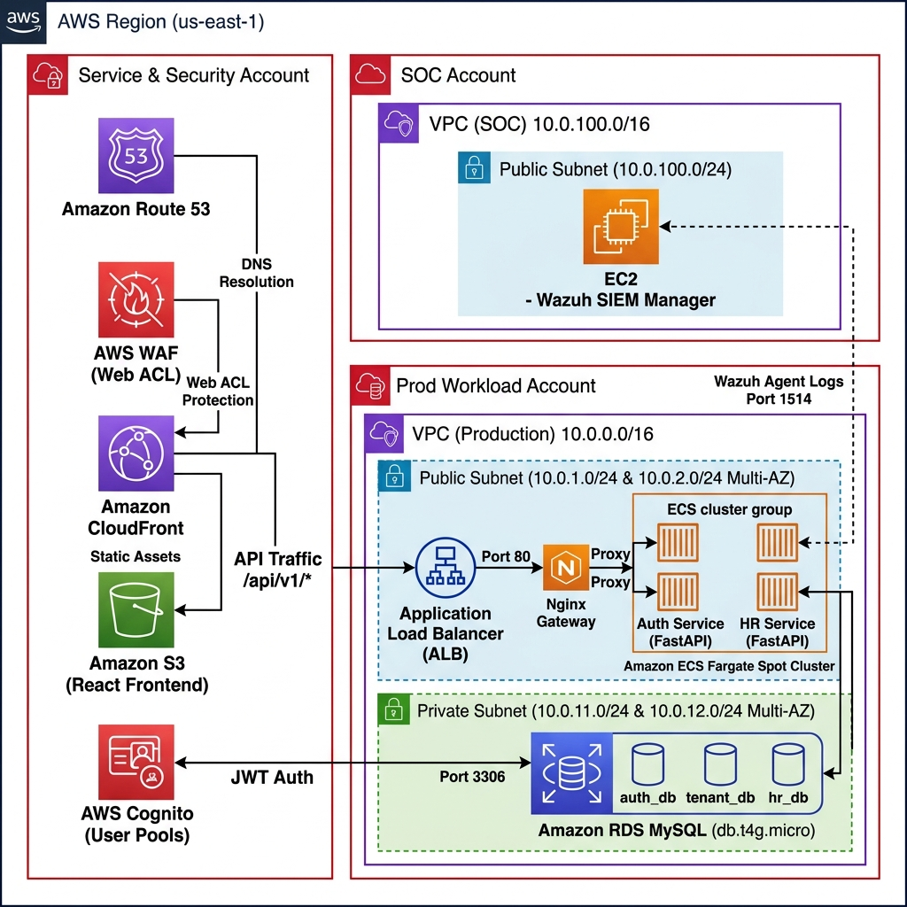

# Thiết Kế Kiến Trúc AWS & Kế Hoạch Tối Ưu Chi Phí Cực Hạn (FinOps)
**Dự án**: SaaS HR Multi-Tenant (FastAPI + ReactJS + Nginx Gateway)  
**Ngân sách mục tiêu**: $100 - $120 / Tháng (Mục tiêu đạt < $70 / Tháng)  
**Yêu cầu bảo mật**: Mạng Zero-Trust, AWS WAF, Wazuh SIEM/SOC, Tích hợp Cognito  
**Kiến trúc sư**: Đội ngũ AWS Cloud Architect & FinOps Expert  

---

## 1. Sơ Đồ Kiến Trúc Hệ Thống

Kiến trúc dưới đây sử dụng Amazon CloudFront để phân phối nội dung tại biên (Edge), AWS WAF để bảo vệ ứng dụng, Application Load Balancer (ALB) để điều hướng request, ECS Fargate Spot để điều phối container, RDS để quản lý cơ sở dữ liệu, và một máy chủ EC2 chuyên dụng cho Wazuh SOC Manager.



### Bảng Tổng Hợp Thành Phần Kiến Trúc

| Tầng | Dịch Vụ AWS | Vai Trò | Vị Trí Mạng |
|:-----|:-----------|:--------|:------------|
| **DNS** | Amazon Route 53 | Phân giải tên miền → CloudFront | Global (Edge) |
| **CDN & Bảo mật** | Amazon CloudFront + AWS WAF | Cache tại biên, chống DDoS, lọc Web ACL | Global (Edge) |
| **Hosting tĩnh** | Amazon S3 | Phục vụ bản build React frontend | Global |
| **Xác thực** | AWS Cognito (User Pools) | Quản lý xác thực người dùng, phát hành JWT token | Regional |
| **Cân bằng tải** | Application Load Balancer (ALB) | Điều hướng theo đường dẫn `/api/v1/*` đến ECS target groups | Public Subnet (Multi-AZ) |
| **Tính toán** | Amazon ECS Fargate Spot (4 Tasks) | Nginx Gateway + 3 microservices FastAPI | Public Subnet (Multi-AZ) |
| **Cơ sở dữ liệu** | Amazon RDS MySQL (db.t4g.micro) | 1 instance chứa 3 database: `auth_db`, `tenant_db`, `hr_db` | Private Subnet (Multi-AZ) |
| **Giám sát SIEM/SOC** | EC2 t3.small (Wazuh Manager) | Trung tâm giám sát an ninh & phân tích log tập trung | Public Subnet (SOC VPC) |

---

## 2. Bảng Ước Tính Chi Phí Hàng Tháng (FinOps)

Bảng tính dưới đây so sánh giữa triển khai AWS tiêu chuẩn và phiên bản **Tối Ưu Chi Phí Cực Hạn** của chúng tôi. Giá ước tính cho vùng `us-east-1` (N. Virginia).

| Dịch Vụ AWS | Cấu Hình Chi Tiết | Chi Phí Tiêu Chuẩn (24/7) | Chi Phí Tối Ưu | Chiến Lược Tối Ưu |
| :--- | :--- | :---: | :---: | :--- |
| **AWS WAF** | 1 Web ACL, 3 Managed Rules (Core, SQLi, IP Rep) | $8.60 | **$8.60** | Gắn vào CloudFront để bảo vệ biên và ALB. |
| **CloudFront & S3** | 100 GB Data Transfer Out, S3 Storage (React App) | $9.50 | **$0.50** | S3 Static Hosting, CloudFront Free Tier (1TB miễn phí/tháng). |
| **AWS ALB** | 1 Load Balancer, 1 LCU | $22.27 | **$22.27** | Thiết yếu cho điều hướng path-based target groups. |
| **ECS Fargate** | 4 Tasks (0.25 vCPU, 0.5 GB RAM mỗi task) | $32.40 | **$9.72** | **Fargate Spot** (tiết kiệm 70% so với On-Demand). |
| **RDS MySQL** | 1 Instance db.t4g.micro (2 vCPU, 1GB RAM) + 20GB gp3 | $13.98 | **$5.70** | **Lập lịch tự động tắt** (chạy 10h/ngày, Thứ 2 - Thứ 6). |
| **EC2 (Wazuh)** | 1 Instance t3.small (2 vCPU, 2GB RAM) + 30GB gp3 | $17.58 | **$6.20** | **EC2 Spot Instance** + Tự động tắt ngoài giờ test. |
| **AWS Cognito** | Cognito User Pools (Xác thực & Đăng ký) | $0.00 | **$0.00** | **Free Tier** hỗ trợ đến 50.000 người dùng hoạt động/tháng. |
| **NAT Gateway** | 1 NAT Gateway (Yêu cầu VPC tiêu chuẩn) | $32.85 | **$0.00** | **Thiết kế VPC không cần NAT** (ECS chạy trong public subnets). |
| **Data Transfer/CloudWatch** | Logs, băng thông liên AZ | $10.00 | **$3.00** | Luân chuyển log & giữ lại tối đa 7 ngày. |
| **Tổng / Tháng** | | **$147.18** | **$56.99** | **Tổng tiết kiệm: ~61% ($90.19 tiết kiệm/tháng)** |

> [!NOTE]  
> Tổng chi phí **$56.99/tháng** nằm rất sâu dưới mức trần ngân sách **$100-$120** của nhóm. Điều này cung cấp cho nhóm bộ đệm $40-$60 cho các đợt tăng lưu lượng, mở rộng database, hoặc bổ sung thêm instance test.

---

## 3. Các Chiến Lược FinOps Cốt Lõi Để Ép Giá

### Chiến lược 1: Fargate Spot cho khối lượng công việc Container (Tiết kiệm 70%)
*   **Hành động**: Cấu hình ECS Service sử dụng `FARGATE_SPOT` thay vì `FARGATE` cho chiến lược đặt task.
*   **Lý do**: Fargate Spot tận dụng tài nguyên dư thừa của AWS với mức giảm 70%. Vì các microservice backend của chúng ta là **stateless** (trạng thái được lưu trong RDS), khi AWS thu hồi tài nguyên Spot (thông báo trước 2 phút), ECS sẽ tự động khởi tạo task thay thế trên node Spot khác mà không làm gián đoạn ứng dụng.

### Chiến lược 2: Lập lịch tự động tắt/bật RDS & Wazuh (Tiết kiệm 60%)
*   **Hành động**: Triển khai AWS Systems Manager (SSM) automation hoặc hàm Lambda đơn giản để tự động **tắt** RDS MySQL và EC2 Wazuh Manager lúc **20:00** và **bật** lại lúc **08:00** (Thứ 2 đến Thứ 6), giữ **tắt hoàn toàn** vào cuối tuần.
*   **Lý do**: Việc phát triển và kiểm thử tại trường/công ty diễn ra trong giờ hành chính. Tắt các instance ngoài giờ và cuối tuần giúp giảm thời gian tính phí từ 730 giờ xuống còn ~200 giờ/tháng.

### Chiến lược 3: Kiến trúc VPC "Không cần NAT" (Tiết kiệm $32.85/tháng)
*   **Hành động**: Chạy ECS Fargate tasks trong **Public Subnets** nhưng gán Security Group **chặn toàn bộ kết nối trực tiếp từ internet vào**. Các task sử dụng Internet Gateway để kết nối ra ngoài (tải thư viện Python, gọi Cognito, ECR, v.v.) **miễn phí**, loại bỏ hoàn toàn nhu cầu mua dịch vụ NAT Gateway ($32.85/tháng).
*   **Lý do**: NAT Gateway tính phí $0.045/giờ chỉ để tồn tại. Loại bỏ nó là biện pháp tiết kiệm kiến trúc lớn nhất cho các nhóm nhỏ trên AWS. An ninh Zero-Trust được duy trì nghiêm ngặt thông qua các quy tắc Security Group.

### Chiến lược 4: Gộp cơ sở dữ liệu đa doanh nghiệp (Multi-Tenant Database)
*   **Hành động**: Sử dụng duy nhất 1 instance RDS `db.t4g.micro` nhưng khởi tạo 3 database riêng biệt bên trong (`auth_db`, `tenant_db`, và `hr_db`).
*   **Lý do**: Tránh triển khai 3 instance RDS độc lập cho 3 microservice. Một instance `db.t4g.micro` duy nhất có đủ CPU/RAM cho kiểm thử và khối lượng công việc nhỏ, đồng thời việc phân tách dữ liệu logic bên trong 1 MySQL cluster giữ nguyên mô hình database-per-service mà không phải chịu chi phí gấp 3 lần.

---

## 4. Thiết Kế Mạng VPC & Phân Vùng Subnet

Để duy trì tính sẵn sàng cao (High Availability) và bảo mật, chúng tôi phân đoạn VPC (`10.0.0.0/16`) trên 2 Vùng Khả dụng (Availability Zone - AZ):

```
Khối CIDR VPC: 10.0.0.0/16
├── Vùng Khả dụng A (us-east-1a)
│   ├── Public Subnet A  (10.0.1.0/24)  --> Chứa ALB, ECS Tasks (AZ-A), Wazuh EC2
│   └── Private Subnet A (10.0.11.0/24) --> Chứa RDS MySQL (Instance chính)
└── Vùng Khả dụng B (us-east-1b)
    ├── Public Subnet B  (10.0.2.0/24)  --> Chứa ALB, ECS Tasks (AZ-B)
    └── Private Subnet B (10.0.12.0/24) --> Chứa RDS Standby (Tùy chọn/Tắt để tiết kiệm)
```

*   **Public Subnets (10.0.1.0/24 & 10.0.2.0/24)**:
    *   **ALB**: Phải đặt trong public subnets để nhận lưu lượng từ CloudFront.
    *   **ECS Fargate Tasks**: Triển khai tại đây để tận dụng Internet Gateway cho các cuộc gọi ra ngoài miễn phí (tránh chi phí NAT Gateway).
    *   **EC2 Wazuh Manager**: Triển khai trong Public Subnet A.
*   **Private Subnets (10.0.11.0/24 & 10.0.12.0/24)**:
    *   **RDS MySQL**: Được cách ly nghiêm ngặt. Không có lưu lượng internet nào có thể truy cập vào các subnet này. Database chỉ giao tiếp với địa chỉ IP nội bộ của các Fargate tasks trong public subnets.

---

## 5. Cấu Hình Security Groups: Quy Tắc Mạng Zero-Trust

Lưu lượng được kiểm soát chặt chẽ bằng các Security Group có trạng thái (Stateful SGs). **Không có thành phần nào chấp nhận kết nối trừ khi được cho phép rõ ràng.**

```
       [ Internet / CloudFront ]
                  │ (HTTPS)
                  ▼
         [ sg-alb-gateway ]
                  │ (Chỉ Port 80/443)
                  ▼
         [ sg-ecs-fargate ]
           │              │
           │ (Port 3306)  │ (Port 1514/1515)
           ▼              ▼
     [ sg-rds-db ]   [ sg-wazuh-soc ]
```

### 1. Security Group cho ALB (`sg-alb-gateway`)
*   **Ingress (Chiều vào)**:
    *   Cho phép TCP Port `443` và `80` từ `Anywhere (0.0.0.0/0)` (Hoặc giới hạn chỉ dải IP CloudFront bằng AWS managed prefix lists để bảo vệ tối đa).
*   **Egress (Chiều ra)**:
    *   Cho phép TCP Port `80/443` đến `sg-ecs-fargate` (phạm vi IP nội bộ của ECS tasks).

### 2. Security Group cho ECS Fargate (`sg-ecs-fargate`)
*   **Ingress (Chiều vào)**:
    *   Cho phép TCP Port `80` (hoặc port container đích) **CHỈ TỪ** nguồn `sg-alb-gateway`. *Điều này chặn mọi người trên internet kết nối trực tiếp đến container, dù chúng có IP công khai.*
*   **Egress (Chiều ra)**:
    *   Cho phép TCP Port `3306` đến `sg-rds-db`.
    *   Cho phép TCP Port `1514` (Đăng ký Wazuh Agent) và `1515` (Gửi log Wazuh Agent) đến `sg-wazuh-soc`.
    *   Cho phép TCP Port `443` đến `Anywhere (0.0.0.0/0)` (để tải thư viện, kéo image ECR, và kết nối AWS Cognito).

### 3. Security Group cho RDS (`sg-rds-db`)
*   **Ingress (Chiều vào)**:
    *   Cho phép TCP Port `3306` (MySQL) **CHỈ TỪ** nguồn `sg-ecs-fargate`. *Truy cập trực tiếp từ internet hoặc các tài nguyên khác vào database là hoàn toàn không thể.*
*   **Egress (Chiều ra)**:
    *   Từ chối toàn bộ lưu lượng ra ngoài (database không có lý do nào để kết nối ra internet).

### 4. Security Group cho Wazuh SOC (`sg-wazuh-soc`)
*   **Ingress (Chiều vào)**:
    *   Cho phép TCP Port `1514` và `1515` từ `sg-ecs-fargate` (Wazuh Agents chạy bên trong FastAPI/Nginx).
    *   Cho phép TCP Port `443` (Giao diện Wazuh Dashboard) **CHỈ TỪ** dải IP tĩnh cụ thể của nhóm bạn.
*   **Egress (Chiều ra)**:
    *   Cho phép TCP Port `443` đến `Anywhere` (để cập nhật bộ quy tắc/rulesets của Wazuh).

---

## 6. Điểm Nổi Bật Của Kiến Trúc Microservices Kết Hợp AWS

*   **Khả năng mở rộng phi trạng thái (Stateless Scaling)**: Bằng cách tách biệt trạng thái vào Cognito (Xác thực) và RDS (Dữ liệu), các container Fargate backend có thể được kiểm thử, hủy bỏ, và khởi động lại tức thì trên các AZ khác nhau sử dụng tài nguyên Spot giá rẻ.
*   **Điều hướng động tại biên (Dynamic Edge Routing)**: CloudFront và ALB đóng vai trò cổng điều hướng. Trang React frontend được phục vụ trực tiếp từ S3 Bucket tại biên, trong khi các cuộc gọi API `/api/v1/auth`, `/api/v1/tenants`, và `/api/v1/hr` được điều hướng động đến các target groups ECS tương ứng.
*   **Kiểm toán SOC (SOC Auditing)**: Wazuh agents được nhúng trong các Fargate tasks liên tục truyền log bảo mật (đăng nhập thất bại, thay đổi container, truy vấn SQL) đến EC2 Wazuh Manager theo thời gian thực, chứng minh sự sẵn sàng tuân thủ doanh nghiệp (SOC2/ISO27001) dưới ngân sách khởi nghiệp.
