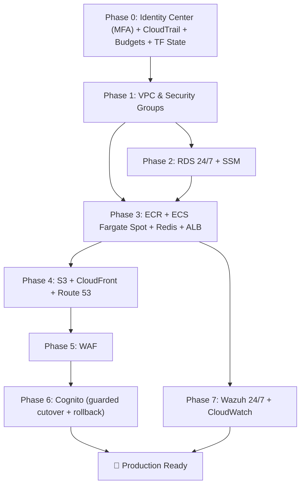

# AWS Integration Plan — SaaS HR Multi-Tenant

Migrate the current Docker Compose local development setup to the production AWS architecture described in [aws_architecture_design.md](aws_architecture_design.md).

> **Region: `ap-southeast-1` (Singapore)** · **IaC: Terraform** · **No CI/CD (manual / script-based)** · **Team identity: IAM Identity Center** · **App identity: AWS Cognito** · **Secrets: SSM Parameter Store (free, no rotation)** · **RDS: 24/7** · **Budget ceiling: $120–$150/mo** (realistic ~$70–$95/mo)

---

## 1. Finalized Decisions (Locked 2026-06-12)

| # | Topic | Decision | Rationale |
|:--|:--|:--|:--|
| 1 | **Deployment Region** | `ap-southeast-1` (Singapore) | End users are in **Vietnam only** → lowest API latency. AZs: `ap-southeast-1a`, `ap-southeast-1b`. |
| 2 | **Region exceptions** | `us-east-1` for **2 global resources only** | (a) **ACM cert for CloudFront**; (b) **WAF Web ACL, `CLOUDFRONT` scope**. Both run at the edge near Vietnam; `us-east-1` is only the control-plane home. |
| 3 | **TLS Certificates** | **2 certificates** | Cert #1 `us-east-1` (CloudFront viewer); Cert #2 (optional) `ap-southeast-1` (ALB). Both free via ACM, DNS-validated through Route 53. |
| 4 | **IaC Tooling** | **Terraform** (OpenTofu-compatible) | Readable HCL, explicit remote state + locking for the 2-dev team, `plan` dry-run safety. |
| 5 | **DNS & Domain** | **Amazon Route 53 only** — no GoDaddy | Register domain directly in Route 53; native ALIAS to CloudFront, automatic ACM DNS validation. |
| 6 | **CI/CD Pipeline** | ❌ **Not used** | Manual / script-based via `scripts/` + `terraform apply`. No GitHub Actions / CodePipeline. |
| 7 | **Team Access** | **IAM Identity Center** (2 users, **MFA enforced**) | Short-lived SSO creds, `AdministratorAccess` permission set. Root locked + MFA. |
| 8 | **Redis (Pub/Sub)** | **Dedicated Redis ECS service via Cloud Map**, on **Fargate Spot** | Non-critical eventually-consistent broker. Shared standalone service (NOT sidecar) at `redis.saashr.local:6379`. ~$3/mo vs ~$14/mo ElastiCache. |
| 9 | **Nginx API Gateway** | ❌ **Removed** | ALB does path routing. **Verified**: all 3 FastAPI services self-generate `X-Correlation-ID` when the header is absent (`main.py`), so no trace loss. |
| 10 | **App Identity Provider** | ✅ **AWS Cognito** (own phase + rollback) | Cognito = source of truth for **authentication**. DB `user_tenants` = source of truth for **tenant membership/role**. `users.password_hash` is **deprecated**, dropped only **after** verified cutover (see Phase 6 rollback). |
| 11 | **Secret storage** | **SSM Parameter Store `SecureString`** (free) — **no Secrets Manager, no rotation** | DB password generated **once** and kept static; JWT keys (transitional) stored here too. In-RAM cache works perfectly with a static value. Don't pay for a rotation feature we disabled. |
| 12 | **RDS uptime** | **24/7** — **auto-stop scheduler removed** | Reliability and operational simplicity beat ~$6/mo. No EventBridge/Lambda to maintain, no morning "failed-to-start = app down" risk, no 7-day auto-restart trap. |
| 13 | **SOC / Wazuh** | **Runs 24/7, single VPC**; claim reframed | A SIEM that auto-stops is not a SIEM, so Wazuh runs 24/7. It lives in the **same VPC** (valid SG-to-SG rules). **Positioned as a "SIEM/log-aggregation demonstration", NOT a SOC2/ISO27001-certified control.** |
| 14 | **Cost guardrail** | **AWS Budgets alert at $100** | The single most important FinOps control; email at 80% / 100% / forecasted. Free. |

---

## 2. Current State → Target Mapping

| Component | Current Implementation | Target AWS Service (`ap-southeast-1` unless noted) |
|:--|:--|:--|
| API Gateway | Nginx container (`api-gateway/`) | **ALB** (path-based routing) — *Nginx removed* |
| Auth / Tenant / HR Service | FastAPI on 8000 / 8001 / 8002 | 3 × ECS **Fargate Spot** tasks |
| Message Broker | Redis container | **Dedicated Redis ECS service** (Fargate Spot) + **Cloud Map** |
| Frontend | Vite React → Nginx container | **S3** (private, OAC) + **CloudFront** |
| Database | MySQL 8.0 container (3 schemas) | **RDS MySQL** `db.t4g.micro` (Single-AZ, **24/7**, 7-day backups) |
| App Identity | Custom RS256 JWT (`security.py`) | **AWS Cognito User Pools** (Phase 6) — DB keeps tenant/role mapping |
| Secrets | `.env` / compose vars | **SSM Parameter Store `SecureString`** (static, free) |
| Edge security | None | **AWS WAF** (`CLOUDFRONT` scope, `us-east-1`) |
| Security/SOC | None | **Wazuh** on EC2 `t3.small` Spot, **24/7**, same VPC |
| DNS / Domain | localhost | **Route 53** (domain registered in Route 53) |
| Team access | — | **IAM Identity Center** (2 users, MFA) |
| Audit | — | **CloudTrail** trail with log-file validation |
| Cost control | — | **AWS Budgets** $100 alert |

---

## 3. Phase 0 — Account, Team Access, Audit & Terraform Backend (Prerequisite)

> One-time foundation. Do this **before** any `infra/` resource.

### 3.1 Lock down the root account
1. Sign in as **root** → enable **MFA**.
2. **Delete any root access keys**.
3. Store the root password in a password manager; stop using root.

### 3.2 IAM Identity Center (2 developers, MFA enforced)
1. Console → **IAM Identity Center** → **Enable**.
2. **Settings → Authentication → Multi-factor authentication**: set MFA to **"Require"** (every sign-in), allow authenticator apps / security keys.
3. **Users** → create 2 users (Dev A, Dev B).
4. **Permission sets** → `AdminAccess` (`AdministratorAccess`, 8h session).
5. **AWS accounts** → assign **both** users the `AdminAccess` set.
6. Each dev: `aws configure sso` once, then `aws sso login --profile saashr` daily.

### 3.3 Audit trail (CloudTrail)
- Create a **CloudTrail trail** (`infra/cloudtrail.tf`) for management events, delivering to a dedicated S3 bucket, with **`enable_log_file_validation = true`**. (Console "Event history" alone is not a durable, tamper-evident trail.)

### 3.4 Cost guardrail (AWS Budgets)
- `infra/budgets.tf`: an **AWS Budgets** monthly cost budget of **$100** with notifications at **80% actual**, **100% actual**, and **100% forecasted**, emailed to both developers. Free.

### 3.5 Terraform remote state (the real "don't block each other" mechanism)
1. Create **one S3 bucket** (versioning + encryption ON) in `ap-southeast-1`, e.g. `saashr-tfstate-<account-id>`, via `infra/bootstrap/`.
2. Configure the backend with the **native S3 lockfile** (Terraform ≥ 1.10 — no DynamoDB table):
   ```hcl
   # infra/providers.tf
   terraform {
     required_version = ">= 1.10"
     backend "s3" {
       bucket       = "saashr-tfstate-<account-id>"
       key          = "global/saashr.tfstate"
       region       = "ap-southeast-1"
       encrypt      = true
       use_lockfile = true            # native S3 state locking
     }
   }
   provider "aws" {                   # default — Singapore (~95% of resources)
     region = "ap-southeast-1"
   }
   provider "aws" {                   # alias — N. Virginia, ONLY for CloudFront cert + WAF
     alias  = "us_east_1"
     region = "us-east-1"
   }
   ```
3. **Working rule:** always `terraform plan` first; announce before `apply`; the lock serialises concurrent applies. Optional: split state by layer (`network`/`data`/`compute`).

---

## 4. Build Phases

### Phase 1: Foundation (VPC, Networking, Security Groups)

#### [NEW] `infra/vpc.tf`
- VPC `10.0.0.0/16` in `ap-southeast-1`, **single VPC for everything (app + SOC)** — keeps SG-to-SG references valid
- Public Subnet A `10.0.1.0/24` (`ap-southeast-1a`) — ALB, ECS tasks
- Public Subnet B `10.0.2.0/24` (`ap-southeast-1b`) — ALB, ECS tasks
- **Public Subnet SOC `10.0.3.0/24`** (`ap-southeast-1a`) — Wazuh EC2 *(same VPC, not a separate VPC/account)*
- Private Subnet A `10.0.11.0/24` + Private Subnet B `10.0.12.0/24` — RDS
- Internet Gateway (**no NAT** — NAT-less design). **Note:** ECS tasks set `assignPublicIp = ENABLED` so they can pull from ECR over the IGW.
- Route tables: public → IGW, private → local only

#### [NEW] `infra/security_groups.tf` (all in one VPC → SG references work)
- `sg-alb-gateway`: Ingress 80/443 from `0.0.0.0/0`; Egress to `sg-ecs-fargate`
- `sg-ecs-fargate`: Ingress 80 from `sg-alb-gateway` only; Egress 3306 to `sg-rds-db`, 6379 within `sg-ecs-fargate` (Redis), 1514/1515 to `sg-wazuh-soc`, 443 to `0.0.0.0/0`
- `sg-rds-db`: Ingress 3306 from `sg-ecs-fargate` only, no egress
- `sg-wazuh-soc`: Ingress 1514/1515 from `sg-ecs-fargate`, 443 (dashboard) from team IPs only

#### [NEW] `infra/variables.tf` — region, CIDRs, team IP allowlist, env tag, domain

---

### Phase 2: Data Layer (RDS 24/7 + SSM Parameter Store)

#### [NEW] `infra/rds.tf`
- RDS MySQL 8.0 on `db.t4g.micro` (Graviton) in private subnets, **running 24/7**
- DB Subnet Group across Private A + B; Single-AZ (Multi-AZ standby disabled for cost)
- 20 GB `gp3`; Parameter group `character_set_server=utf8mb4`; attach `sg-rds-db`
- **`backup_retention_period = 7`** (daily automated snapshots), `copy_tags_to_snapshot = true`
- `deletion_protection = false` + `skip_final_snapshot = true` for the demo *(flip both for production)*
- **No auto-stop scheduler** (Decision #12)

#### [NEW] `infra/params.tf` — SSM Parameter Store (replaces Secrets Manager)
- `/saashr/db/password` (`SecureString`) — generated **once** via Terraform `random_password`, then **static**
- `/saashr/db/url`, `/saashr/jwt/private_key`, `/saashr/jwt/public_key` (`SecureString`, transitional until Cognito cutover)
- **Free**, KMS-encrypted, **no rotation**. The app reads each parameter **once at startup** and caches it for the process lifetime.

#### [MODIFY] `database/init.sql` — unchanged; run once to create `auth_db`, `tenant_db`, `hr_db`
#### [NEW] `scripts/rds_init.sh` — connect to RDS via **SSM Session Manager** (no public bastion) and run `init.sql`

##### Application Config Changes
- [MODIFY] `auth/tenant/hr` `app/core/config.py` — fetch DB params from **SSM** when `AWS_SSM_PREFIX` is set; fall back to env vars for local dev
- [NEW] `microservices/shared/aws_params.py` — shared `boto3 ssm:GetParameter` fetch + **in-memory cache** (static value → cache never goes stale)

---

### Phase 3: Compute (ECR + ECS Fargate Spot + Redis + ALB)

#### [NEW] `infra/ecr.tf` — **3 repos**: `saashr-auth`, `saashr-tenant`, `saashr-hr` (no gateway). Lifecycle: keep last 5, expire untagged after 1 day.

#### [NEW] `infra/ecs.tf` — ECS Cluster, **Fargate Spot** capacity provider (`FARGATE_SPOT` w=4, `FARGATE` w=1 fallback), **Cloud Map** namespace `saashr.local`.

#### [NEW] `infra/ecs_tasks.tf` — **4 tasks** (0.25 vCPU / 0.5 GB):
1. `saashr-auth`, 2. `saashr-tenant`, 3. `saashr-hr`
4. `saashr-redis` — `redis:alpine`, registered as `redis.saashr.local:6379`, **no persistence**, **no auth** (reachable only inside `sg-ecs-fargate`)
- `tenant`/`hr` set `REDIS_URL=redis://redis.saashr.local:6379/0`
- Execution role: ECR pull, CloudWatch Logs, **`ssm:GetParameter` + KMS decrypt**
- `assignPublicIp = ENABLED`; logs → `/ecs/saashr/`

#### [NEW] `infra/alb.tf` — ALB in public subnets; path routing `/api/v1/{auth,tenants,hr}/*` → service target groups; health `/api/v1/{service}/health`; optional HTTPS listener using ACM cert #2 (`ap-southeast-1`).

#### [MODIFY] Dockerfiles (3 services) — add `boto3`; keep `python:3.11-slim`.

---

### Phase 4: Frontend + DNS (S3 + CloudFront + Route 53)

#### [NEW] `infra/s3_frontend.tf` — private bucket `saashr-frontend-{account-id}`, block public access, CloudFront **OAC**-only.
#### [NEW] `infra/cloudfront.tf` — two origins: S3 (default, React SPA) + ALB (`/api/v1/*`); OAC; SPA error mapping 403/404 → `/index.html`(200); **viewer cert = ACM cert #1 via `provider = aws.us_east_1`**.
#### [NEW] `infra/route53.tf` — register domain in Route 53 → hosted zone; **A/ALIAS** `app.<domain>` → CloudFront; ACM DNS-validation records auto-created.
#### [NEW] `scripts/deploy_frontend.sh` — `npm run build` → `aws s3 sync dist/ --delete` → `aws cloudfront create-invalidation`.
#### [MODIFY] `frontend/vite.config.js` + [NEW] `frontend/.env.production` — `VITE_API_BASE_URL=` (relative; CloudFront proxies `/api/v1/*`).

---

### Phase 5: Edge Security (WAF)

#### [NEW] `infra/waf.tf`
- WAF v2 Web ACL, **`CLOUDFRONT` scope → `provider = aws.us_east_1`** (global; rules execute at edge near Vietnam), attached to the CloudFront distribution
- Managed rule groups: `AWSManagedRulesCommonRuleSet`, `AWSManagedRulesSQLiRuleSet`, `AWSManagedRulesAmazonIpReputationList`
- Rate-limit rule: 2000 req / 5 min per IP

---

### Phase 6: Identity Migration — Cognito (own phase, with rollback)

> Highest-risk change in the project: it touches all 3 services' token validation, the login flow, the frontend, and a user migration. Treat it as a guarded cutover, not a bullet point.

#### Decision (resolves Cognito vs `password_hash`)
- **Cognito = source of truth for authentication** (credentials, sign-in, MFA, JWT issuance).
- **DB `user_tenants` = source of truth for tenant membership + role.**
- Cognito token carries `custom:tenant_id` (active tenant) + group → role.
- `auth_db.users.password_hash` is **deprecated**; it is **NOT dropped** until after a verified production cutover.

#### [NEW] `infra/cognito.tf`
- User Pool (email sign-up/sign-in, password policy, optional MFA), App Client for React (auth-code flow + Hosted UI / Amplify), groups `owner`/`admin`/`employee`, custom attribute `custom:tenant_id`. Cognito exposes a **JWKS** endpoint for public-key validation.

#### [MODIFY] Service code — behind a feature flag
- Add env flag **`AUTH_PROVIDER=cognito|local`** to all 3 services.
- `auth-service/app/core/security.py`: when `cognito`, validate tokens against the **Cognito JWKS**; login via `InitiateAuth`. When `local`, keep the existing RS256 + `password_hash` path.
- `tenant`/`hr`: point JWT public-key source at the Cognito **JWKS URL** when `cognito`.

#### [NEW] `scripts/migrate_users_cognito.sh` — one-time import of seed users (`AdminCreateUser`), set `custom:tenant_id`, force password reset on first login.

#### Rollback plan
1. Deploy with `AUTH_PROVIDER=local` first; confirm app healthy.
2. Flip to `AUTH_PROVIDER=cognito`; verify login + tenant isolation end-to-end.
3. **If anything fails, flip the flag back to `local`** (`force-new-deployment`) — instant revert, `password_hash` still present.
4. Only after the Cognito path is verified in production for a few days → drop `password_hash` in a separate cleanup commit.

---

### Phase 7: Observability & SOC (Wazuh 24/7 + CloudWatch)

#### [NEW] `infra/wazuh_ec2.tf`
- EC2 `t3.small` **Spot** in **Public Subnet SOC (`10.0.3.0/24`, same VPC)**, Wazuh Manager via user-data, 30 GB `gp3`, `sg-wazuh-soc`, **runs 24/7** (no auto-stop)
- **Honest framing:** this is a **SIEM/log-aggregation demonstration**, not a certified SOC2/ISO27001 control. On Spot it can still be reclaimed (brief gap); use on-demand if you need true continuity.

#### [NEW] `infra/cloudwatch.tf`
- Log groups `/ecs/saashr/{auth,tenant,hr,redis}`, retention **7 days**
- Alarms: ECS running task count < desired, RDS CPU > 80%, ALB 5xx rate > 5%

#### [MODIFY] Dockerfiles (3 services) — install Wazuh agent, report to Wazuh Manager private IP on 1514/1515.

---

## 5. New Directory Structure

```text
SaaS-HR-Multi-tenant/
├── infra/
│   ├── bootstrap/                  # one-time: tfstate S3 bucket
│   │   └── main.tf
│   ├── providers.tf                # default ap-southeast-1 + aws.us_east_1 alias + S3 backend
│   ├── variables.tf
│   ├── outputs.tf
│   ├── cloudtrail.tf               # [NEW] audit trail + log-file validation
│   ├── budgets.tf                  # [NEW] AWS Budgets $100 alert
│   ├── vpc.tf                      # single VPC: app + SOC subnets
│   ├── security_groups.tf
│   ├── rds.tf                      # 24/7 + 7-day backups (no scheduler)
│   ├── params.tf                   # SSM Parameter Store SecureString (no Secrets Manager)
│   ├── ecr.tf
│   ├── ecs.tf                      # cluster + Cloud Map
│   ├── ecs_tasks.tf                # auth, tenant, hr, redis
│   ├── alb.tf
│   ├── s3_frontend.tf
│   ├── cloudfront.tf               # viewer cert via aws.us_east_1
│   ├── route53.tf
│   ├── waf.tf                      # CLOUDFRONT scope via aws.us_east_1
│   ├── cognito.tf                  # Phase 6 — IdP
│   ├── wazuh_ec2.tf                # 24/7, same VPC
│   └── cloudwatch.tf
│   # NOTE: no scheduler.tf, no secrets.tf — removed by Decisions #11 & #12
│
├── scripts/
│   ├── push_ecr.sh
│   ├── deploy_frontend.sh
│   ├── rds_init.sh
│   └── migrate_users_cognito.sh
│
├── microservices/
│   ├── shared/
│   │   └── aws_params.py           # [NEW] SSM fetch + in-memory cache
│   ├── auth-service/               # (config.py, security.py AUTH_PROVIDER flag, requirements.txt)
│   ├── tenant-service/             # (config.py, requirements.txt)
│   └── hr-service/                 # (config.py, requirements.txt)
│
├── frontend/
│   ├── .env.production             # [NEW]
│   └── ...                         # (modified vite.config.js)
│
├── api-gateway/                    # KEPT only for local docker-compose (not deployed to AWS)
├── docker-compose.yml              # UNCHANGED — local dev
└── ...
```

---

## 6. Step-by-Step Execution Runbook (no `-target`)

> Terraform resolves the dependency graph itself — a single `terraform apply` builds everything in order. ECS tasks crash-loop harmlessly until the DB schema + images exist; the imperative scripts below fill those in, then a forced redeploy stabilises them.

```bash
# ── Step 0: Foundation (once) ───────────────────────────────
#   Root: enable MFA, delete root keys (console)
#   IAM Identity Center: enable, ENFORCE MFA, create 2 users + AdminAccess set
aws configure sso && aws sso login --profile saashr
cd infra/bootstrap && terraform init && terraform apply   # tfstate bucket

# ── Step 1: Provision the whole stack ───────────────────────
cd ../ ; terraform init
terraform plan                      # review
terraform apply                     # VPC, SG, RDS, SSM, ECR, ECS, ALB, S3,
                                     # CloudFront, Route53, WAF, Cognito, Wazuh,
                                     # CloudWatch, CloudTrail, Budgets

# ── Step 2: Initialise the database ─────────────────────────
./scripts/rds_init.sh               # runs database/init.sql via SSM

# ── Step 3: Build + push images, stabilise ECS ──────────────
./scripts/push_ecr.sh auth tenant hr
for s in auth tenant hr; do
  aws ecs update-service --cluster saashr-cluster --service saashr-$s \
    --force-new-deployment --profile saashr
done                                 # redis pulls its public image automatically

# ── Step 4: Frontend ────────────────────────────────────────
./scripts/deploy_frontend.sh         # build React, sync to S3, invalidate CF

# ── Step 5: Identity cutover (guarded) ──────────────────────
#   Deploy ran with AUTH_PROVIDER=local. Verify app, then:
./scripts/migrate_users_cognito.sh   # import seed users
#   set AUTH_PROVIDER=cognito (tfvars) and re-apply ECS task defs:
terraform apply
#   verify login; if broken → set AUTH_PROVIDER=local + terraform apply (instant rollback)
```

### Redeploy a code change later (no CI/CD)
```bash
./scripts/push_ecr.sh hr
aws ecs update-service --cluster saashr-cluster --service saashr-hr \
  --force-new-deployment --profile saashr
```
### Tear down (cost safety)
```bash
terraform destroy        # demo: deletion_protection=false, skip_final_snapshot=true allow this
```

---

## 7. Verification Plan

```bash
terraform init && terraform validate && terraform plan      # IaC integrity
aws ecs describe-services --cluster saashr-cluster \
  --services saashr-auth saashr-tenant saashr-hr saashr-redis
curl -I https://app.<domain>/                               # SPA
curl https://app.<domain>/api/v1/auth/health                # + tenants/health, hr/health
```
Manual checks:
- RDS reachable from ECS via `/health`; full login → API flow works
- Pub/Sub: update a tenant status → `hr-service` log shows the consumed event (Cloud Map OK)
- WAF blocks a SQLi test payload
- **AWS Budgets** email arrives on a forced threshold; **CloudTrail** trail is logging with validation
- Cognito cutover: `AUTH_PROVIDER=cognito` login works; flag flip back to `local` reverts instantly
- Wazuh dashboard reachable only from team IPs
- `docker-compose up` still works locally

---

## 8. Execution Order & Dependencies



> [!TIP]
> Complete **Phase 0 → 4** for a working AWS deployment. Layer Phase 5 (WAF), Phase 6 (Cognito, behind the flag), and Phase 7 (Wazuh) incrementally without downtime.

---

## 9. Estimated Monthly Cost — `ap-southeast-1` (Singapore)

Estimates are **ranges, not false-precision decimals** — Spot pricing fluctuates and `t4g`/`t3` are burstable. Reflects 24/7 RDS + 24/7 Wazuh (auto-stop removed), SSM (free), Budgets/CloudTrail/Identity Center (free).

| AWS Service | Config | Est. / Month |
|:--|:--|:--:|
| Application Load Balancer | 1 ALB + ~1 LCU (largest fixed cost) | $22 – $26 |
| RDS MySQL | `db.t4g.micro` 24/7 + 20 GB gp3 + 7-day backups | $15 – $18 |
| ECS Fargate Spot | 4 tasks (auth, tenant, hr, redis) @ 0.25 vCPU/0.5 GB | $10 – $14 |
| EC2 (Wazuh) | `t3.small` Spot 24/7 + 30 GB gp3 | $8 – $11 |
| AWS WAF | 1 Web ACL + 3 managed rules + rate-limit | $8 – $10 |
| Data Transfer / CloudWatch | logs (7-day), inter-AZ | $3 – $6 |
| Route 53 | hosted zone + queries + domain (amortized) | ~$2 |
| CloudFront + S3 | 100 GB out (CF free tier), static React | ~$1 |
| ECR | image storage | <$1 |
| Cognito · SSM · Budgets · CloudTrail · Identity Center | free tier / management events | $0 |
| **Total** | | **≈ $70 – $95 / month** |

> [!NOTE]
> **~$70–$95/month** — higher than the earlier ~$67 because we deliberately chose **24/7 RDS + 24/7 Wazuh** (reliability and a SIEM that's actually on) over the auto-stop savings. Still far under the **$120–$150** ceiling, with the **$100 AWS Budgets alert** as the safety net. Re-price with the AWS Pricing Calculator set to **Asia Pacific (Singapore)**.
