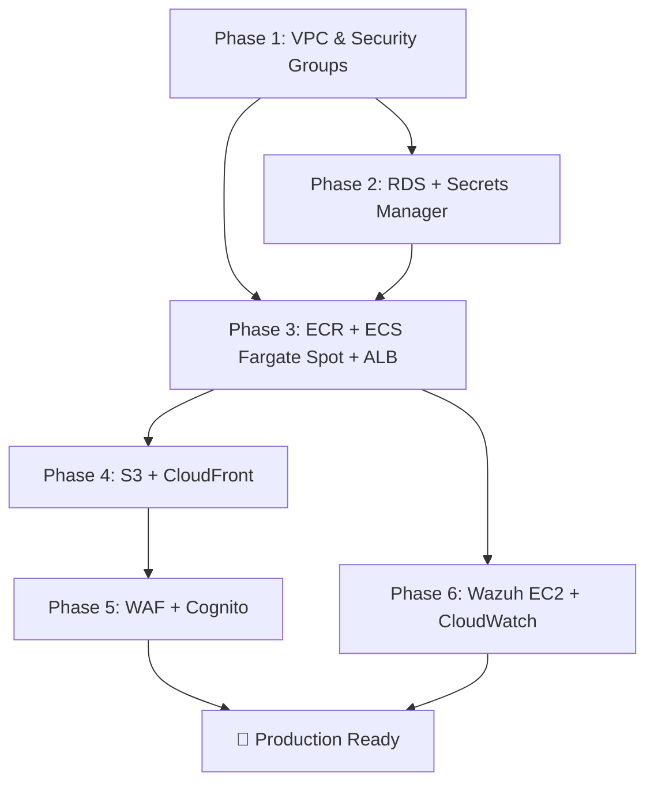

# AWS Integration Plan — SaaS HR Multi-Tenant

Migrate the current Docker Compose local development setup to the production AWS architecture described in [aws_architecture_design.md](file:///c:/Users/Admin/Desktop/SaaS-HR-Multi-tenant/aws_architecture_design.md).

## Current State Summary

| Component | Current Implementation | Target AWS Service |
|:--|:--|:--|
| API Gateway | Nginx container (`api-gateway/`) | ALB (path-based routing) |
| Auth Service | FastAPI on port 8000 | ECS Fargate Spot task |
| Tenant Service | FastAPI on port 8001 | ECS Fargate Spot task |
| HR Service | FastAPI on port 8002 | ECS Fargate Spot task |
| Frontend | Vite React → Nginx container | S3 + CloudFront |
| Database | MySQL 8.0 container (3 schemas) | RDS MySQL `db.t4g.micro` |
| Message Broker | Redis container | Redis container in ECS (or ElastiCache later) |
| Auth/Identity | Custom RS256 JWT (`app/core/security.py`) | AWS Cognito User Pools (phased) |
| Security/SOC | None | Wazuh on EC2 `t3.small` Spot |
| DNS | localhost | Route 53 |

---

## Open Questions

> [!IMPORTANT]
> **1. Infrastructure-as-Code (IaC) Tooling**
> Do you prefer **Terraform**, **AWS CDK (Python)**, or **AWS CloudFormation (YAML)** for defining infrastructure? This affects the entire `infra/` directory structure. I recommend **Terraform** for its maturity and multi-cloud flexibility, but CDK Python might feel more natural given your FastAPI backend.

> [!IMPORTANT]
> **2. Cognito Migration Strategy**
> Your current auth uses custom RS256 JWT signing in [security.py](file:///c:/Users/Admin/Desktop/SaaS-HR-Multi-tenant/microservices/auth-service/app/core/security.py). Do you want to:
> - **(A)** Keep custom JWT initially and integrate Cognito in a later phase (lower risk, faster deployment)
> - **(B)** Migrate to Cognito immediately as the identity provider (more rework upfront, but aligns with the architecture doc)

> [!IMPORTANT]
> **3. Domain Name**
> Do you already have a domain name registered (or planned) for Route 53? This affects CloudFront distribution and ALB certificate setup.

> [!IMPORTANT]
> **4. CI/CD Pipeline**
> Do you want to set up CI/CD (GitHub Actions → ECR → ECS deploy) as part of this integration, or defer it?

> [!IMPORTANT]
> **5. Redis Strategy**
> Your `tenant-service` and `hr-service` use Redis Pub/Sub. On AWS, should we:
> - **(A)** Run Redis as a sidecar container in ECS (cheapest, aligns with FinOps budget)
> - **(B)** Use ElastiCache for Redis (managed, but ~$13+/month for `cache.t4g.micro`)

---

## Proposed Changes — 6 Phases

### Phase 1: AWS Foundation (VPC, Networking, Security Groups)

Create the network backbone exactly as specified in the architecture document.

#### [NEW] `infra/vpc.tf` (or equivalent IaC)
- VPC `10.0.0.0/16` in `us-east-1`
- Public Subnet A `10.0.1.0/24` (us-east-1a)
- Public Subnet B `10.0.2.0/24` (us-east-1b)
- Private Subnet A `10.0.11.0/24` (us-east-1a)
- Private Subnet B `10.0.12.0/24` (us-east-1b)
- Internet Gateway (no NAT Gateway — NAT-Less design per FinOps Strategy 3)
- Route tables: public subnets → IGW, private subnets → local only

#### [NEW] `infra/security_groups.tf`
- `sg-alb-gateway`: Ingress 80/443 from 0.0.0.0/0, Egress to `sg-ecs-fargate`
- `sg-ecs-fargate`: Ingress 80 from `sg-alb-gateway` only, Egress 3306 to `sg-rds-db`, 1514/1515 to `sg-wazuh-soc`, 443 to 0.0.0.0/0
- `sg-rds-db`: Ingress 3306 from `sg-ecs-fargate` only, no egress
- `sg-wazuh-soc`: Ingress 1514/1515 from `sg-ecs-fargate`, 443 from team IPs only

#### [NEW] `infra/variables.tf`
- Region, CIDR blocks, team IP allowlist, environment tag

---

### Phase 2: Data Layer (RDS + Secrets Manager)

Migrate the local MySQL container to a managed RDS instance.

#### [NEW] `infra/rds.tf`
- RDS MySQL 8.0 on `db.t4g.micro` in private subnets
- DB Subnet Group spanning Private Subnet A + B
- Single-AZ deployment (cost optimization; Multi-AZ standby disabled)
- 20 GB `gp3` storage, no auto-scaling initially
- Parameter group with `character_set_server=utf8mb4`
- Attach `sg-rds-db` security group

#### [NEW] `infra/secrets.tf`
- AWS Secrets Manager secret for `MYSQL_ROOT_PASSWORD`
- AWS Secrets Manager secret for `JWT_PRIVATE_KEY` and `JWT_PUBLIC_KEY`
- Rotate-able secret policy

#### [MODIFY] `database/init.sql`
- No structural changes needed. This script will be run manually against RDS once to bootstrap the 3 schemas (`auth_db`, `tenant_db`, `hr_db`). We'll document the procedure.

#### [NEW] `scripts/rds_init.sh`
- Shell script to connect to RDS via bastion/SSM Session Manager and execute `init.sql`

#### [NEW] `infra/scheduler.tf`
- AWS EventBridge rule + Lambda function for RDS Auto-Stop/Start scheduler (Strategy 2)
- Stop at 8:00 PM UTC+7, Start at 8:00 AM UTC+7, Mon-Fri only
- Weekends: keep RDS stopped

##### Application Config Changes

#### [MODIFY] [config.py](file:///c:/Users/Admin/Desktop/SaaS-HR-Multi-tenant/microservices/auth-service/app/core/config.py)
- Add logic to fetch `DATABASE_URL` from AWS Secrets Manager when `AWS_SECRETS_ARN` environment variable is set
- Fallback to environment variable for local development compatibility

#### [MODIFY] [config.py](file:///c:/Users/Admin/Desktop/SaaS-HR-Multi-tenant/microservices/tenant-service/app/core/config.py) (tenant-service)
- Same Secrets Manager integration pattern

#### [MODIFY] [config.py](file:///c:/Users/Admin/Desktop/SaaS-HR-Multi-tenant/microservices/hr-service/app/core/config.py) (hr-service)
- Same Secrets Manager integration pattern

#### [NEW] `microservices/shared/aws_secrets.py`
- Shared utility module for fetching secrets from AWS Secrets Manager using `boto3`
- Caches secrets in-memory to avoid per-request API calls
- Used by all 3 microservice `config.py` files

---

### Phase 3: Container Platform (ECR + ECS Fargate Spot)

Containerize and deploy all backend services to ECS.

#### [NEW] `infra/ecr.tf`
- 4 ECR repositories: `saashr-gateway`, `saashr-auth`, `saashr-tenant`, `saashr-hr`
- Lifecycle policy: keep last 5 images, expire untagged after 1 day

#### [NEW] `infra/ecs.tf`
- ECS Cluster with Fargate Spot capacity provider (Strategy 1)
- Capacity provider strategy: `FARGATE_SPOT` weight=4, `FARGATE` weight=1 (fallback)

#### [NEW] `infra/ecs_tasks.tf`
- **4 Task Definitions** (each 0.25 vCPU, 0.5 GB RAM):
  1. `saashr-gateway` — Nginx proxy (ALB replaces most of its role, but kept for internal routing if needed)
  2. `saashr-auth` — Auth FastAPI service
  3. `saashr-tenant` — Tenant FastAPI service  
  4. `saashr-hr` — HR FastAPI service
- Task execution role with permissions for ECR pull, CloudWatch Logs, Secrets Manager read
- Task role with permissions for Secrets Manager `GetSecretValue`
- Log configuration: `awslogs` driver → CloudWatch Log Group `/ecs/saashr/`

#### [NEW] `infra/alb.tf`
- Application Load Balancer in public subnets
- Target groups for each ECS service
- Listener rules (path-based routing):
  - `/api/v1/auth/*` → auth-service target group
  - `/api/v1/tenants/*` → tenant-service target group  
  - `/api/v1/hr/*` → hr-service target group
- Health check paths: `/api/v1/{service}/health`

#### [MODIFY] Dockerfiles (all 3 microservices + gateway)
- Add `boto3` to [requirements.txt](file:///c:/Users/Admin/Desktop/SaaS-HR-Multi-tenant/microservices/auth-service/requirements.txt) (and equivalent for other services)
- Optimize for smaller images (already using `python:3.11-slim`, which is good)

> [!NOTE]
> **Nginx Gateway Decision**: With ALB handling path-based routing, the Nginx gateway container becomes optional. We can either:
> - Remove it entirely and let ALB route directly to service containers (recommended — saves 1 task's cost)
> - Keep it as a sidecar for request correlation ID generation (but the services already handle this)

---

### Phase 4: Frontend Deployment (S3 + CloudFront)

Replace the frontend Nginx container with S3 static hosting + CloudFront CDN.

#### [NEW] `infra/s3_frontend.tf`
- S3 bucket for React build artifacts (`saashr-frontend-{account-id}`)
- Bucket policy: allow CloudFront OAC access only
- Block all public access (served exclusively through CloudFront)

#### [NEW] `infra/cloudfront.tf`
- CloudFront distribution with two origins:
  1. **S3 Origin** (default behavior) — serves React SPA (`index.html`, JS, CSS, assets)
  2. **ALB Origin** (behavior: `/api/v1/*`) — proxies API calls to backend
- Origin Access Control (OAC) for S3
- Custom error response: 403/404 → `/index.html` with 200 status (SPA routing)
- Cache policy: static assets cached aggressively, API calls pass-through
- If domain available: ACM certificate + custom domain

#### [NEW] `scripts/deploy_frontend.sh`
- Build React app: `npm run build`
- Sync to S3: `aws s3 sync dist/ s3://bucket-name --delete`
- Invalidate CloudFront cache: `aws cloudfront create-invalidation`

#### [MODIFY] [vite.config.js](file:///c:/Users/Admin/Desktop/SaaS-HR-Multi-tenant/frontend/vite.config.js)
- Configure API proxy base URL to use environment variable (`VITE_API_BASE_URL`)
- For production: API calls go to CloudFront `/api/v1/*` which routes to ALB

#### [NEW] `frontend/.env.production`
- `VITE_API_BASE_URL=` (empty or CloudFront URL — relative paths work since CloudFront proxies `/api/v1/*`)

---

### Phase 5: Security Layer (WAF + Cognito)

#### [NEW] `infra/waf.tf`
- AWS WAF v2 Web ACL attached to CloudFront distribution
- 3 Managed Rule Groups:
  1. `AWSManagedRulesCommonRuleSet` — OWASP Top 10 protection
  2. `AWSManagedRulesSQLiRuleSet` — SQL injection protection
  3. `AWSManagedRulesAmazonIpReputationList` — Known bad IP blocking
- Rate limiting rule: 2000 requests/5 min per IP

#### [NEW] `infra/cognito.tf` (Phase 5b — if Option B chosen)
- Cognito User Pool with email-based sign-up
- App client for React frontend (implicit or authorization code flow)
- User Pool Groups mapping to roles: `owner`, `admin`, `employee`
- Custom attributes: `tenant_id`
- JWT token configuration matching current RS256 flow

#### [MODIFY] Auth service code (Phase 5b — Cognito migration)
- Replace custom JWT creation in [security.py](file:///c:/Users/Admin/Desktop/SaaS-HR-Multi-tenant/microservices/auth-service/app/core/security.py) with Cognito token validation
- Update login flow to authenticate against Cognito instead of local `password_hash`
- Migrate existing seed users to Cognito User Pool

---

### Phase 6: Observability & SOC (Wazuh + CloudWatch)

#### [NEW] `infra/wazuh_ec2.tf`
- EC2 `t3.small` Spot Instance in Public Subnet A
- Wazuh Manager AMI or user-data script for installation
- 30 GB `gp3` EBS volume
- Attach `sg-wazuh-soc` security group
- Auto-stop scheduler (same EventBridge pattern as RDS)

#### [NEW] `infra/cloudwatch.tf`
- Log groups for each ECS service: `/ecs/saashr/auth`, `/ecs/saashr/tenant`, `/ecs/saashr/hr`, `/ecs/saashr/gateway`
- Retention: 7 days (FinOps optimization)
- CloudWatch Alarms:
  - ECS task count < desired (service recovery alert)
  - RDS CPU > 80%
  - ALB 5xx error rate > 5%

#### [MODIFY] Dockerfiles (all services)
- Install Wazuh agent in container images
- Configure agent to report to Wazuh Manager private IP on ports 1514/1515

---

## New Directory Structure

```text
SaaS-HR-Multi-tenant/
├── infra/                          # [NEW] Infrastructure-as-Code
│   ├── main.tf                     # Provider config, backend state (S3)
│   ├── variables.tf                # Input variables
│   ├── outputs.tf                  # Exported values (ALB DNS, CloudFront URL, etc.)
│   ├── vpc.tf                      # VPC, subnets, IGW, route tables
│   ├── security_groups.tf          # All 4 security groups
│   ├── rds.tf                      # RDS MySQL instance + subnet group
│   ├── secrets.tf                  # Secrets Manager secrets
│   ├── ecr.tf                      # ECR repositories
│   ├── ecs.tf                      # ECS cluster + capacity providers
│   ├── ecs_tasks.tf                # Task definitions + services
│   ├── alb.tf                      # ALB + target groups + listener rules
│   ├── s3_frontend.tf              # S3 bucket for React app
│   ├── cloudfront.tf               # CloudFront distribution
│   ├── waf.tf                      # WAF Web ACL + rules
│   ├── cognito.tf                  # Cognito User Pools (Phase 5b)
│   ├── wazuh_ec2.tf                # Wazuh EC2 Spot instance
│   ├── cloudwatch.tf               # Log groups + alarms
│   └── scheduler.tf                # EventBridge + Lambda for auto-stop
│
├── scripts/                        # [NEW] Deployment & operations scripts
│   ├── deploy_frontend.sh          # Build + S3 sync + CF invalidation
│   ├── rds_init.sh                 # Bootstrap RDS with init.sql
│   └── push_ecr.sh                 # Build + tag + push Docker images to ECR
│
├── microservices/
│   ├── shared/                     # [NEW] Shared cross-service utilities
│   │   └── aws_secrets.py          # Secrets Manager fetch + caching
│   ├── auth-service/               # (modified config.py, requirements.txt)
│   ├── tenant-service/             # (modified config.py, requirements.txt)
│   └── hr-service/                 # (modified config.py, requirements.txt)
│
├── frontend/
│   ├── .env.production             # [NEW] Production env vars
│   └── ...                         # (modified vite.config.js)
│
├── docker-compose.yml              # UNCHANGED — kept for local development
└── ...
```

---

## Verification Plan

### Automated Tests
```bash
# Phase 1: Validate IaC syntax and plan
terraform init && terraform validate && terraform plan

# Phase 3: Verify ECS tasks are healthy
aws ecs describe-services --cluster saashr-cluster --services saashr-auth saashr-tenant saashr-hr

# Phase 4: Test CloudFront distribution
curl -I https://<cloudfront-distribution>.cloudfront.net/
curl https://<cloudfront-distribution>.cloudfront.net/api/v1/auth/health
```

### Manual Verification
- Verify RDS connectivity from ECS tasks via health endpoints
- Test full login → API flow through CloudFront → ALB → ECS → RDS pipeline
- Confirm WAF blocks SQL injection test payloads
- Verify Wazuh dashboard is accessible only from team IPs
- Confirm RDS auto-stop triggers at scheduled time
- Run `docker-compose up` locally to confirm local dev workflow is unbroken

---

## Execution Order & Dependencies



> [!TIP]
> **Recommended approach**: Complete Phases 1–4 first. This gets you a working deployment on AWS. Phases 5–6 (WAF, Cognito, Wazuh) can be layered on incrementally without downtime.

## Estimated Monthly Cost (Post-Deployment)

Per the [architecture document](file:///c:/Users/Admin/Desktop/SaaS-HR-Multi-tenant/aws_architecture_design.md): **~$56.99/month** with all FinOps optimizations applied, well under the $100–$120 budget ceiling.
