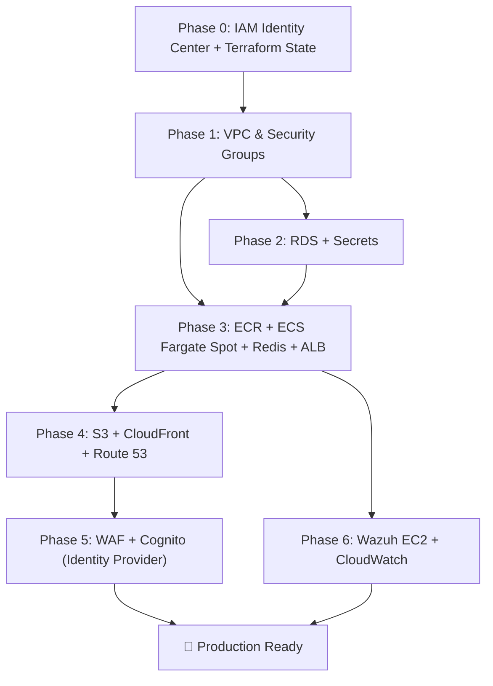

# AWS Integration Plan — SaaS HR Multi-Tenant

Migrate the current Docker Compose local development setup to the production AWS architecture described in [aws_architecture_design.md](aws_architecture_design.md).

> **Region: `ap-southeast-1` (Singapore)** · **IaC: Terraform** · **No CI/CD (manual / script-based)** · **Identity for team: IAM Identity Center** · **Budget ceiling: $120–$150/month** (projected ~$67/mo)

---

## 1. Finalized Decisions (Locked 2026-06-11)

| # | Topic | Decision | Rationale |
|:--|:--|:--|:--|
| 1 | **Deployment Region** | `ap-southeast-1` (Singapore) | End users are in **Vietnam only** → lowest API latency (~30–60 ms vs ~200–250 ms to `us-east-1`). AZs: `ap-southeast-1a`, `ap-southeast-1b`. |
| 2 | **Region exceptions** | `us-east-1` for **2 global resources only** | (a) **ACM certificate for CloudFront** — CloudFront only trusts certs from N. Virginia. (b) **WAF Web ACL, `CLOUDFRONT` scope** — a global resource that must be created in `us-east-1`. Both run *at the edge* near Vietnam; `us-east-1` is only the control-plane home. |
| 3 | **TLS Certificates** | **2 certificates** | Cert #1 in `us-east-1` for the **CloudFront** viewer domain. Cert #2 (optional) in `ap-southeast-1` for the **ALB** origin. Both issued free via AWS Certificate Manager (DNS-validated through Route 53). |
| 4 | **IaC Tooling** | **Terraform** (OpenTofu-compatible) | Readable HCL across ~15 resource types, explicit remote state + locking for the 2-dev team, `plan` dry-run safety, huge module ecosystem. |
| 5 | **DNS & Domain** | **Amazon Route 53 only** — no GoDaddy | Register the domain *directly in Route 53*; the public hosted zone is auto-created. One vendor, native ALIAS records to CloudFront, automatic ACM DNS validation. |
| 6 | **CI/CD Pipeline** | ❌ **Not used** | All deployments are **manual / script-based** via `scripts/` (`push_ecr.sh`, `deploy_frontend.sh`, `rds_init.sh`) + `terraform apply` from a laptop. No GitHub Actions / CodePipeline / CodeBuild. |
| 7 | **Team Access** | **AWS IAM Identity Center** (2 users) | Short-lived credentials (no long-lived keys on laptops), one SSO portal, `AdministratorAccess` permission set per dev. Root account locked + MFA. |
| 8 | **Redis (Pub/Sub)** | **Dedicated Redis ECS service via Cloud Map Service Discovery**, on **Fargate Spot** | Redis is a *non-critical, eventually-consistent* message broker (not a datastore). A shared standalone ECS service (NOT a sidecar) reachable at `redis.saashr.local:6379` preserves the event-driven pattern at ~$3/mo vs ~$14/mo for ElastiCache. |
| 9 | **Nginx API Gateway** | ❌ **Removed** | ALB performs path-based routing; FastAPI services already generate correlation IDs. Dropping the gateway task frees ~25% of compute and one ECR repo. |
| 10 | **Identity Provider (app users)** | ✅ **AWS Cognito User Pools (Option B)** | Cognito is the committed identity provider — managed sign-up/sign-in, MFA, hosted UI, and JWT issuance — removing the need to maintain custom RS256 signing/rotation. Built in **Phase 5** (not deferred). Requires migrating the login flow to `InitiateAuth` and seeding existing users into the User Pool. |

---

## 2. Current State → Target Mapping

| Component | Current Implementation | Target AWS Service (`ap-southeast-1` unless noted) |
|:--|:--|:--|
| API Gateway | Nginx container (`api-gateway/`) | **ALB** (path-based routing) — *Nginx gateway removed* |
| Auth Service | FastAPI on port 8000 | ECS **Fargate Spot** task |
| Tenant Service | FastAPI on port 8001 | ECS **Fargate Spot** task |
| HR Service | FastAPI on port 8002 | ECS **Fargate Spot** task |
| Message Broker | Redis container | **Dedicated Redis ECS service** (Fargate Spot) + **Cloud Map** service discovery |
| Frontend | Vite React → Nginx container | **S3** (private, OAC) + **CloudFront** |
| Database | MySQL 8.0 container (3 schemas) | **RDS MySQL** `db.t4g.micro` (Single-AZ, auto-stop) |
| Auth/Identity | Custom RS256 JWT (`security.py`) | **AWS Cognito User Pools** (User Pool + App Client, JWT/OIDC) — Phase 5 |
| Edge security | None | **AWS WAF** (`CLOUDFRONT` scope, `us-east-1`) |
| Security/SOC | None | **Wazuh** on EC2 `t3.small` Spot |
| DNS / Domain | localhost | **Route 53** (domain registered in Route 53) |
| TLS | None | **ACM** cert #1 `us-east-1` (CloudFront) + cert #2 `ap-southeast-1` (ALB, optional) |
| Team access | — | **IAM Identity Center** (2 users, short-lived creds) |
| Terraform state | — | **S3 backend** + native lockfile (`use_lockfile`) |

---

## 3. Phase 0 — Account, Team Access & Terraform Backend (Prerequisite)

> One-time foundation. Do this **before** any `infra/` resource so both developers can work simultaneously without colliding.

### 3.1 Lock down the root account
1. Sign in as **root** → enable **MFA** (authenticator app or hardware key).
2. **Delete any root access keys** (`My Security Credentials`).
3. Store the root password in a password manager; stop using root for daily work.

### 3.2 Enable IAM Identity Center (2 developers)
1. Console → **IAM Identity Center** → **Enable**.
2. **Users** → create 2 users (Dev A, Dev B), each with their own email.
3. **Permission sets** → create `AdminAccess` → attach AWS-managed `AdministratorAccess`, session duration 8h.
4. **AWS accounts** → select the account → assign **both** users the `AdminAccess` permission set.
5. Each developer, on their own laptop:
   ```bash
   aws configure sso          # one-time: SSO start URL + region ap-southeast-1
   aws sso login --profile saashr   # daily: refresh short-lived credentials
   ```
> Root stays locked; CloudTrail (on by default) records who did what. `AdministratorAccess` is the pragmatic choice for a 2-person team building all the infra — least-privilege scoping here just creates `AccessDenied` friction.

### 3.3 Bootstrap the Terraform remote state (the real "don't block each other" mechanism)
IAM lets you both *in*; **shared, locked Terraform state** is what stops two simultaneous `apply`s from corrupting each other.
1. Create **one S3 bucket** (versioning **ON**, encryption **ON**) in `ap-southeast-1`, e.g. `saashr-tfstate-<account-id>`. Create it once by hand or via a tiny `infra/bootstrap/` config (the state bucket can't live in the state it stores).
2. Configure the backend with the **native S3 lockfile** (Terraform ≥ 1.10 — no separate DynamoDB table needed):
   ```hcl
   # infra/providers.tf
   terraform {
     required_version = ">= 1.10"
     backend "s3" {
       bucket       = "saashr-tfstate-<account-id>"
       key          = "global/saashr.tfstate"
       region       = "ap-southeast-1"
       encrypt      = true
       use_lockfile = true            # native S3 state locking
     }
   }

   provider "aws" {                   # default — Singapore, used by ~95% of resources
     region = "ap-southeast-1"
   }

   provider "aws" {                   # alias — N. Virginia, ONLY for CloudFront cert + WAF
     alias  = "us_east_1"
     region = "us-east-1"
   }
   ```
3. **Working rule for 2 devs:** always `terraform plan` first; announce before `apply`; the lock makes concurrent applies wait instead of clobbering. Optionally split state by layer (`network` / `data` / `compute`) so each dev can own a layer.

---

## 4. Proposed Changes — 6 Build Phases

### Phase 1: AWS Foundation (VPC, Networking, Security Groups)

#### [NEW] `infra/vpc.tf`
- VPC `10.0.0.0/16` in **`ap-southeast-1`**
- Public Subnet A `10.0.1.0/24` (`ap-southeast-1a`)
- Public Subnet B `10.0.2.0/24` (`ap-southeast-1b`)
- Private Subnet A `10.0.11.0/24` (`ap-southeast-1a`)
- Private Subnet B `10.0.12.0/24` (`ap-southeast-1b`)
- Internet Gateway (**no NAT Gateway** — NAT-Less design, FinOps Strategy 3)
- Route tables: public subnets → IGW, private subnets → local only

#### [NEW] `infra/security_groups.tf`
- `sg-alb-gateway`: Ingress 80/443 from `0.0.0.0/0`, Egress to `sg-ecs-fargate`
- `sg-ecs-fargate`: Ingress 80 from `sg-alb-gateway` only; Egress 3306 to `sg-rds-db`, 6379 to `sg-ecs-fargate` (Redis, intra-SG), 1514/1515 to `sg-wazuh-soc`, 443 to `0.0.0.0/0`
- `sg-rds-db`: Ingress 3306 from `sg-ecs-fargate` only, no egress
- `sg-wazuh-soc`: Ingress 1514/1515 from `sg-ecs-fargate`, 443 from team IPs only

#### [NEW] `infra/variables.tf`
- Region (`ap-southeast-1`), CIDR blocks, team IP allowlist, environment tag, domain name

---

### Phase 2: Data Layer (RDS + Secrets Manager)

#### [NEW] `infra/rds.tf`
- RDS MySQL 8.0 on `db.t4g.micro` (Graviton — available in `ap-southeast-1`) in private subnets
- DB Subnet Group spanning Private Subnet A + B
- Single-AZ (Multi-AZ standby disabled for cost)
- 20 GB `gp3` storage, no auto-scaling initially
- Parameter group: `character_set_server=utf8mb4`
- Attach `sg-rds-db`

#### [NEW] `infra/secrets.tf`
- AWS Secrets Manager secret for the **RDS master password** (native rotation candidate)
- `JWT_PRIVATE_KEY` / `JWT_PUBLIC_KEY` — *optional FinOps swap:* store as **SSM Parameter Store `SecureString`** (free) instead of Secrets Manager ($0.40/secret/mo) since they don't need rotation

#### [MODIFY] `database/init.sql`
- No structural changes. Run once against RDS to bootstrap the 3 schemas (`auth_db`, `tenant_db`, `hr_db`).

#### [NEW] `scripts/rds_init.sh`
- Connect to RDS via SSM Session Manager (no public bastion needed) and execute `init.sql`

#### [NEW] `infra/scheduler.tf`
- EventBridge rule + Lambda to **Auto-Stop/Start RDS** (FinOps Strategy 2)
- Stop 20:00 ICT (UTC+7), Start 08:00 ICT, Mon–Fri; weekends stopped
- **Idempotent daily stop** — RDS auto-restarts 7 days after a manual stop, so the stop Lambda must re-stop it

##### Application Config Changes
- [MODIFY] `microservices/auth-service/app/core/config.py` — fetch `DATABASE_URL` from Secrets Manager / SSM when `AWS_SECRETS_ARN` is set; fall back to env var for local dev
- [MODIFY] `microservices/tenant-service/app/core/config.py` — same pattern
- [MODIFY] `microservices/hr-service/app/core/config.py` — same pattern
- [NEW] `microservices/shared/aws_secrets.py` — shared `boto3` fetch + in-memory cache, used by all 3 services

---

### Phase 3: Container Platform (ECR + ECS Fargate Spot + Redis + ALB)

#### [NEW] `infra/ecr.tf`
- **3 ECR repositories**: `saashr-auth`, `saashr-tenant`, `saashr-hr` *(no `saashr-gateway` — Nginx gateway removed)*
- Lifecycle policy: keep last 5 images, expire untagged after 1 day

#### [NEW] `infra/ecs.tf`
- ECS Cluster with **Fargate Spot** capacity provider (Strategy 1)
- Capacity provider strategy: `FARGATE_SPOT` weight=4, `FARGATE` weight=1 (fallback)
- **AWS Cloud Map** private DNS namespace `saashr.local` for service discovery

#### [NEW] `infra/ecs_tasks.tf`
- **4 Task Definitions** (each 0.25 vCPU, 0.5 GB RAM):
  1. `saashr-auth` — Auth FastAPI
  2. `saashr-tenant` — Tenant FastAPI
  3. `saashr-hr` — HR FastAPI
  4. `saashr-redis` — **shared Redis broker** (`redis:alpine`), registered in Cloud Map as `redis.saashr.local:6379`, **no persistence** (ephemeral pub/sub)
- `tenant-service` & `hr-service` set `REDIS_URL=redis://redis.saashr.local:6379/0`
- Task execution role: ECR pull, CloudWatch Logs, Secrets Manager/SSM read
- Task role: `GetSecretValue` / `ssm:GetParameter`
- Logs: `awslogs` driver → CloudWatch `/ecs/saashr/`

#### [NEW] `infra/alb.tf`
- Application Load Balancer in public subnets (`sg-alb-gateway`)
- Target groups per service; path-based listener rules:
  - `/api/v1/auth/*` → auth-service
  - `/api/v1/tenants/*` → tenant-service
  - `/api/v1/hr/*` → hr-service
- Health check paths: `/api/v1/{service}/health`
- Optional HTTPS listener using ACM cert #2 (`ap-southeast-1`)

#### [MODIFY] Dockerfiles (3 microservices)
- Add `boto3` to each `requirements.txt`
- Keep `python:3.11-slim` base (already optimal)

---

### Phase 4: Frontend + DNS (S3 + CloudFront + Route 53)

#### [NEW] `infra/s3_frontend.tf`
- S3 bucket for React build (`saashr-frontend-{account-id}`), block all public access, CloudFront **OAC**-only policy

#### [NEW] `infra/cloudfront.tf`
- CloudFront distribution, two origins:
  1. **S3 origin** (default) — React SPA
  2. **ALB origin** (`/api/v1/*`) — proxies API to backend in `ap-southeast-1`
- OAC for S3; SPA error mapping 403/404 → `/index.html` (200)
- Cache: static aggressive, API pass-through
- **Viewer cert = ACM cert #1 in `us-east-1`** (declared with `provider = aws.us_east_1`)

#### [NEW] `infra/route53.tf`
- **Register the domain in Route 53** (or transfer in) → public hosted zone auto-created
- **A/ALIAS** record `app.<domain>` → CloudFront distribution
- ACM **DNS-validation** CNAME records (both certs) created automatically in the zone
- Hosted zone cost ~$0.50/mo + queries

#### [NEW] `scripts/deploy_frontend.sh`
- `npm run build` → `aws s3 sync dist/ s3://<bucket> --delete` → `aws cloudfront create-invalidation`

#### [MODIFY] `frontend/vite.config.js` + [NEW] `frontend/.env.production`
- `VITE_API_BASE_URL=` (empty/relative — CloudFront proxies `/api/v1/*` to ALB)

---

### Phase 5: Security Layer (WAF + Cognito)

#### [NEW] `infra/waf.tf`
- AWS WAF v2 Web ACL, **`CLOUDFRONT` scope → created with `provider = aws.us_east_1`** (global resource, control-plane in N. Virginia; rules execute at edge near Vietnam)
- Attached to the CloudFront distribution
- 3 Managed Rule Groups: `AWSManagedRulesCommonRuleSet`, `AWSManagedRulesSQLiRuleSet`, `AWSManagedRulesAmazonIpReputationList`
- Rate-limit rule: 2000 req / 5 min per IP

#### [NEW] `infra/cognito.tf` — **committed (Decision #10)**
- Cognito **User Pool** with email-based sign-up/sign-in, password policy, optional MFA
- **App Client** for the React frontend (authorization-code flow + Cognito Hosted UI, or Amplify/SDK)
- **User Pool Groups** mapped to roles: `owner` / `admin` / `employee`
- **Custom attribute** `custom:tenant_id` carried in the token to drive tenant isolation
- Token config aligned with the services' existing RS256 verification — Cognito exposes a **JWKS endpoint** for public-key validation

#### [MODIFY] Auth service code — Cognito migration
- Replace custom JWT creation in `auth-service/app/core/security.py` with **Cognito token validation against the Cognito JWKS** (public keys)
- Update the login flow to authenticate via Cognito (`InitiateAuth`) instead of comparing the local `password_hash`
- `tenant-service` / `hr-service` verify Cognito-issued JWTs by pointing their public-key source at the Cognito **JWKS URL**

#### [NEW] `scripts/migrate_users_cognito.sh`
- One-time script to import existing seed users into the User Pool (`AdminCreateUser`), set `custom:tenant_id`, and force a password reset on first login

---

### Phase 6: Observability & SOC (Wazuh + CloudWatch)

#### [NEW] `infra/wazuh_ec2.tf`
- EC2 `t3.small` **Spot** in Public Subnet A, Wazuh Manager via user-data, 30 GB `gp3`, `sg-wazuh-soc`, auto-stop scheduler (same EventBridge pattern)

#### [NEW] `infra/cloudwatch.tf`
- Log groups `/ecs/saashr/{auth,tenant,hr,redis}`, retention **7 days**
- Alarms: ECS running task count < desired, RDS CPU > 80%, ALB 5xx rate > 5%

#### [MODIFY] Dockerfiles (3 services)
- Install Wazuh agent, report to Wazuh Manager private IP on 1514/1515

---

## 5. New Directory Structure

```text
SaaS-HR-Multi-tenant/
├── infra/                          # [NEW] Terraform IaC
│   ├── bootstrap/                  # [NEW] one-time: tfstate S3 bucket
│   │   └── main.tf
│   ├── providers.tf                # [NEW] default ap-southeast-1 + aws.us_east_1 alias + S3 backend
│   ├── variables.tf
│   ├── outputs.tf
│   ├── vpc.tf
│   ├── security_groups.tf
│   ├── rds.tf
│   ├── secrets.tf
│   ├── ecr.tf
│   ├── ecs.tf                      # cluster + Cloud Map namespace
│   ├── ecs_tasks.tf                # auth, tenant, hr, redis task defs + services
│   ├── alb.tf
│   ├── s3_frontend.tf
│   ├── cloudfront.tf               # viewer cert via aws.us_east_1
│   ├── route53.tf                  # [NEW] domain + hosted zone + ALIAS + ACM validation
│   ├── waf.tf                      # CLOUDFRONT scope via aws.us_east_1
│   ├── cognito.tf                  # Cognito User Pool + App Client (Phase 5 — IdP)
│   ├── wazuh_ec2.tf
│   ├── cloudwatch.tf
│   └── scheduler.tf
│
├── scripts/                        # [NEW] Manual deployment (no CI/CD)
│   ├── push_ecr.sh                 # build + tag + push images, force ECS redeploy
│   ├── deploy_frontend.sh          # build + S3 sync + CF invalidation
│   ├── rds_init.sh                 # bootstrap RDS schemas via SSM
│   └── migrate_users_cognito.sh    # [NEW] import seed users into Cognito User Pool
│
├── microservices/
│   ├── shared/
│   │   └── aws_secrets.py          # [NEW] Secrets Manager/SSM fetch + cache
│   ├── auth-service/               # (modified config.py, requirements.txt)
│   ├── tenant-service/             # (modified config.py, requirements.txt)
│   └── hr-service/                 # (modified config.py, requirements.txt)
│
├── frontend/
│   ├── .env.production             # [NEW]
│   └── ...                         # (modified vite.config.js)
│
├── api-gateway/                    # KEPT only for local docker-compose (not deployed to AWS)
├── docker-compose.yml              # UNCHANGED — local dev
└── ...
```

---

## 6. Step-by-Step Execution Runbook (Manual / Script-based)

> Run from a laptop authenticated via `aws sso login --profile saashr`. Each `terraform apply` is preceded by `terraform plan`.

### Step 0 — Foundation (once)
```bash
# 0.1 Root: enable MFA, delete root keys (console)
# 0.2 IAM Identity Center: enable, create 2 users, AdminAccess permission set, assign both
# 0.3 Configure SSO on each laptop
aws configure sso
aws sso login --profile saashr

# 0.4 Bootstrap Terraform state bucket
cd infra/bootstrap && terraform init && terraform apply   # creates saashr-tfstate-<acct-id>
```

### Step 1 — Network & Security
```bash
cd infra
terraform init                       # wires the S3 backend (use_lockfile)
terraform plan  -target=...vpc -target=...security_groups
terraform apply -target=...vpc -target=...security_groups
```

### Step 2 — Data layer
```bash
terraform apply -target=aws_db_instance.mysql -target=...secrets -target=...scheduler
# Initialize schemas (RDS is private → go through SSM)
./scripts/rds_init.sh                 # runs database/init.sql against RDS
```

### Step 3 — Build & push images, deploy compute
```bash
# Build + push the 3 service images to ECR
./scripts/push_ecr.sh auth tenant hr
# Create cluster, Cloud Map, Redis service, task defs, services, ALB
terraform apply -target=...ecr -target=...ecs -target=...ecs_tasks -target=...alb
# Verify
aws ecs describe-services --cluster saashr-cluster \
  --services saashr-auth saashr-tenant saashr-hr saashr-redis --profile saashr
```

### Step 4 — Frontend + DNS
```bash
terraform apply -target=...s3_frontend -target=...cloudfront -target=...route53
./scripts/deploy_frontend.sh          # build React, sync to S3, invalidate CF
```

### Step 5 — Edge security + Identity (Cognito)
```bash
terraform apply -target=...waf        # CLOUDFRONT-scope Web ACL (us-east-1 alias) + attach
terraform apply -target=...cognito    # Cognito User Pool + App Client + groups + custom:tenant_id
./scripts/migrate_users_cognito.sh    # one-time: import seed users into the User Pool
```

### Step 6 — SOC & monitoring
```bash
terraform apply -target=...wazuh_ec2 -target=...cloudwatch
# Or simply: terraform apply   (converge everything, then re-run scripts as needed)
```

### Redeploy a code change later (no CI/CD)
```bash
./scripts/push_ecr.sh hr              # rebuild + push one service
aws ecs update-service --cluster saashr-cluster --service saashr-hr \
  --force-new-deployment --profile saashr
```

---

## 7. Verification Plan

```bash
# IaC integrity
terraform init && terraform validate && terraform plan

# ECS health
aws ecs describe-services --cluster saashr-cluster \
  --services saashr-auth saashr-tenant saashr-hr saashr-redis

# End-to-end through CloudFront → ALB → ECS → RDS
curl -I https://app.<domain>/
curl https://app.<domain>/api/v1/auth/health
curl https://app.<domain>/api/v1/tenants/health
curl https://app.<domain>/api/v1/hr/health
```
Manual checks:
- RDS reachable from ECS via `/health` endpoints
- Full login → API flow works end-to-end
- Pub/Sub: update a tenant status → confirm `hr-service` log shows the consumed event (Cloud Map resolution working)
- WAF blocks a SQLi test payload
- Wazuh dashboard reachable only from team IPs
- RDS auto-stop fires on schedule (and re-stops idempotently)
- `docker-compose up` still works locally (dev workflow unbroken)

---

## 8. Execution Order & Dependencies



> [!TIP]
> Complete **Phase 0 → 4** first for a working AWS deployment. Layer Phase 5 (WAF/Cognito) and Phase 6 (Wazuh) incrementally without downtime.

---

## 9. Estimated Monthly Cost — `ap-southeast-1` (Singapore)

All FinOps optimizations applied (Fargate Spot, NAT-less, RDS/Wazuh auto-stop, 7-day logs). Singapore unit prices run ~10–20% above `us-east-1`.

| AWS Service | Config | Est. Cost / Month |
|:--|:--|:--:|
| AWS WAF | 1 Web ACL + 3 managed rules + rate-limit | ~$9.00 |
| CloudFront + S3 | 100 GB out, static React (CF free tier) | ~$1.00 |
| Application Load Balancer | 1 ALB + ~1 LCU | ~$24.00 |
| ECS Fargate Spot | 4 tasks (auth, tenant, hr, **redis**) @ 0.25 vCPU/0.5 GB, Spot | ~$12.00 |
| RDS MySQL | `db.t4g.micro` + 20 GB gp3, auto-stop ~200 h/mo | ~$6.50 |
| EC2 (Wazuh) | `t3.small` Spot + 30 GB gp3, auto-stop | ~$7.00 |
| AWS Cognito | Free tier ≤ 50k MAU | $0.00 |
| Route 53 | 1 hosted zone + queries + domain (amortized) | ~$2.00 |
| Secrets Manager / SSM | RDS secret (JWT keys → free SSM) | ~$0.80 |
| NAT Gateway | NAT-less design | $0.00 |
| Data Transfer / CloudWatch | logs (7-day), inter-AZ | ~$4.00 |
| ECR | image storage | ~$0.50 |
| IAM Identity Center | team SSO | $0.00 |
| **Total** | | **≈ $66.80 / month** |

> [!NOTE]
> **≈ $67/month** sits far under the **$120–$150** ceiling — leaving a **~$53–$83 buffer** for traffic spikes, extra test instances, or disabling auto-stop during demos. Re-price with the AWS Pricing Calculator set to **Asia Pacific (Singapore)** before committing.
