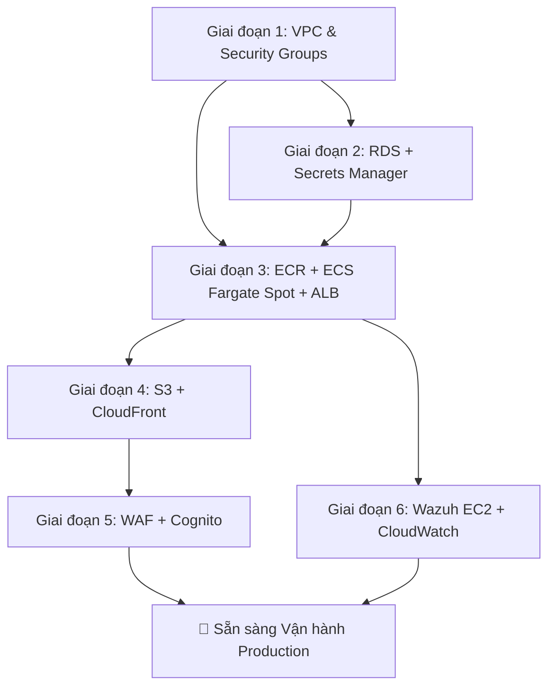

# Kế hoạch Tích hợp AWS — SaaS HR Multi-Tenant

Di chuyển cấu hình phát triển cục bộ Docker Compose hiện tại sang kiến trúc AWS production được mô tả trong tài liệu [aws_architecture_design.md](file:///c:/Users/Admin/Desktop/SaaS-HR-Multi-tenant/aws_architecture_design.md).

## Tóm tắt Trạng thái Hiện tại

| Thành phần | Triển khai Hiện tại | Dịch vụ AWS Mục tiêu |
|:--|:--|:--|
| API Gateway | Nginx container (`api-gateway/`) | ALB (Định tuyến theo đường dẫn - path-based routing) |
| Auth Service | FastAPI trên cổng 8000 | ECS Fargate Spot task |
| Tenant Service | FastAPI trên cổng 8001 | ECS Fargate Spot task |
| HR Service | FastAPI trên cổng 8002 | ECS Fargate Spot task |
| Frontend | Vite React → Nginx container | S3 + CloudFront |
| Database | MySQL 8.0 container (3 schema) | RDS MySQL `db.t4g.micro` |
| Message Broker | Redis container | Redis container trên ECS (hoặc ElastiCache sau này) |
| Auth/Identity | JWT RS256 tự cấu hình (`app/core/security.py`) | AWS Cognito User Pools (theo giai đoạn) |
| Security/SOC | Không có | Wazuh trên EC2 `t3.small` Spot |
| DNS | localhost | Route 53 |

---

## Các Câu hỏi Cần Thảo luận

> [!IMPORTANT]
> **1. Công cụ Infrastructure-as-Code (IaC)**
> Bạn muốn sử dụng **Terraform**, **AWS CDK (Python)**, hay **AWS CloudFormation (YAML)** để định nghĩa cơ sở hạ tầng? Điều này ảnh hưởng đến toàn bộ cấu trúc thư mục `infra/`. Chúng tôi khuyến nghị sử dụng **Terraform** vì tính trưởng thành và khả năng linh hoạt đa đám mây, nhưng CDK Python có thể mang lại cảm giác tự nhiên hơn đối với đội ngũ phát triển FastAPI của bạn.

> [!IMPORTANT]
> **2. Chiến lược Di chuyển sang Cognito**
> Hệ thống xác thực hiện tại của bạn sử dụng cơ chế tự ký JWT RS256 trong [security.py](file:///c:/Users/Admin/Desktop/SaaS-HR-Multi-tenant/microservices/auth-service/app/core/security.py). Bạn muốn:
> - **(A)** Giữ cơ chế JWT tự cấu hình ở giai đoạn đầu và tích hợp Cognito ở giai đoạn sau (ít rủi ro hơn, triển khai nhanh hơn).
> - **(B)** Chuyển đổi sang Cognito ngay lập tức để làm nhà cung cấp danh tính (tốn nhiều công sức chỉnh sửa mã nguồn ban đầu hơn, nhưng đồng bộ ngay với tài liệu kiến trúc).

> [!IMPORTANT]
> **3. Tên miền (Domain Name)**
> Bạn đã đăng ký (hoặc dự kiến đăng ký) tên miền nào cho Route 53 chưa? Điều này sẽ ảnh hưởng đến cấu hình phân phối của CloudFront và cài đặt chứng chỉ SSL cho ALB.

> [!IMPORTANT]
> **4. Luồng CI/CD**
> Bạn có muốn thiết lập luồng CI/CD (GitHub Actions → ECR → ECS deploy) ngay trong đợt tích hợp này hay để sau?

> [!IMPORTANT]
> **5. Chiến lược triển khai Redis**
> Cả `tenant-service` và `hr-service` đều đang sử dụng Redis Pub/Sub. Trên AWS, chúng ta nên:
> - **(A)** Chạy Redis dưới dạng sidecar container trong ECS (tiết kiệm chi phí nhất, phù hợp với ngân sách FinOps).
> - **(B)** Sử dụng Amazon ElastiCache cho Redis (được quản lý hoàn toàn, nhưng mất khoảng ~$13+/tháng cho instance loại `cache.t4g.micro`).

---

## Các Thay đổi Đề xuất — 6 Giai đoạn

### Giai đoạn 1: Nền tảng AWS (VPC, Mạng, Nhóm Bảo mật)

Xây dựng bộ khung mạng chính xác theo các thông số trong tài liệu thiết kế kiến trúc.

#### [NEW] `infra/vpc.tf` (hoặc IaC tương đương)
- VPC dải mạng `10.0.0.0/16` tại vùng `us-east-1`
- Public Subnet A `10.0.1.0/24` (us-east-1a)
- Public Subnet B `10.0.2.0/24` (us-east-1b)
- Private Subnet A `10.0.11.0/24` (us-east-1a)
- Private Subnet B `10.0.12.0/24` (us-east-1b)
- Internet Gateway (Không dùng NAT Gateway — Thiết kế NAT-Less theo Chiến lược FinOps số 3)
- Bảng định tuyến (Route tables): Public subnets → IGW, Private subnets → Chỉ kết nối nội bộ (local)

#### [NEW] `infra/security_groups.tf`
- `sg-alb-gateway`: Cho phép Ingress cổng 80/443 từ mọi nơi `0.0.0.0/0`, Egress dẫn tới `sg-ecs-fargate`.
- `sg-ecs-fargate`: Chỉ cho phép Ingress cổng 80 từ `sg-alb-gateway`, Egress cổng 3306 tới `sg-rds-db`, cổng 1514/1515 tới `sg-wazuh-soc`, cổng 443 ra ngoài `0.0.0.0/0`.
- `sg-rds-db`: Chỉ cho phép Ingress cổng 3306 từ `sg-ecs-fargate`, chặn hoàn toàn Egress.
- `sg-wazuh-soc`: Cho phép Ingress cổng 1514/1515 từ `sg-ecs-fargate`, cổng 443 chỉ từ các IP tĩnh của đội ngũ phát triển.

#### [NEW] `infra/variables.tf`
- Vùng chạy AWS (Region), dải IP CIDR, danh sách IP cho phép kết nối, tag môi trường.

---

### Giai đoạn 2: Lớp Dữ liệu (RDS + Secrets Manager)

Chuyển đổi container MySQL cục bộ sang một cơ sở dữ liệu được AWS quản lý (RDS instance).

#### [NEW] `infra/rds.tf`
- RDS MySQL 8.0 chạy trên cấu hình `db.t4g.micro` nằm trong các subnet riêng tư (private subnets).
- Nhóm mạng cơ sở dữ liệu (DB Subnet Group) trải rộng trên Private Subnet A + B.
- Triển khai Single-AZ (Tối ưu hóa chi phí; tắt tính năng standby Multi-AZ).
- Dung lượng lưu trữ 20 GB loại `gp3`, ban đầu không bật tự động tăng dung lượng.
- Parameter group cấu hình `character_set_server=utf8mb4`.
- Gắn nhóm bảo mật `sg-rds-db`.

#### [NEW] `infra/secrets.tf`
- Khởi tạo secret trên AWS Secrets Manager lưu trữ `MYSQL_ROOT_PASSWORD`.
- Khởi tạo secret lưu trữ `JWT_PRIVATE_KEY` và `JWT_PUBLIC_KEY`.
- Chính sách bảo mật cho phép xoay vòng khóa (rotate-able).

#### [MODIFY] `database/init.sql`
- Không thay đổi cấu trúc bảng. Kịch bản này sẽ được thực thi thủ công một lần vào RDS để tạo 3 database schema (`auth_db`, `tenant_db`, `hr_db`). Chúng tôi sẽ chuẩn bị tài liệu hướng dẫn quy trình này.

#### [NEW] `scripts/rds_init.sh`
- Script bash để kết nối vào RDS thông qua máy chủ Bastion hoặc SSM Session Manager để chạy tệp `init.sql`.

#### [NEW] `infra/scheduler.tf`
- Quy tắc AWS EventBridge + Lambda function để lập lịch Tự động Dừng/Khởi động RDS (Chiến lược FinOps số 2).
- Tự động tắt vào lúc 20:00 (giờ VN, UTC+7), tự động bật vào 08:00 (giờ VN, UTC+7), từ Thứ Hai đến Thứ Sáu.
- Cuối tuần: giữ RDS luôn ở trạng thái dừng.

##### Thay đổi Cấu hình Ứng dụng

#### [MODIFY] [config.py](file:///c:/Users/Admin/Desktop/SaaS-HR-Multi-tenant/microservices/auth-service/app/core/config.py)
- Bổ sung logic lấy `DATABASE_URL` từ AWS Secrets Manager khi có biến môi trường `AWS_SECRETS_ARN`.
- Tự động chuyển về dùng biến môi trường cục bộ để giữ tính tương thích khi phát triển offline.

#### [MODIFY] [config.py](file:///c:/Users/Admin/Desktop/SaaS-HR-Multi-tenant/microservices/tenant-service/app/core/config.py) (tenant-service)
- Tích hợp mô hình kết nối Secrets Manager tương tự.

#### [MODIFY] [config.py](file:///c:/Users/Admin/Desktop/SaaS-HR-Multi-tenant/microservices/hr-service/app/core/config.py) (hr-service)
- Tích hợp mô hình kết nối Secrets Manager tương tự.

#### [NEW] `microservices/shared/aws_secrets.py`
- Module tiện ích dùng chung để kết nối và lấy dữ liệu bảo mật từ AWS Secrets Manager bằng thư viện `boto3`.
- Hỗ trợ lưu bộ nhớ đệm (cache) trong RAM để tránh gọi API Secrets Manager liên tục trên mỗi request.
- Được import và sử dụng bởi tệp `config.py` của cả 3 microservice.

---

### Giai đoạn 3: Nền tảng Container (ECR + ECS Fargate Spot)

Đóng gói ứng dụng thành container và triển khai các dịch vụ backend lên ECS.

#### [NEW] `infra/ecr.tf`
- Tạo 4 kho lưu trữ ảnh container (ECR Repositories): `saashr-gateway`, `saashr-auth`, `saashr-tenant`, `saashr-hr`.
- Quy định vòng đời: chỉ lưu giữ tối đa 5 ảnh container mới nhất, tự động xóa ảnh không gắn thẻ (untagged) sau 1 ngày.

#### [NEW] `infra/ecs.tf`
- Khởi tạo cụm ECS Cluster sử dụng bộ phân phối tài nguyên Fargate Spot (Chiến lược FinOps số 1).
- Trọng số phân phối: `FARGATE_SPOT` trọng số = 4, `FARGATE` tiêu chuẩn trọng số = 1 (để dự phòng).

#### [NEW] `infra/ecs_tasks.tf`
- **Cấu hình 4 Task Definition** (mỗi task chạy cấu hình 0.25 vCPU, 0.5 GB RAM):
  1. `saashr-gateway` — Nginx proxy (ALB sẽ thay thế phần lớn vai trò này, nhưng giữ lại để định tuyến nội bộ nếu cần).
  2. `saashr-auth` — FastAPI xác thực người dùng.
  3. `saashr-tenant` — FastAPI quản lý tenant.
  4. `saashr-hr` — FastAPI xử lý nghiệp vụ nhân sự.
- Task execution role có quyền kéo ảnh từ ECR, đẩy log vào CloudWatch Logs, và đọc cấu hình Secrets Manager.
- Task role có quyền gọi hàm `GetSecretValue` từ Secrets Manager.
- Cấu hình Log: driver `awslogs` → Ghi nhận vào CloudWatch Log Group `/ecs/saashr/`.

#### [NEW] `infra/alb.tf`
- Khởi tạo bộ cân bằng tải Application Load Balancer đặt ở các public subnet.
- Tạo các nhóm đích (Target Groups) tương ứng cho từng dịch vụ ECS.
- Cấu hình Listener rules (định tuyến theo đường dẫn):
  - `/api/v1/auth/*` → target group của auth-service
  - `/api/v1/tenants/*` → target group của tenant-service
  - `/api/v1/hr/*` → target group của hr-service
- Đường dẫn kiểm tra trạng thái hoạt động (Health checks): `/api/v1/{service}/health`.

#### [MODIFY] Dockerfiles (cả 3 microservices + gateway)
- Thêm thư viện `boto3` vào tệp [requirements.txt](file:///c:/Users/Admin/Desktop/SaaS-HR-Multi-tenant/microservices/auth-service/requirements.txt) (và tệp tương ứng của các dịch vụ khác).
- Tối ưu hóa kích thước ảnh container (hiện đang dùng `python:3.11-slim` là cấu hình tối ưu sẵn có).

> [!NOTE]
> **Về Nginx Gateway**: Khi sử dụng ALB để định tuyến theo đường dẫn, container Nginx gateway có thể không cần thiết nữa. Chúng ta có thể chọn:
> - Loại bỏ hoàn toàn để ALB chuyển tiếp trực tiếp đến các container dịch vụ (Khuyên dùng — giúp tiết kiệm chi phí chạy thêm 1 task).
> - Giữ lại như một sidecar để sinh Correlation ID cho request (tuy nhiên bản thân các microservice hiện tại đã có middleware xử lý việc này).

---

### Giai đoạn 4: Triển khai Frontend (S3 + CloudFront)

Thay thế container frontend chạy Nginx bằng hệ thống lưu trữ tĩnh trên S3 kết hợp mạng phân phối CloudFront CDN.

#### [NEW] `infra/s3_frontend.tf`
- Tạo bucket S3 chứa các tệp mã nguồn build của React (`saashr-frontend-{account-id}`).
- Cấu hình chính sách bucket: chỉ cho phép truy cập từ CloudFront thông qua OAC (Origin Access Control).
- Chặn mọi truy cập công khai trực tiếp từ internet (mọi truy cập phải đi qua CloudFront).

#### [NEW] `infra/cloudfront.tf`
- Phân phối CloudFront với hai nguồn dữ liệu (Origins):
  1. **S3 Origin** (Hành vi mặc định) — phục vụ ứng dụng React SPA (tải `index.html`, các tệp JS, CSS, assets).
  2. **ALB Origin** (Hành vi định tuyến `/api/v1/*`) — chuyển tiếp (proxy) các cuộc gọi API tới backend.
- Áp dụng cơ chế Origin Access Control (OAC) bảo mật cho S3.
- Cấu hình mã lỗi tùy chỉnh: khi gặp lỗi 403/404 → chuyển tiếp về `/index.html` với mã trạng thái 200 (để hỗ trợ cơ chế định tuyến phía client của ứng dụng SPA).
- Quy định bộ nhớ đệm (Cache policy): Cache mạnh mẽ các tệp tĩnh, các cuộc gọi API thì bỏ qua cache và chuyển tiếp thẳng.
- Nếu có tên miền: Cài đặt chứng chỉ ACM SSL + trỏ tên miền tùy chỉnh.

#### [NEW] `scripts/deploy_frontend.sh`
- Chạy lệnh build React: `npm run build`
- Đồng bộ dữ liệu lên S3: `aws s3 sync dist/ s3://bucket-name --delete`
- Làm mới bộ nhớ đệm CloudFront: `aws cloudfront create-invalidation`

#### [MODIFY] [vite.config.js](file:///c:/Users/Admin/Desktop/SaaS-HR-Multi-tenant/frontend/vite.config.js)
- Cấu hình biến môi trường (`VITE_API_BASE_URL`) để trỏ URL gọi API.
- Môi trường production: Các cuộc gọi API sẽ gọi trực tiếp đến đường dẫn tương đối `/api/v1/*` của CloudFront để tự động chuyển tiếp tới ALB.

#### [NEW] `frontend/.env.production`
- Cài đặt `VITE_API_BASE_URL=` (để trống hoặc trỏ tới tên miền CloudFront — sử dụng đường dẫn tương đối do CloudFront đã proxy `/api/v1/*`).

---

### Giai đoạn 5: Lớp Bảo mật (WAF + Cognito)

#### [NEW] `infra/waf.tf`
- Tạo AWS WAF v2 Web ACL liên kết trực tiếp vào phân phối CloudFront.
- Sử dụng 3 Nhóm Luật (Managed Rule Groups) có sẵn của AWS:
  1. `AWSManagedRulesCommonRuleSet` — Ngăn chặn các lỗ hổng bảo mật phổ biến (OWASP Top 10).
  2. `AWSManagedRulesSQLiRuleSet` — Chống tấn công tiêm mã độc SQL (SQL Injection).
  3. `AWSManagedRulesAmazonIpReputationList` — Chặn danh sách các dải IP xấu đã biết.
- Thiết lập luật giới hạn tần suất (Rate limiting): Tối đa 2000 request/5 phút cho mỗi địa chỉ IP.

#### [NEW] `infra/cognito.tf` (Giai đoạn 5b — Nếu chọn Phương án B)
- Khởi tạo Cognito User Pool cho phép người dùng đăng ký bằng Email.
- Thiết lập App Client tương thích cho React Frontend (sử dụng luồng implicit hoặc authorization code).
- Định nghĩa các nhóm User Pool tương ứng với quyền truy cập hệ thống: `owner`, `admin`, `employee`.
- Tạo thuộc tính tùy chỉnh: `tenant_id`.
- Cấu hình thông số JWT token trùng khớp với luồng xử lý khóa RS256 hiện tại.

#### [MODIFY] Mã nguồn Auth service (Giai đoạn 5b — Di chuyển sang Cognito)
- Thay thế đoạn mã tự sinh JWT trong tệp [security.py](file:///c:/Users/Admin/Desktop/SaaS-HR-Multi-tenant/microservices/auth-service/app/core/security.py) bằng cơ chế xác thực JWT được gửi từ Cognito.
- Thay đổi logic đăng nhập để xác thực thông tin tài khoản trực tiếp qua Cognito thay vì so sánh `password_hash` cục bộ trong database.
- Viết script đồng bộ dữ liệu người dùng có sẵn sang Cognito User Pool.

---

### Giai đoạn 6: Giám sát Hệ thống & SOC (Wazuh + CloudWatch)

#### [NEW] `infra/wazuh_ec2.tf`
- Chạy một máy chủ EC2 `t3.small` dạng Spot Instance trong Public Subnet A.
- Sử dụng Wazuh Manager AMI hoặc nạp script cài đặt tự động qua user-data.
- Gắn ổ cứng EBS 30 GB loại `gp3`.
- Áp dụng nhóm bảo mật `sg-wazuh-soc`.
- Cài đặt cơ chế tự động tắt máy (Sử dụng EventBridge tương tự như với RDS).

#### [NEW] `infra/cloudwatch.tf`
- Khởi tạo các nhóm lưu log (Log groups) cho mỗi dịch vụ trên ECS: `/ecs/saashr/auth`, `/ecs/saashr/tenant`, `/ecs/saashr/hr`, `/ecs/saashr/gateway`.
- Thiết lập thời gian lưu trữ: 7 ngày (Tối ưu hóa chi phí FinOps).
- Thiết lập các cảnh báo CloudWatch (Alarms):
  - Số lượng ECS task chạy thực tế thấp hơn cấu hình mong muốn (Cảnh báo dịch vụ bị sập).
  - Sử dụng CPU của RDS vượt mức 80%.
  - Tỷ lệ lỗi 5xx của ALB vượt quá mức 5%.

#### [MODIFY] Dockerfiles (Tất cả các dịch vụ backend)
- Cài đặt agent Wazuh tích hợp sẵn vào ảnh container khi build.
- Cấu hình thông tin kết nối để agent gửi báo cáo bảo mật về IP nội bộ của Wazuh Manager qua cổng 1514/1515.

---

## Cấu trúc Thư mục Mới

```text
SaaS-HR-Multi-tenant/
├── infra/                          # [NEW] Thư mục chứa mã nguồn cơ sở hạ tầng (IaC)
│   ├── main.tf                     # Cấu hình provider, lưu trữ state (S3)
│   ├── variables.tf                # Khai báo các biến đầu vào
│   ├── outputs.tf                  # Các giá trị đầu ra (DNS của ALB, CloudFront URL, v.v.)
│   ├── vpc.tf                      # Định nghĩa VPC, subnet, IGW, route tables
│   ├── security_groups.tf          # Cấu hình 4 nhóm bảo mật của hệ thống
│   ├── rds.tf                      # RDS MySQL instance + subnet group
│   ├── secrets.tf                  # Định nghĩa các secrets lưu trên Secrets Manager
│   ├── ecr.tf                      # Các kho lưu ảnh container ECR
│   ├── ecs.tf                      # ECS cluster + cấu hình capacity providers
│   ├── ecs_tasks.tf                # Khai báo các task definition và service ECS
│   ├── alb.tf                      # ALB + target groups + listener rules
│   ├── s3_frontend.tf              # Bucket S3 lưu trữ React app
│   ├── cloudfront.tf               # Phân phối CloudFront CDN
│   ├── waf.tf                      # WAF Web ACL + các luật chặn
│   ├── cognito.tf                  # Cognito User Pools (Giai đoạn 5b)
│   ├── wazuh_ec2.tf                # Instance EC2 cài Wazuh Manager
│   ├── cloudwatch.tf               # Nhóm log + cảnh báo CloudWatch
│   └── scheduler.tf                # Thiết lập EventBridge + Lambda tự động tắt RDS
│
├── scripts/                        # [NEW] Các script hỗ trợ vận hành và triển khai
│   ├── deploy_frontend.sh          # Build + đồng bộ S3 + làm mới bộ nhớ đệm CloudFront
│   ├── rds_init.sh                 # Kết nối RDS và chạy file init.sql để khởi tạo DB
│   └── push_ecr.sh                 # Build + tag + push ảnh container lên ECR
│
├── microservices/
│   ├── shared/                     # [NEW] Các tiện ích dùng chung giữa các service
│   │   └── aws_secrets.py          # Script kết nối Secrets Manager + lưu cache trong RAM
│   ├── auth-service/               # (Cập nhật config.py, requirements.txt)
│   ├── tenant-service/             # (Cập nhật config.py, requirements.txt)
│   └── hr-service/                 # (Cập nhật config.py, requirements.txt)
│
├── frontend/
│   ├── .env.production             # [NEW] File cấu hình biến môi trường production
│   └── ...                         # (Cập nhật vite.config.js)
│
├── docker-compose.yml              # GIỮ NGUYÊN — phục vụ phát triển cục bộ (local)
└── ...
```

---

## Kế hoạch Xác minh

### Kiểm thử Tự động
```bash
# Giai đoạn 1: Kiểm tra cú pháp IaC và xem trước kế hoạch tạo tài nguyên
terraform init && terraform validate && terraform plan

# Giai đoạn 3: Xác minh các task ECS đang chạy khỏe mạnh
aws ecs describe-services --cluster saashr-cluster --services saashr-auth saashr-tenant saashr-hr

# Giai đoạn 4: Kiểm tra phản hồi từ CDN CloudFront
curl -I https://<cloudfront-distribution>.cloudfront.net/
curl https://<cloudfront-distribution>.cloudfront.net/api/v1/auth/health
```

### Xác minh Thủ công
- Kiểm tra khả năng kết nối tới RDS từ các task ECS thông qua endpoint health.
- Chạy thử nghiệm luồng đầy đủ: Đăng nhập → Gọi API qua CloudFront → ALB → ECS → RDS.
- Kiểm tra tính hiệu quả của WAF bằng cách thử gửi request chứa mã độc SQL injection xem có bị chặn hay không.
- Xác minh trang quản trị Wazuh chỉ có thể truy cập được từ các địa chỉ IP của đội phát triển được liệt kê trong cấu hình.
- Theo dõi log để xác định xem RDS có tự động dừng hoạt động đúng giờ thiết lập hay không.
- Chạy lệnh `docker-compose up` cục bộ tại máy cá nhân để đảm bảo luồng phát triển offline của dự án không bị ảnh hưởng.

---

## Thứ tự Thực hiện & Sự Phụ thuộc giữa các thành phần



> [!TIP]
> **Khuyến nghị**: Hoàn thành các Giai đoạn từ 1 đến 4 trước. Việc này sẽ đảm bảo bạn có một hệ thống chạy thử nghiệm hoàn chỉnh trên AWS. Các Giai đoạn 5 và 6 (WAF, Cognito, Wazuh) có thể được bổ sung và nâng cấp dần dần sau đó mà không làm gián đoạn hệ thống.

## Chi phí Ước tính Hàng tháng (Sau khi Triển khai)

Dựa theo [tài liệu kiến trúc](file:///c:/Users/Admin/Desktop/SaaS-HR-Multi-tenant/aws_architecture_design.md): **~$56.99/tháng** sau khi áp dụng triệt để tất cả các phương pháp FinOps tối ưu hóa, tiết kiệm đáng kể so với mức trần ngân sách $100–$120.
