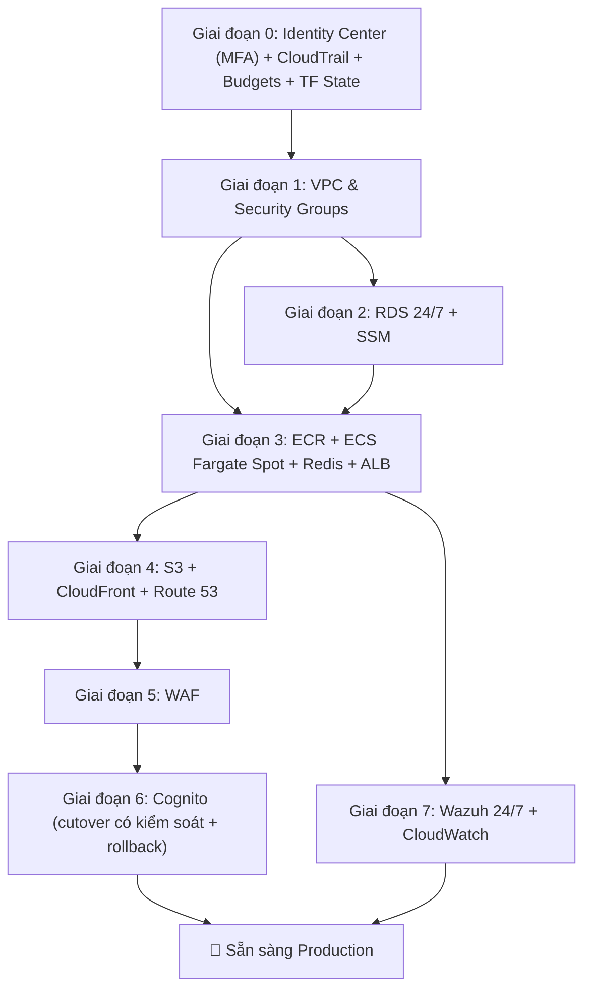

# Kế hoạch Tích hợp AWS — SaaS HR Multi-Tenant

Di chuyển cấu hình phát triển cục bộ Docker Compose hiện tại sang kiến trúc AWS production mô tả trong [aws_architecture_design.md](aws_architecture_design.md).

> **Region: `ap-southeast-1` (Singapore)** · **IaC: Terraform** · **Không CI/CD (thủ công / script)** · **Danh tính team: IAM Identity Center** · **Danh tính app: AWS Cognito** · **Secret: SSM Parameter Store (miễn phí, không rotation)** · **RDS: 24/7** · **Trần ngân sách: $120–$150/tháng** (thực tế ~$70–$95/tháng)

---

## 1. Các Quyết định Đã Chốt (Khóa 2026-06-12)

| # | Hạng mục | Quyết định | Lý do |
|:--|:--|:--|:--|
| 1 | **Vùng triển khai** | `ap-southeast-1` (Singapore) | Người dùng **chỉ ở Việt Nam** → độ trễ API thấp nhất. AZ: `ap-southeast-1a`, `ap-southeast-1b`. |
| 2 | **Ngoại lệ vùng** | `us-east-1` cho **đúng 2 tài nguyên global** | (a) **Cert ACM cho CloudFront**; (b) **WAF Web ACL scope `CLOUDFRONT`**. Cả hai chạy ở edge gần VN; `us-east-1` chỉ là control-plane. |
| 3 | **Chứng chỉ TLS** | **2 chứng chỉ** | Cert #1 `us-east-1` (CloudFront); Cert #2 (tùy chọn) `ap-southeast-1` (ALB). Miễn phí qua ACM, xác thực DNS qua Route 53. |
| 4 | **Công cụ IaC** | **Terraform** (tương thích OpenTofu) | HCL dễ đọc, remote state + locking cho team 2 người, `plan` xem trước an toàn. |
| 5 | **DNS & Tên miền** | **Chỉ Amazon Route 53** — bỏ GoDaddy | Đăng ký tên miền thẳng trong Route 53; ALIAS gốc trỏ CloudFront, tự xác thực ACM bằng DNS. |
| 6 | **Luồng CI/CD** | ❌ **Không dùng** | Thủ công / script qua `scripts/` + `terraform apply`. Không GitHub Actions / CodePipeline. |
| 7 | **Truy cập team** | **IAM Identity Center** (2 user, **bắt buộc MFA**) | Credential SSO ngắn hạn, permission set `AdministratorAccess`. Root khóa + MFA. |
| 8 | **Redis (Pub/Sub)** | **Redis ECS service dùng chung qua Cloud Map**, chạy **Fargate Spot** | Broker non-critical, eventual-consistency. Service độc lập dùng chung (KHÔNG sidecar) tại `redis.saashr.local:6379`. ~$3/tháng vs ~$14/tháng ElastiCache. |
| 9 | **Nginx API Gateway** | ❌ **Loại bỏ** | ALB định tuyến đường dẫn. **Đã verify**: cả 3 service FastAPI **tự sinh `X-Correlation-ID`** khi thiếu header (`main.py`), nên không mất trace. |
| 10 | **Nhà cung cấp danh tính app** | ✅ **AWS Cognito** (phase riêng + rollback) | Cognito = nguồn sự thật cho **xác thực**. DB `user_tenants` = nguồn sự thật cho **tenant/vai trò**. `users.password_hash` **deprecated**, chỉ xóa **sau khi** cutover được kiểm chứng (xem Giai đoạn 6). |
| 11 | **Lưu secret** | **SSM Parameter Store `SecureString`** (miễn phí) — **không Secrets Manager, không rotation** | Mật khẩu DB sinh **một lần** rồi giữ tĩnh; khóa JWT (tạm) lưu cùng. Cache trong RAM chạy hoàn hảo với giá trị tĩnh. Không trả tiền cho tính năng rotation đã tắt. |
| 12 | **RDS uptime** | **24/7** — **bỏ scheduler auto-stop** | Độ tin cậy + đơn giản vận hành hơn ~$6/tháng. Không EventBridge/Lambda phải bảo trì, không rủi ro "sáng ra start lỗi = app sập", không bẫy auto-restart 7 ngày. |
| 13 | **SOC / Wazuh** | **Chạy 24/7, cùng VPC**; điều chỉnh tuyên bố | SIEM mà tự tắt thì không phải SIEM → Wazuh chạy 24/7. Đặt **cùng VPC** (rule SG-to-SG hợp lệ). **Định vị là "demo SIEM/gom log", KHÔNG phải control SOC2/ISO27001 được chứng nhận.** |
| 14 | **Chốt chặn chi phí** | **AWS Budgets cảnh báo $100** | Control FinOps quan trọng nhất; email tại 80% / 100% / dự báo. Miễn phí. |

---

## 2. Ánh xạ Hiện trạng → Mục tiêu

| Thành phần | Hiện tại | Mục tiêu AWS (`ap-southeast-1` nếu không ghi chú) |
|:--|:--|:--|
| API Gateway | Nginx container | **ALB** (định tuyến đường dẫn) — *bỏ Nginx* |
| Auth / Tenant / HR | FastAPI 8000 / 8001 / 8002 | 3 × ECS **Fargate Spot** task |
| Message Broker | Redis container | **Redis ECS service dùng chung** (Fargate Spot) + **Cloud Map** |
| Frontend | Vite React → Nginx | **S3** (riêng tư, OAC) + **CloudFront** |
| Database | MySQL 8.0 (3 schema) | **RDS MySQL** `db.t4g.micro` (Single-AZ, **24/7**, backup 7 ngày) |
| Danh tính app | JWT RS256 (`security.py`) | **AWS Cognito User Pools** (Giai đoạn 6) — DB giữ map tenant/vai trò |
| Secret | `.env` / biến compose | **SSM Parameter Store `SecureString`** (tĩnh, miễn phí) |
| Bảo mật biên | Không có | **AWS WAF** (scope `CLOUDFRONT`, `us-east-1`) |
| Security/SOC | Không có | **Wazuh** EC2 `t3.small` Spot, **24/7**, cùng VPC |
| DNS / Tên miền | localhost | **Route 53** |
| Truy cập team | — | **IAM Identity Center** (2 user, MFA) |
| Audit | — | **CloudTrail** có log-file validation |
| Kiểm soát chi phí | — | **AWS Budgets** cảnh báo $100 |

---

## 3. Giai đoạn 0 — Tài khoản, Truy cập, Audit & Terraform Backend (Bắt buộc trước)

> Nền tảng một lần. Làm **trước** mọi tài nguyên `infra/`.

### 3.1 Khóa tài khoản root
1. Đăng nhập **root** → bật **MFA**.
2. **Xóa mọi access key root**.
3. Lưu mật khẩu root vào password manager; ngừng dùng root.

### 3.2 IAM Identity Center (2 dev, bắt buộc MFA)
1. Console → **IAM Identity Center** → **Enable**.
2. **Settings → Authentication → MFA**: đặt **"Require"** (mọi lần đăng nhập), cho phép authenticator app / security key.
3. **Users** → tạo 2 user (Dev A, Dev B).
4. **Permission sets** → `AdminAccess` (`AdministratorAccess`, phiên 8h).
5. **AWS accounts** → gán **cả hai** user set `AdminAccess`.
6. Mỗi dev: `aws configure sso` một lần, rồi `aws sso login --profile saashr` hằng ngày.

### 3.3 Audit trail (CloudTrail)
- Tạo **CloudTrail trail** (`infra/cloudtrail.tf`) cho management events, ghi vào bucket S3 riêng, bật **`enable_log_file_validation = true`**. ("Event history" trên console không phải trail bền/chống sửa.)

### 3.4 Chốt chặn chi phí (AWS Budgets)
- `infra/budgets.tf`: budget chi phí tháng **$100** với cảnh báo tại **80% thực tế**, **100% thực tế**, **100% dự báo**, gửi email cả 2 dev. Miễn phí.

### 3.5 Terraform remote state (cơ chế thật giúp "không chặn nhau")
1. Tạo **một bucket S3** (versioning + mã hóa ON) ở `ap-southeast-1`, ví dụ `saashr-tfstate-<account-id>`, qua `infra/bootstrap/`.
2. Cấu hình backend dùng **lockfile gốc của S3** (Terraform ≥ 1.10 — không cần DynamoDB):
   ```hcl
   # infra/providers.tf
   terraform {
     required_version = ">= 1.10"
     backend "s3" {
       bucket       = "saashr-tfstate-<account-id>"
       key          = "global/saashr.tfstate"
       region       = "ap-southeast-1"
       encrypt      = true
       use_lockfile = true            # khóa state gốc của S3
     }
   }
   provider "aws" {                   # mặc định — Singapore (~95% tài nguyên)
     region = "ap-southeast-1"
   }
   provider "aws" {                   # alias — N. Virginia, CHỈ cho cert CloudFront + WAF
     alias  = "us_east_1"
     region = "us-east-1"
   }
   ```
3. **Quy tắc làm việc:** luôn `terraform plan` trước; báo nhau trước `apply`; khóa khiến apply đồng thời phải chờ. Tùy chọn: tách state theo lớp (`network`/`data`/`compute`).

---

## 4. Các Giai đoạn Xây dựng

### Giai đoạn 1: Nền tảng (VPC, Mạng, Security Groups)

#### [NEW] `infra/vpc.tf`
- VPC `10.0.0.0/16` ở `ap-southeast-1`, **một VPC duy nhất cho tất cả (app + SOC)** — giữ rule SG-to-SG hợp lệ
- Public Subnet A `10.0.1.0/24` (`ap-southeast-1a`) — ALB, ECS task
- Public Subnet B `10.0.2.0/24` (`ap-southeast-1b`) — ALB, ECS task
- **Public Subnet SOC `10.0.3.0/24`** (`ap-southeast-1a`) — Wazuh EC2 *(cùng VPC, không phải VPC/account riêng)*
- Private Subnet A `10.0.11.0/24` + Private Subnet B `10.0.12.0/24` — RDS
- Internet Gateway (**không NAT** — NAT-less). **Lưu ý:** ECS task đặt `assignPublicIp = ENABLED` để kéo ảnh từ ECR qua IGW.
- Route tables: public → IGW, private → chỉ local

#### [NEW] `infra/security_groups.tf` (cùng VPC → SG reference chạy được)
- `sg-alb-gateway`: Ingress 80/443 từ `0.0.0.0/0`; Egress tới `sg-ecs-fargate`
- `sg-ecs-fargate`: Ingress 80 chỉ từ `sg-alb-gateway`; Egress 3306 tới `sg-rds-db`, 6379 nội bộ `sg-ecs-fargate` (Redis), 1514/1515 tới `sg-wazuh-soc`, 443 ra `0.0.0.0/0`
- `sg-rds-db`: Ingress 3306 chỉ từ `sg-ecs-fargate`, chặn egress
- `sg-wazuh-soc`: Ingress 1514/1515 từ `sg-ecs-fargate`, 443 (dashboard) chỉ từ IP team

#### [NEW] `infra/variables.tf` — region, CIDR, IP team, tag môi trường, tên miền

---

### Giai đoạn 2: Lớp Dữ liệu (RDS 24/7 + SSM Parameter Store)

#### [NEW] `infra/rds.tf`
- RDS MySQL 8.0 trên `db.t4g.micro` (Graviton) trong private subnet, **chạy 24/7**
- DB Subnet Group trải Private A + B; Single-AZ (tắt standby Multi-AZ để tiết kiệm)
- 20 GB `gp3`; Parameter group `character_set_server=utf8mb4`; gắn `sg-rds-db`
- **`backup_retention_period = 7`** (snapshot tự động hằng ngày), `copy_tags_to_snapshot = true`
- `deletion_protection = false` + `skip_final_snapshot = true` cho demo *(bật cả hai khi lên production)*
- **Không scheduler auto-stop** (Quyết định #12)

#### [NEW] `infra/params.tf` — SSM Parameter Store (thay Secrets Manager)
- `/saashr/db/password` (`SecureString`) — sinh **một lần** bằng Terraform `random_password`, rồi **tĩnh**
- `/saashr/db/url`, `/saashr/jwt/private_key`, `/saashr/jwt/public_key` (`SecureString`, tạm tới khi cutover Cognito)
- **Miễn phí**, mã hóa KMS, **không rotation**. App đọc mỗi param **một lần lúc khởi động** và cache suốt vòng đời tiến trình.

#### [MODIFY] `database/init.sql` — không đổi; chạy một lần tạo `auth_db`, `tenant_db`, `hr_db`
#### [NEW] `scripts/rds_init.sh` — kết nối RDS qua **SSM Session Manager** (không bastion public), chạy `init.sql`

##### Thay đổi Cấu hình Ứng dụng
- [MODIFY] `auth/tenant/hr` `app/core/config.py` — lấy param DB từ **SSM** khi có `AWS_SSM_PREFIX`; fallback biến môi trường khi dev cục bộ
- [NEW] `microservices/shared/aws_params.py` — module `boto3 ssm:GetParameter` dùng chung + **cache RAM** (giá trị tĩnh → cache không bao giờ cũ)

---

### Giai đoạn 3: Compute (ECR + ECS Fargate Spot + Redis + ALB)

#### [NEW] `infra/ecr.tf` — **3 repo**: `saashr-auth`, `saashr-tenant`, `saashr-hr` (không gateway). Vòng đời: giữ 5 ảnh, xóa untagged sau 1 ngày.

#### [NEW] `infra/ecs.tf` — ECS Cluster, capacity provider **Fargate Spot** (`FARGATE_SPOT` w=4, `FARGATE` w=1 dự phòng), namespace **Cloud Map** `saashr.local`.

#### [NEW] `infra/ecs_tasks.tf` — **4 task** (0.25 vCPU / 0.5 GB):
1. `saashr-auth`, 2. `saashr-tenant`, 3. `saashr-hr`
4. `saashr-redis` — `redis:alpine`, đăng ký `redis.saashr.local:6379`, **không persistence**, **không auth** (chỉ truy cập được trong `sg-ecs-fargate`)
- `tenant`/`hr` đặt `REDIS_URL=redis://redis.saashr.local:6379/0`
- Execution role: kéo ECR, CloudWatch Logs, **`ssm:GetParameter` + giải mã KMS**
- `assignPublicIp = ENABLED`; log → `/ecs/saashr/`

#### [NEW] `infra/alb.tf` — ALB ở public subnet; định tuyến `/api/v1/{auth,tenants,hr}/*` → target group; health `/api/v1/{service}/health`; listener HTTPS tùy chọn dùng ACM cert #2 (`ap-southeast-1`).

#### [MODIFY] Dockerfiles (3 service) — thêm `boto3`; giữ `python:3.11-slim`.

---

### Giai đoạn 4: Frontend + DNS (S3 + CloudFront + Route 53)

#### [NEW] `infra/s3_frontend.tf` — bucket riêng `saashr-frontend-{account-id}`, chặn public, chỉ **OAC** CloudFront.
#### [NEW] `infra/cloudfront.tf` — hai origin: S3 (mặc định, React SPA) + ALB (`/api/v1/*`); OAC; ánh xạ lỗi SPA 403/404 → `/index.html`(200); **cert hiển thị = ACM cert #1 qua `provider = aws.us_east_1`**.
#### [NEW] `infra/route53.tf` — đăng ký tên miền trong Route 53 → hosted zone; **A/ALIAS** `app.<domain>` → CloudFront; bản ghi xác thực DNS ACM tự tạo.
#### [NEW] `scripts/deploy_frontend.sh` — `npm run build` → `aws s3 sync dist/ --delete` → `aws cloudfront create-invalidation`.
#### [MODIFY] `frontend/vite.config.js` + [NEW] `frontend/.env.production` — `VITE_API_BASE_URL=` (tương đối; CloudFront proxy `/api/v1/*`).

---

### Giai đoạn 5: Bảo mật Biên (WAF)

#### [NEW] `infra/waf.tf`
- WAF v2 Web ACL, **scope `CLOUDFRONT` → `provider = aws.us_east_1`** (global; rule chạy ở edge gần VN), gắn vào CloudFront
- Managed rule group: `AWSManagedRulesCommonRuleSet`, `AWSManagedRulesSQLiRuleSet`, `AWSManagedRulesAmazonIpReputationList`
- Rate-limit: 2000 request / 5 phút mỗi IP

---

### Giai đoạn 6: Di chuyển Danh tính — Cognito (phase riêng, có rollback)

> Thay đổi rủi ro nhất dự án: đụng token validation cả 3 service, luồng login, frontend, và migrate user. Coi như một cutover có kiểm soát, không phải một gạch đầu dòng.

#### Quyết định (giải quyết Cognito vs `password_hash`)
- **Cognito = nguồn sự thật cho xác thực** (credential, đăng nhập, MFA, cấp JWT).
- **DB `user_tenants` = nguồn sự thật cho tenant + vai trò.**
- Token Cognito mang `custom:tenant_id` (tenant đang active) + group → vai trò.
- `auth_db.users.password_hash` **deprecated**; **KHÔNG xóa** cho tới khi cutover production được kiểm chứng.

#### [NEW] `infra/cognito.tf`
- User Pool (đăng ký/đăng nhập email, chính sách mật khẩu, MFA tùy chọn), App Client cho React (auth-code + Hosted UI / Amplify), group `owner`/`admin`/`employee`, thuộc tính `custom:tenant_id`. Cognito có **endpoint JWKS** để xác thực public key.

#### [MODIFY] Mã nguồn service — sau một feature flag
- Thêm env flag **`AUTH_PROVIDER=cognito|local`** cho cả 3 service.
- `auth-service/app/core/security.py`: khi `cognito`, xác thực token qua **JWKS Cognito**; login qua `InitiateAuth`. Khi `local`, giữ đường RS256 + `password_hash` cũ.
- `tenant`/`hr`: trỏ nguồn public key sang **JWKS URL** Cognito khi `cognito`.

#### [NEW] `scripts/migrate_users_cognito.sh` — nạp user seed một lần (`AdminCreateUser`), gán `custom:tenant_id`, buộc đổi mật khẩu lần đầu.

#### Kế hoạch rollback
1. Deploy với `AUTH_PROVIDER=local` trước; xác nhận app khỏe.
2. Chuyển `AUTH_PROVIDER=cognito`; verify login + cô lập tenant đầu-cuối.
3. **Nếu lỗi, lật flag về `local`** (`force-new-deployment`) — revert tức thì, `password_hash` vẫn còn.
4. Chỉ khi đường Cognito chạy ổn vài ngày trên production → xóa `password_hash` trong một commit dọn dẹp riêng.

---

### Giai đoạn 7: Giám sát & SOC (Wazuh 24/7 + CloudWatch)

#### [NEW] `infra/wazuh_ec2.tf`
- EC2 `t3.small` **Spot** trong **Public Subnet SOC (`10.0.3.0/24`, cùng VPC)**, Wazuh Manager qua user-data, 30 GB `gp3`, `sg-wazuh-soc`, **chạy 24/7** (không auto-stop)
- **Định vị trung thực:** đây là **demo SIEM/gom log**, không phải control SOC2/ISO27001 được chứng nhận. Trên Spot vẫn có thể bị thu hồi (gián đoạn ngắn); dùng on-demand nếu cần liên tục thật.

#### [NEW] `infra/cloudwatch.tf`
- Log group `/ecs/saashr/{auth,tenant,hr,redis}`, lưu **7 ngày**
- Alarm: số task ECS đang chạy < mong muốn, CPU RDS > 80%, tỷ lệ 5xx ALB > 5%

#### [MODIFY] Dockerfiles (3 service) — cài agent Wazuh, báo về IP nội bộ Wazuh Manager qua 1514/1515.

---

## 5. Cấu trúc Thư mục Mới

```text
SaaS-HR-Multi-tenant/
├── infra/
│   ├── bootstrap/                  # một lần: bucket S3 chứa tfstate
│   │   └── main.tf
│   ├── providers.tf                # mặc định ap-southeast-1 + alias aws.us_east_1 + backend S3
│   ├── variables.tf
│   ├── outputs.tf
│   ├── cloudtrail.tf               # [NEW] audit trail + log-file validation
│   ├── budgets.tf                  # [NEW] AWS Budgets cảnh báo $100
│   ├── vpc.tf                      # một VPC: subnet app + SOC
│   ├── security_groups.tf
│   ├── rds.tf                      # 24/7 + backup 7 ngày (không scheduler)
│   ├── params.tf                   # SSM Parameter Store SecureString (không Secrets Manager)
│   ├── ecr.tf
│   ├── ecs.tf                      # cluster + Cloud Map
│   ├── ecs_tasks.tf                # auth, tenant, hr, redis
│   ├── alb.tf
│   ├── s3_frontend.tf
│   ├── cloudfront.tf               # cert hiển thị qua aws.us_east_1
│   ├── route53.tf
│   ├── waf.tf                      # scope CLOUDFRONT qua aws.us_east_1
│   ├── cognito.tf                  # Giai đoạn 6 — IdP
│   ├── wazuh_ec2.tf                # 24/7, cùng VPC
│   └── cloudwatch.tf
│   # LƯU Ý: không có scheduler.tf, không secrets.tf — đã bỏ theo Quyết định #11 & #12
│
├── scripts/
│   ├── push_ecr.sh
│   ├── deploy_frontend.sh
│   ├── rds_init.sh
│   └── migrate_users_cognito.sh
│
├── microservices/
│   ├── shared/
│   │   └── aws_params.py           # [NEW] lấy SSM + cache RAM
│   ├── auth-service/               # (config.py, security.py flag AUTH_PROVIDER, requirements.txt)
│   ├── tenant-service/             # (config.py, requirements.txt)
│   └── hr-service/                 # (config.py, requirements.txt)
│
├── frontend/
│   ├── .env.production             # [NEW]
│   └── ...                         # (cập nhật vite.config.js)
│
├── api-gateway/                    # GIỮ chỉ cho docker-compose cục bộ (không deploy AWS)
├── docker-compose.yml              # GIỮ NGUYÊN — dev cục bộ
└── ...
```

---

## 6. Quy trình Thực hiện Từng bước (không `-target`)

> Terraform tự giải đồ thị phụ thuộc — một `terraform apply` dựng tất cả theo đúng thứ tự. Task ECS crash-loop vô hại tới khi có schema DB + ảnh; các script bên dưới bù vào, rồi force redeploy cho ổn định.

```bash
# ── Bước 0: Nền tảng (một lần) ──────────────────────────────
#   Root: bật MFA, xóa key root (console)
#   IAM Identity Center: enable, BẮT BUỘC MFA, tạo 2 user + set AdminAccess
aws configure sso && aws sso login --profile saashr
cd infra/bootstrap && terraform init && terraform apply   # bucket tfstate

# ── Bước 1: Provision toàn bộ stack ─────────────────────────
cd ../ ; terraform init
terraform plan                      # xem trước
terraform apply                     # VPC, SG, RDS, SSM, ECR, ECS, ALB, S3,
                                     # CloudFront, Route53, WAF, Cognito, Wazuh,
                                     # CloudWatch, CloudTrail, Budgets

# ── Bước 2: Khởi tạo database ───────────────────────────────
./scripts/rds_init.sh               # chạy database/init.sql qua SSM

# ── Bước 3: Build + push ảnh, ổn định ECS ───────────────────
./scripts/push_ecr.sh auth tenant hr
for s in auth tenant hr; do
  aws ecs update-service --cluster saashr-cluster --service saashr-$s \
    --force-new-deployment --profile saashr
done                                 # redis tự kéo ảnh public

# ── Bước 4: Frontend ────────────────────────────────────────
./scripts/deploy_frontend.sh         # build React, đồng bộ S3, invalidate CF

# ── Bước 5: Cutover danh tính (có kiểm soát) ────────────────
#   Deploy chạy với AUTH_PROVIDER=local. Verify app, rồi:
./scripts/migrate_users_cognito.sh   # nạp user seed
#   đặt AUTH_PROVIDER=cognito (tfvars) và apply lại task def ECS:
terraform apply
#   verify login; nếu lỗi → đặt AUTH_PROVIDER=local + terraform apply (rollback tức thì)
```

### Triển khai lại khi sửa code (không CI/CD)
```bash
./scripts/push_ecr.sh hr
aws ecs update-service --cluster saashr-cluster --service saashr-hr \
  --force-new-deployment --profile saashr
```
### Gỡ bỏ (an toàn chi phí)
```bash
terraform destroy        # demo: deletion_protection=false, skip_final_snapshot=true cho phép
```

---

## 7. Kế hoạch Xác minh

```bash
terraform init && terraform validate && terraform plan      # toàn vẹn IaC
aws ecs describe-services --cluster saashr-cluster \
  --services saashr-auth saashr-tenant saashr-hr saashr-redis
curl -I https://app.<domain>/                               # SPA
curl https://app.<domain>/api/v1/auth/health                # + tenants/health, hr/health
```
Kiểm tra thủ công:
- RDS truy cập được từ ECS qua `/health`; luồng login → API chạy thông suốt
- Pub/Sub: cập nhật trạng thái tenant → log `hr-service` cho thấy đã nhận event (Cloud Map OK)
- WAF chặn payload thử SQLi
- **AWS Budgets** gửi email khi ép vượt ngưỡng; **CloudTrail** đang ghi log có validation
- Cutover Cognito: `AUTH_PROVIDER=cognito` login chạy; lật flag về `local` revert tức thì
- Dashboard Wazuh chỉ truy cập được từ IP team
- `docker-compose up` vẫn chạy cục bộ

---

## 8. Thứ tự Thực hiện & Phụ thuộc



> [!TIP]
> Hoàn thành **Giai đoạn 0 → 4** để có hệ thống chạy được trên AWS. Bổ sung Giai đoạn 5 (WAF), 6 (Cognito sau flag), 7 (Wazuh) dần dần mà không gián đoạn.

---

## 9. Chi phí Ước tính Hàng tháng — `ap-southeast-1` (Singapore)

Ước tính là **khoảng, không phải số thập phân giả chính xác** — giá Spot dao động và `t4g`/`t3` là burstable. Phản ánh RDS 24/7 + Wazuh 24/7 (bỏ auto-stop), SSM (free), Budgets/CloudTrail/Identity Center (free).

| Dịch vụ AWS | Cấu hình | Ước tính / Tháng |
|:--|:--|:--:|
| Application Load Balancer | 1 ALB + ~1 LCU (chi phí cố định lớn nhất) | $22 – $26 |
| RDS MySQL | `db.t4g.micro` 24/7 + 20 GB gp3 + backup 7 ngày | $15 – $18 |
| ECS Fargate Spot | 4 task (auth, tenant, hr, redis) @ 0.25 vCPU/0.5 GB | $10 – $14 |
| EC2 (Wazuh) | `t3.small` Spot 24/7 + 30 GB gp3 | $8 – $11 |
| AWS WAF | 1 Web ACL + 3 managed rule + rate-limit | $8 – $10 |
| Data Transfer / CloudWatch | log (7 ngày), inter-AZ | $3 – $6 |
| Route 53 | hosted zone + truy vấn + tên miền (phân bổ) | ~$2 |
| CloudFront + S3 | 100 GB out (CF free tier), React tĩnh | ~$1 |
| ECR | lưu ảnh | <$1 |
| Cognito · SSM · Budgets · CloudTrail · Identity Center | free tier / management events | $0 |
| **Tổng cộng** | | **≈ $70 – $95 / tháng** |

> [!NOTE]
> **~$70–$95/tháng** — cao hơn mức ~$67 trước đây vì ta chủ động chọn **RDS 24/7 + Wazuh 24/7** (độ tin cậy và một SIEM thật sự bật) thay vì tiết kiệm bằng auto-stop. Vẫn sâu dưới trần **$120–$150**, với **cảnh báo AWS Budgets $100** làm lưới an toàn. Tính lại bằng AWS Pricing Calculator đặt vùng **Asia Pacific (Singapore)**.
