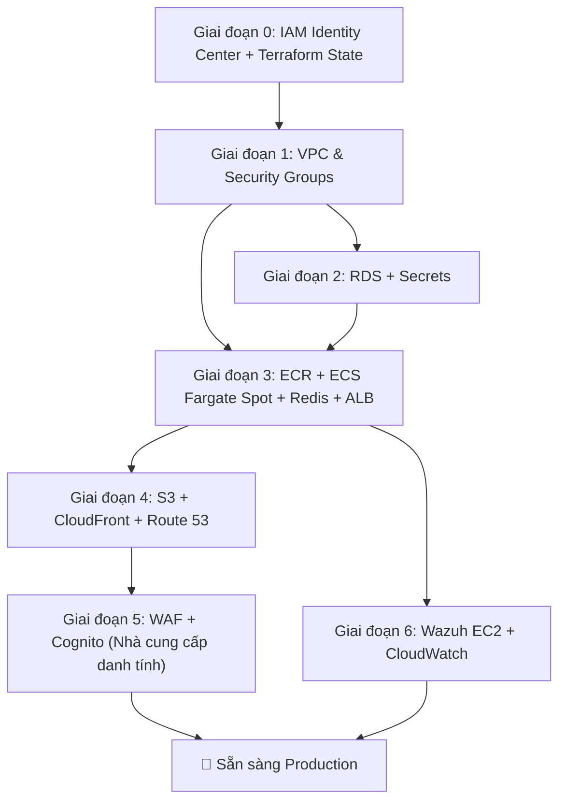

# Kế hoạch Tích hợp AWS — SaaS HR Multi-Tenant

Di chuyển cấu hình phát triển cục bộ Docker Compose hiện tại sang kiến trúc AWS production được mô tả trong tài liệu [aws_architecture_design.md](aws_architecture_design.md).

> **Vùng (Region): `ap-southeast-1` (Singapore)** · **IaC: Terraform** · **Không CI/CD (triển khai thủ công / bằng script)** · **Truy cập cho team: IAM Identity Center** · **Trần ngân sách: $120–$150/tháng** (dự kiến ~$67/tháng)

---

## 1. Các Quyết định Đã Chốt (Khóa ngày 2026-06-11)

| # | Hạng mục | Quyết định | Lý do |
|:--|:--|:--|:--|
| 1 | **Vùng triển khai** | `ap-southeast-1` (Singapore) | Người dùng cuối **chỉ ở Việt Nam** → độ trễ API thấp nhất (~30–60 ms so với ~200–250 ms tới `us-east-1`). AZ: `ap-southeast-1a`, `ap-southeast-1b`. |
| 2 | **Ngoại lệ vùng** | `us-east-1` cho **đúng 2 tài nguyên global** | (a) **Chứng chỉ ACM cho CloudFront** — CloudFront chỉ nhận cert từ N. Virginia. (b) **WAF Web ACL scope `CLOUDFRONT`** — tài nguyên global bắt buộc tạo ở `us-east-1`. Cả hai *chạy ở edge* gần Việt Nam; `us-east-1` chỉ là nơi quản lý (control-plane). |
| 3 | **Chứng chỉ TLS** | **2 chứng chỉ** | Cert #1 ở `us-east-1` cho tên miền hiển thị qua **CloudFront**. Cert #2 (tùy chọn) ở `ap-southeast-1` cho **ALB**. Cả hai cấp miễn phí qua ACM (xác thực bằng DNS qua Route 53). |
| 4 | **Công cụ IaC** | **Terraform** (tương thích OpenTofu) | HCL dễ đọc cho ~15 loại tài nguyên, remote state + locking rõ ràng cho team 2 người, `plan` để xem trước an toàn, hệ sinh thái module lớn. |
| 5 | **DNS & Tên miền** | **Chỉ dùng Amazon Route 53** — bỏ GoDaddy | Đăng ký tên miền *trực tiếp trong Route 53*; hosted zone tự tạo. Một nhà cung cấp duy nhất, bản ghi ALIAS gốc trỏ CloudFront, tự động xác thực ACM bằng DNS. |
| 6 | **Luồng CI/CD** | ❌ **Không sử dụng** | Mọi lần triển khai là **thủ công / bằng script** qua `scripts/` (`push_ecr.sh`, `deploy_frontend.sh`, `rds_init.sh`) + `terraform apply` từ laptop. Không GitHub Actions / CodePipeline / CodeBuild. |
| 7 | **Truy cập team** | **AWS IAM Identity Center** (2 user) | Credential ngắn hạn (không lưu key dài hạn trên laptop), một cổng SSO, mỗi dev một permission set `AdministratorAccess`. Tài khoản root bị khóa + bật MFA. |
| 8 | **Redis (Pub/Sub)** | **Redis ECS service dùng chung qua Cloud Map Service Discovery**, chạy **Fargate Spot** | Redis là message broker *non-critical, eventual-consistency* (không phải datastore). Một ECS service độc lập dùng chung (KHÔNG phải sidecar), truy cập tại `redis.saashr.local:6379`, giữ trọn pattern event-driven với ~$3/tháng so với ~$14/tháng của ElastiCache. |
| 9 | **Nginx API Gateway** | ❌ **Loại bỏ** | ALB đảm nhận định tuyến theo đường dẫn; các service FastAPI đã tự sinh correlation ID. Bỏ task gateway giúp tiết kiệm ~25% compute và 1 kho ECR. |
| 10 | **Nhà cung cấp danh tính (user app)** | ✅ **AWS Cognito User Pools (Phương án B)** | Cognito là nhà cung cấp danh tính chính thức — quản lý đăng ký/đăng nhập, MFA, hosted UI, và cấp JWT — bỏ được gánh nặng tự duy trì ký/xoay khóa RS256. Xây ngay trong **Giai đoạn 5** (không hoãn). Cần chuyển luồng đăng nhập sang `InitiateAuth` và nạp user hiện có vào User Pool. |

---

## 2. Ánh xạ Hiện trạng → Mục tiêu

| Thành phần | Triển khai Hiện tại | Dịch vụ AWS Mục tiêu (`ap-southeast-1` nếu không ghi chú khác) |
|:--|:--|:--|
| API Gateway | Nginx container (`api-gateway/`) | **ALB** (định tuyến theo đường dẫn) — *đã bỏ Nginx gateway* |
| Auth Service | FastAPI cổng 8000 | ECS **Fargate Spot** task |
| Tenant Service | FastAPI cổng 8001 | ECS **Fargate Spot** task |
| HR Service | FastAPI cổng 8002 | ECS **Fargate Spot** task |
| Message Broker | Redis container | **Redis ECS service dùng chung** (Fargate Spot) + **Cloud Map** service discovery |
| Frontend | Vite React → Nginx container | **S3** (riêng tư, OAC) + **CloudFront** |
| Database | MySQL 8.0 container (3 schema) | **RDS MySQL** `db.t4g.micro` (Single-AZ, auto-stop) |
| Auth/Identity | JWT RS256 tự cấu hình (`security.py`) | **AWS Cognito User Pools** (User Pool + App Client, JWT/OIDC) — Giai đoạn 5 |
| Bảo mật biên (edge) | Không có | **AWS WAF** (scope `CLOUDFRONT`, ở `us-east-1`) |
| Security/SOC | Không có | **Wazuh** trên EC2 `t3.small` Spot |
| DNS / Tên miền | localhost | **Route 53** (đăng ký tên miền trong Route 53) |
| TLS | Không có | **ACM** cert #1 `us-east-1` (CloudFront) + cert #2 `ap-southeast-1` (ALB, tùy chọn) |
| Truy cập team | — | **IAM Identity Center** (2 user, credential ngắn hạn) |
| Terraform state | — | **S3 backend** + lockfile gốc (`use_lockfile`) |

---

## 3. Giai đoạn 0 — Tài khoản, Truy cập Team & Terraform Backend (Bắt buộc trước tiên)

> Nền tảng làm một lần. Thực hiện **trước** mọi tài nguyên trong `infra/` để hai dev làm việc song song mà không xung đột.

### 3.1 Khóa chặt tài khoản root
1. Đăng nhập **root** → bật **MFA** (app authenticator hoặc khóa cứng).
2. **Xóa mọi access key của root** (`My Security Credentials`).
3. Lưu mật khẩu root vào trình quản lý mật khẩu; ngừng dùng root cho công việc hằng ngày.

### 3.2 Bật IAM Identity Center (2 dev)
1. Console → **IAM Identity Center** → **Enable**.
2. **Users** → tạo 2 user (Dev A, Dev B), mỗi người một email riêng.
3. **Permission sets** → tạo `AdminAccess` → gắn policy `AdministratorAccess` của AWS, thời lượng phiên 8 giờ.
4. **AWS accounts** → chọn tài khoản → gán **cả hai** user permission set `AdminAccess`.
5. Mỗi dev, trên laptop của mình:
   ```bash
   aws configure sso          # một lần: SSO start URL + region ap-southeast-1
   aws sso login --profile saashr   # hằng ngày: làm mới credential ngắn hạn
   ```
> Root luôn bị khóa; CloudTrail (bật sẵn) ghi lại ai làm gì. `AdministratorAccess` là lựa chọn thực dụng cho team 2 người tự dựng toàn bộ hạ tầng — siết least-privilege ở đây chỉ gây vướng lỗi `AccessDenied`.

### 3.3 Khởi tạo Terraform remote state (cơ chế thật sự giúp "không chặn nhau")
IAM chỉ cho hai bạn *vào*; **state Terraform dùng chung có khóa** mới là thứ ngăn hai lệnh `apply` đồng thời phá state của nhau.
1. Tạo **một bucket S3** (bật **versioning**, bật **mã hóa**) ở `ap-southeast-1`, ví dụ `saashr-tfstate-<account-id>`. Tạo thủ công một lần hoặc qua thư mục nhỏ `infra/bootstrap/` (bucket chứa state không thể nằm trong chính state mà nó lưu).
2. Cấu hình backend dùng **lockfile gốc của S3** (Terraform ≥ 1.10 — không cần bảng DynamoDB riêng):
   ```hcl
   # infra/providers.tf
   terraform {
     required_version = ">= 1.10"
     backend "s3" {
       bucket       = "saashr-tfstate-<account-id>"
       key          = "global/saashr.tfstate"
       region       = "ap-southeast-1"
       encrypt      = true
       use_lockfile = true            # khóa state gốc của S3
     }
   }

   provider "aws" {                   # mặc định — Singapore, dùng cho ~95% tài nguyên
     region = "ap-southeast-1"
   }

   provider "aws" {                   # alias — N. Virginia, CHỈ cho cert CloudFront + WAF
     alias  = "us_east_1"
     region = "us-east-1"
   }
   ```
3. **Quy tắc làm việc cho 2 dev:** luôn `terraform plan` trước; báo nhau trước khi `apply`; khóa khiến lệnh apply đồng thời phải chờ thay vì ghi đè. Tùy chọn tách state theo lớp (`network` / `data` / `compute`) để mỗi dev sở hữu một lớp.

---

## 4. Các Thay đổi Đề xuất — 6 Giai đoạn Xây dựng

### Giai đoạn 1: Nền tảng AWS (VPC, Mạng, Security Groups)

#### [NEW] `infra/vpc.tf`
- VPC `10.0.0.0/16` tại **`ap-southeast-1`**
- Public Subnet A `10.0.1.0/24` (`ap-southeast-1a`)
- Public Subnet B `10.0.2.0/24` (`ap-southeast-1b`)
- Private Subnet A `10.0.11.0/24` (`ap-southeast-1a`)
- Private Subnet B `10.0.12.0/24` (`ap-southeast-1b`)
- Internet Gateway (**không NAT Gateway** — thiết kế NAT-Less, Chiến lược FinOps số 3)
- Route tables: public subnets → IGW, private subnets → chỉ nội bộ (local)

#### [NEW] `infra/security_groups.tf`
- `sg-alb-gateway`: Ingress 80/443 từ `0.0.0.0/0`, Egress tới `sg-ecs-fargate`
- `sg-ecs-fargate`: Chỉ Ingress 80 từ `sg-alb-gateway`; Egress 3306 tới `sg-rds-db`, 6379 tới chính `sg-ecs-fargate` (Redis, nội bộ SG), 1514/1515 tới `sg-wazuh-soc`, 443 ra `0.0.0.0/0`
- `sg-rds-db`: Chỉ Ingress 3306 từ `sg-ecs-fargate`, chặn toàn bộ egress
- `sg-wazuh-soc`: Ingress 1514/1515 từ `sg-ecs-fargate`, 443 chỉ từ IP của team

#### [NEW] `infra/variables.tf`
- Region (`ap-southeast-1`), dải CIDR, danh sách IP của team, tag môi trường, tên miền

---

### Giai đoạn 2: Lớp Dữ liệu (RDS + Secrets Manager)

#### [NEW] `infra/rds.tf`
- RDS MySQL 8.0 trên `db.t4g.micro` (Graviton — có sẵn ở `ap-southeast-1`) trong private subnet
- DB Subnet Group trải Private Subnet A + B
- Single-AZ (tắt standby Multi-AZ để tiết kiệm)
- 20 GB `gp3`, ban đầu không auto-scaling
- Parameter group: `character_set_server=utf8mb4`
- Gắn `sg-rds-db`

#### [NEW] `infra/secrets.tf`
- Secret AWS Secrets Manager cho **mật khẩu master RDS** (ứng viên cho rotation)
- `JWT_PRIVATE_KEY` / `JWT_PUBLIC_KEY` — *tùy chọn tối ưu FinOps:* lưu dưới dạng **SSM Parameter Store `SecureString`** (miễn phí) thay vì Secrets Manager ($0.40/secret/tháng) vì không cần rotation

#### [MODIFY] `database/init.sql`
- Không đổi cấu trúc. Chạy một lần vào RDS để tạo 3 schema (`auth_db`, `tenant_db`, `hr_db`).

#### [NEW] `scripts/rds_init.sh`
- Kết nối RDS qua SSM Session Manager (không cần bastion public) và chạy `init.sql`

#### [NEW] `infra/scheduler.tf`
- EventBridge + Lambda **Tự động Dừng/Khởi động RDS** (Chiến lược FinOps số 2)
- Tắt 20:00 ICT (giờ VN, UTC+7), bật 08:00 ICT, Thứ Hai–Sáu; cuối tuần giữ tắt
- **Lệnh stop chạy mỗi ngày, idempotent** — RDS tự bật lại sau 7 ngày kể từ lần dừng thủ công, nên Lambda phải dừng lại

##### Thay đổi Cấu hình Ứng dụng
- [MODIFY] `microservices/auth-service/app/core/config.py` — lấy `DATABASE_URL` từ Secrets Manager / SSM khi có `AWS_SECRETS_ARN`; fallback về biến môi trường khi dev cục bộ
- [MODIFY] `microservices/tenant-service/app/core/config.py` — cùng mô hình
- [MODIFY] `microservices/hr-service/app/core/config.py` — cùng mô hình
- [NEW] `microservices/shared/aws_secrets.py` — module `boto3` dùng chung + cache trong RAM, dùng bởi cả 3 service

---

### Giai đoạn 3: Nền tảng Container (ECR + ECS Fargate Spot + Redis + ALB)

#### [NEW] `infra/ecr.tf`
- **3 kho ECR**: `saashr-auth`, `saashr-tenant`, `saashr-hr` *(không còn `saashr-gateway` — đã bỏ Nginx gateway)*
- Quy định vòng đời: giữ 5 ảnh mới nhất, xóa ảnh untagged sau 1 ngày

#### [NEW] `infra/ecs.tf`
- ECS Cluster với capacity provider **Fargate Spot** (Chiến lược 1)
- Chiến lược: `FARGATE_SPOT` trọng số=4, `FARGATE` trọng số=1 (dự phòng)
- **AWS Cloud Map** namespace DNS riêng `saashr.local` cho service discovery

#### [NEW] `infra/ecs_tasks.tf`
- **4 Task Definition** (mỗi task 0.25 vCPU, 0.5 GB RAM):
  1. `saashr-auth` — Auth FastAPI
  2. `saashr-tenant` — Tenant FastAPI
  3. `saashr-hr` — HR FastAPI
  4. `saashr-redis` — **broker Redis dùng chung** (`redis:alpine`), đăng ký trong Cloud Map là `redis.saashr.local:6379`, **không persistence** (pub/sub tạm thời)
- `tenant-service` & `hr-service` đặt `REDIS_URL=redis://redis.saashr.local:6379/0`
- Task execution role: kéo ảnh ECR, ghi CloudWatch Logs, đọc Secrets Manager/SSM
- Task role: `GetSecretValue` / `ssm:GetParameter`
- Log: driver `awslogs` → CloudWatch `/ecs/saashr/`

#### [NEW] `infra/alb.tf`
- Application Load Balancer ở public subnet (`sg-alb-gateway`)
- Target group cho từng service; listener rule theo đường dẫn:
  - `/api/v1/auth/*` → auth-service
  - `/api/v1/tenants/*` → tenant-service
  - `/api/v1/hr/*` → hr-service
- Health check: `/api/v1/{service}/health`
- Listener HTTPS tùy chọn dùng ACM cert #2 (`ap-southeast-1`)

#### [MODIFY] Dockerfiles (3 microservice)
- Thêm `boto3` vào mỗi `requirements.txt`
- Giữ base `python:3.11-slim` (đã tối ưu)

---

### Giai đoạn 4: Frontend + DNS (S3 + CloudFront + Route 53)

#### [NEW] `infra/s3_frontend.tf`
- Bucket S3 cho bản build React (`saashr-frontend-{account-id}`), chặn mọi truy cập công khai, policy chỉ cho **OAC** của CloudFront

#### [NEW] `infra/cloudfront.tf`
- Phân phối CloudFront, hai origin:
  1. **S3 origin** (mặc định) — React SPA
  2. **ALB origin** (`/api/v1/*`) — proxy API về backend ở `ap-southeast-1`
- OAC cho S3; ánh xạ lỗi SPA 403/404 → `/index.html` (200)
- Cache: tệp tĩnh cache mạnh, API pass-through
- **Cert hiển thị = ACM cert #1 ở `us-east-1`** (khai báo với `provider = aws.us_east_1`)

#### [NEW] `infra/route53.tf`
- **Đăng ký tên miền trong Route 53** (hoặc transfer vào) → hosted zone tự tạo
- Bản ghi **A/ALIAS** `app.<domain>` → phân phối CloudFront
- Bản ghi CNAME **xác thực DNS của ACM** (cả 2 cert) tự tạo trong zone
- Chi phí hosted zone ~$0.50/tháng + truy vấn

#### [NEW] `scripts/deploy_frontend.sh`
- `npm run build` → `aws s3 sync dist/ s3://<bucket> --delete` → `aws cloudfront create-invalidation`

#### [MODIFY] `frontend/vite.config.js` + [NEW] `frontend/.env.production`
- `VITE_API_BASE_URL=` (để trống/đường dẫn tương đối — CloudFront proxy `/api/v1/*` tới ALB)

---

### Giai đoạn 5: Lớp Bảo mật (WAF + Cognito)

#### [NEW] `infra/waf.tf`
- AWS WAF v2 Web ACL, **scope `CLOUDFRONT` → tạo với `provider = aws.us_east_1`** (tài nguyên global, control-plane ở N. Virginia; luật chạy ở edge gần Việt Nam)
- Gắn vào phân phối CloudFront
- 3 Managed Rule Group: `AWSManagedRulesCommonRuleSet`, `AWSManagedRulesSQLiRuleSet`, `AWSManagedRulesAmazonIpReputationList`
- Luật rate-limit: 2000 request / 5 phút mỗi IP

#### [NEW] `infra/cognito.tf` — **đã chốt (Quyết định #10)**
- Cognito **User Pool** cho đăng ký/đăng nhập bằng email, chính sách mật khẩu, MFA tùy chọn
- **App Client** cho React frontend (luồng authorization-code + Cognito Hosted UI, hoặc Amplify/SDK)
- **User Pool Groups** ánh xạ vai trò: `owner` / `admin` / `employee`
- **Thuộc tính tùy chỉnh** `custom:tenant_id` mang trong token để cô lập tenant
- Cấu hình token đồng bộ với cơ chế xác thực RS256 hiện có — Cognito cung cấp **endpoint JWKS** để xác thực bằng public key

#### [MODIFY] Mã nguồn Auth service — Di chuyển sang Cognito
- Thay phần tự sinh JWT trong `auth-service/app/core/security.py` bằng **xác thực token Cognito qua JWKS** (public key)
- Đổi luồng đăng nhập sang xác thực qua Cognito (`InitiateAuth`) thay vì so sánh `password_hash` cục bộ
- `tenant-service` / `hr-service` xác thực JWT do Cognito cấp bằng cách trỏ nguồn public key sang **JWKS URL** của Cognito

#### [NEW] `scripts/migrate_users_cognito.sh`
- Script một lần để nạp user seed hiện có vào User Pool (`AdminCreateUser`), gán `custom:tenant_id`, và buộc đổi mật khẩu ở lần đăng nhập đầu

---

### Giai đoạn 6: Giám sát & SOC (Wazuh + CloudWatch)

#### [NEW] `infra/wazuh_ec2.tf`
- EC2 `t3.small` **Spot** ở Public Subnet A, cài Wazuh Manager qua user-data, 30 GB `gp3`, `sg-wazuh-soc`, scheduler auto-stop (cùng mô hình EventBridge)

#### [NEW] `infra/cloudwatch.tf`
- Log group `/ecs/saashr/{auth,tenant,hr,redis}`, lưu **7 ngày**
- Alarm: số task ECS đang chạy < mong muốn, CPU RDS > 80%, tỷ lệ 5xx của ALB > 5%

#### [MODIFY] Dockerfiles (3 service)
- Cài agent Wazuh, báo về IP nội bộ Wazuh Manager qua 1514/1515

---

## 5. Cấu trúc Thư mục Mới

```text
SaaS-HR-Multi-tenant/
├── infra/                          # [NEW] Terraform IaC
│   ├── bootstrap/                  # [NEW] một lần: bucket S3 chứa tfstate
│   │   └── main.tf
│   ├── providers.tf                # [NEW] mặc định ap-southeast-1 + alias aws.us_east_1 + backend S3
│   ├── variables.tf
│   ├── outputs.tf
│   ├── vpc.tf
│   ├── security_groups.tf
│   ├── rds.tf
│   ├── secrets.tf
│   ├── ecr.tf
│   ├── ecs.tf                      # cluster + namespace Cloud Map
│   ├── ecs_tasks.tf                # task def + service: auth, tenant, hr, redis
│   ├── alb.tf
│   ├── s3_frontend.tf
│   ├── cloudfront.tf               # cert hiển thị qua aws.us_east_1
│   ├── route53.tf                  # [NEW] tên miền + hosted zone + ALIAS + xác thực ACM
│   ├── waf.tf                      # scope CLOUDFRONT qua aws.us_east_1
│   ├── cognito.tf                  # Cognito User Pool + App Client (Giai đoạn 5 — IdP)
│   ├── wazuh_ec2.tf
│   ├── cloudwatch.tf
│   └── scheduler.tf
│
├── scripts/                        # [NEW] Triển khai thủ công (không CI/CD)
│   ├── push_ecr.sh                 # build + tag + push ảnh, ép ECS redeploy
│   ├── deploy_frontend.sh          # build + đồng bộ S3 + làm mới cache CloudFront
│   ├── rds_init.sh                 # khởi tạo schema RDS qua SSM
│   └── migrate_users_cognito.sh    # [NEW] nạp user seed vào Cognito User Pool
│
├── microservices/
│   ├── shared/
│   │   └── aws_secrets.py          # [NEW] lấy Secrets Manager/SSM + cache
│   ├── auth-service/               # (cập nhật config.py, requirements.txt)
│   ├── tenant-service/             # (cập nhật config.py, requirements.txt)
│   └── hr-service/                 # (cập nhật config.py, requirements.txt)
│
├── frontend/
│   ├── .env.production             # [NEW]
│   └── ...                         # (cập nhật vite.config.js)
│
├── api-gateway/                    # GIỮ chỉ cho docker-compose cục bộ (không deploy lên AWS)
├── docker-compose.yml              # GIỮ NGUYÊN — phát triển cục bộ
└── ...
```

---

## 6. Quy trình Thực hiện Từng bước (Thủ công / bằng Script)

> Chạy từ laptop đã đăng nhập qua `aws sso login --profile saashr`. Mỗi `terraform apply` đều có `terraform plan` đứng trước.

### Bước 0 — Nền tảng (một lần)
```bash
# 0.1 Root: bật MFA, xóa key root (trên console)
# 0.2 IAM Identity Center: bật, tạo 2 user, permission set AdminAccess, gán cả hai
# 0.3 Cấu hình SSO trên mỗi laptop
aws configure sso
aws sso login --profile saashr

# 0.4 Khởi tạo bucket state Terraform
cd infra/bootstrap && terraform init && terraform apply   # tạo saashr-tfstate-<acct-id>
```

### Bước 1 — Mạng & Bảo mật
```bash
cd infra
terraform init                       # nối backend S3 (use_lockfile)
terraform plan  -target=...vpc -target=...security_groups
terraform apply -target=...vpc -target=...security_groups
```

### Bước 2 — Lớp dữ liệu
```bash
terraform apply -target=aws_db_instance.mysql -target=...secrets -target=...scheduler
# Khởi tạo schema (RDS riêng tư → đi qua SSM)
./scripts/rds_init.sh                 # chạy database/init.sql vào RDS
```

### Bước 3 — Build & push ảnh, triển khai compute
```bash
# Build + push 3 ảnh service lên ECR
./scripts/push_ecr.sh auth tenant hr
# Tạo cluster, Cloud Map, service Redis, task def, service, ALB
terraform apply -target=...ecr -target=...ecs -target=...ecs_tasks -target=...alb
# Kiểm tra
aws ecs describe-services --cluster saashr-cluster \
  --services saashr-auth saashr-tenant saashr-hr saashr-redis --profile saashr
```

### Bước 4 — Frontend + DNS
```bash
terraform apply -target=...s3_frontend -target=...cloudfront -target=...route53
./scripts/deploy_frontend.sh          # build React, đồng bộ S3, làm mới CF
```

### Bước 5 — Bảo mật biên + Danh tính (Cognito)
```bash
terraform apply -target=...waf        # Web ACL scope CLOUDFRONT (alias us-east-1) + gắn
terraform apply -target=...cognito    # Cognito User Pool + App Client + groups + custom:tenant_id
./scripts/migrate_users_cognito.sh    # một lần: nạp user seed vào User Pool
```

### Bước 6 — SOC & giám sát
```bash
terraform apply -target=...wazuh_ec2 -target=...cloudwatch
# Hoặc đơn giản: terraform apply   (hội tụ toàn bộ, rồi chạy lại script nếu cần)
```

### Triển khai lại khi sửa code (không CI/CD)
```bash
./scripts/push_ecr.sh hr              # build lại + push một service
aws ecs update-service --cluster saashr-cluster --service saashr-hr \
  --force-new-deployment --profile saashr
```

---

## 7. Kế hoạch Xác minh

```bash
# Tính toàn vẹn IaC
terraform init && terraform validate && terraform plan

# Sức khỏe ECS
aws ecs describe-services --cluster saashr-cluster \
  --services saashr-auth saashr-tenant saashr-hr saashr-redis

# Luồng đầu-cuối qua CloudFront → ALB → ECS → RDS
curl -I https://app.<domain>/
curl https://app.<domain>/api/v1/auth/health
curl https://app.<domain>/api/v1/tenants/health
curl https://app.<domain>/api/v1/hr/health
```
Kiểm tra thủ công:
- RDS truy cập được từ ECS qua endpoint `/health`
- Luồng đăng nhập → API chạy thông suốt đầu-cuối
- Pub/Sub: cập nhật trạng thái tenant → log của `hr-service` cho thấy đã nhận event (Cloud Map resolve đúng)
- WAF chặn payload thử SQLi
- Dashboard Wazuh chỉ truy cập được từ IP của team
- RDS auto-stop chạy đúng lịch (và dừng lại idempotent)
- `docker-compose up` vẫn chạy cục bộ (luồng dev không hỏng)

---

## 8. Thứ tự Thực hiện & Phụ thuộc



> [!TIP]
> Hoàn thành **Giai đoạn 0 → 4** trước để có hệ thống chạy được trên AWS. Bổ sung Giai đoạn 5 (WAF/Cognito) và Giai đoạn 6 (Wazuh) dần dần mà không gián đoạn.

---

## 9. Chi phí Ước tính Hàng tháng — `ap-southeast-1` (Singapore)

Đã áp dụng toàn bộ tối ưu FinOps (Fargate Spot, NAT-less, auto-stop RDS/Wazuh, log 7 ngày). Giá đơn vị tại Singapore cao hơn `us-east-1` ~10–20%.

| Dịch vụ AWS | Cấu hình | Chi phí ước tính / Tháng |
|:--|:--|:--:|
| AWS WAF | 1 Web ACL + 3 managed rule + rate-limit | ~$9.00 |
| CloudFront + S3 | 100 GB out, React tĩnh (CF free tier) | ~$1.00 |
| Application Load Balancer | 1 ALB + ~1 LCU | ~$24.00 |
| ECS Fargate Spot | 4 task (auth, tenant, hr, **redis**) @ 0.25 vCPU/0.5 GB, Spot | ~$12.00 |
| RDS MySQL | `db.t4g.micro` + 20 GB gp3, auto-stop ~200 h/tháng | ~$6.50 |
| EC2 (Wazuh) | `t3.small` Spot + 30 GB gp3, auto-stop | ~$7.00 |
| AWS Cognito | Free tier ≤ 50k MAU | $0.00 |
| Route 53 | 1 hosted zone + truy vấn + tên miền (phân bổ) | ~$2.00 |
| Secrets Manager / SSM | secret RDS (khóa JWT → SSM miễn phí) | ~$0.80 |
| NAT Gateway | Thiết kế NAT-less | $0.00 |
| Data Transfer / CloudWatch | log (7 ngày), inter-AZ | ~$4.00 |
| ECR | lưu trữ ảnh | ~$0.50 |
| IAM Identity Center | SSO cho team | $0.00 |
| **Tổng cộng** | | **≈ $66.80 / tháng** |

> [!NOTE]
> **≈ $67/tháng** nằm rất sâu dưới trần **$120–$150** — còn **~$53–$83 đệm** cho lưu lượng tăng đột biến, instance test thêm, hoặc tắt auto-stop khi demo. Hãy tính lại bằng AWS Pricing Calculator đặt vùng **Asia Pacific (Singapore)** trước khi chốt.
